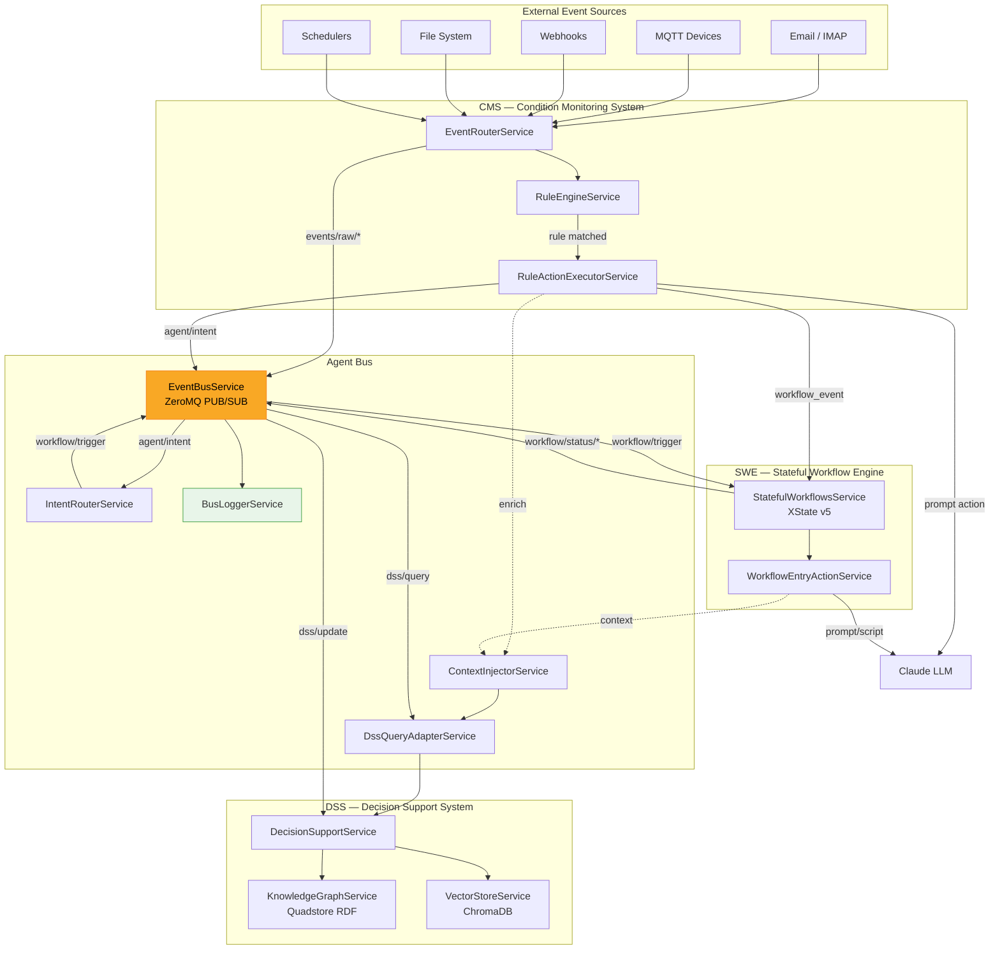
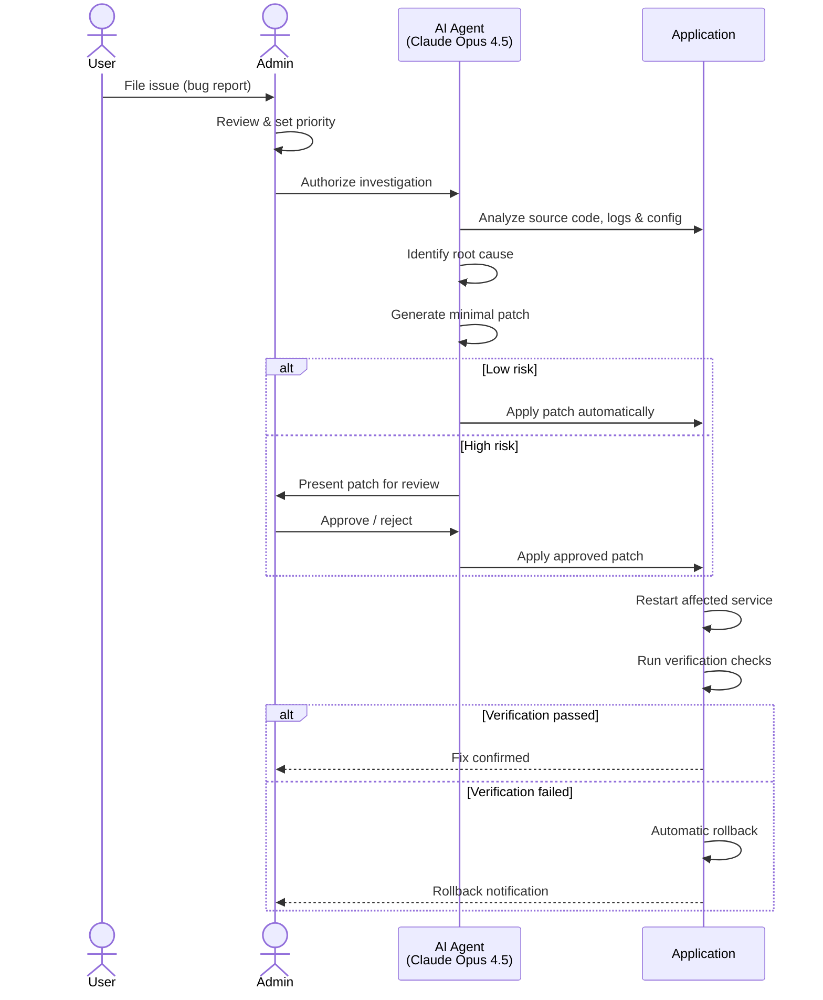
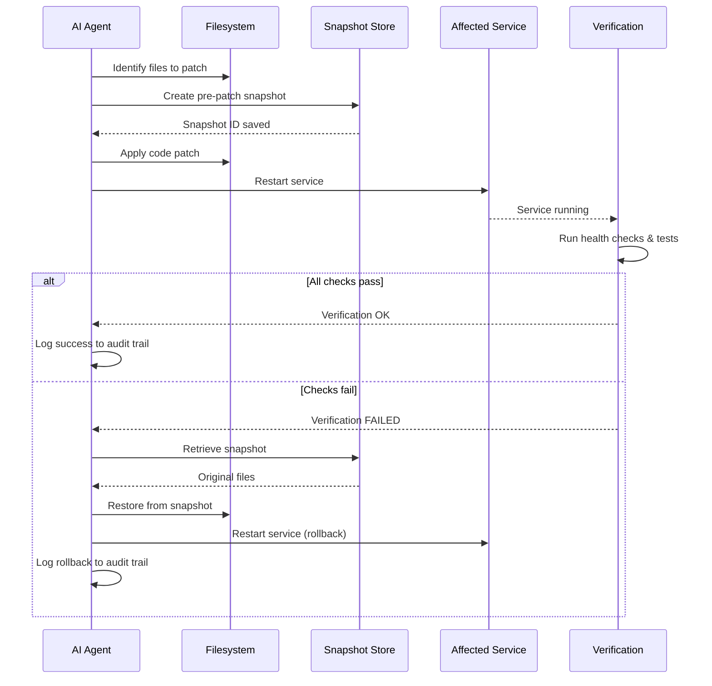
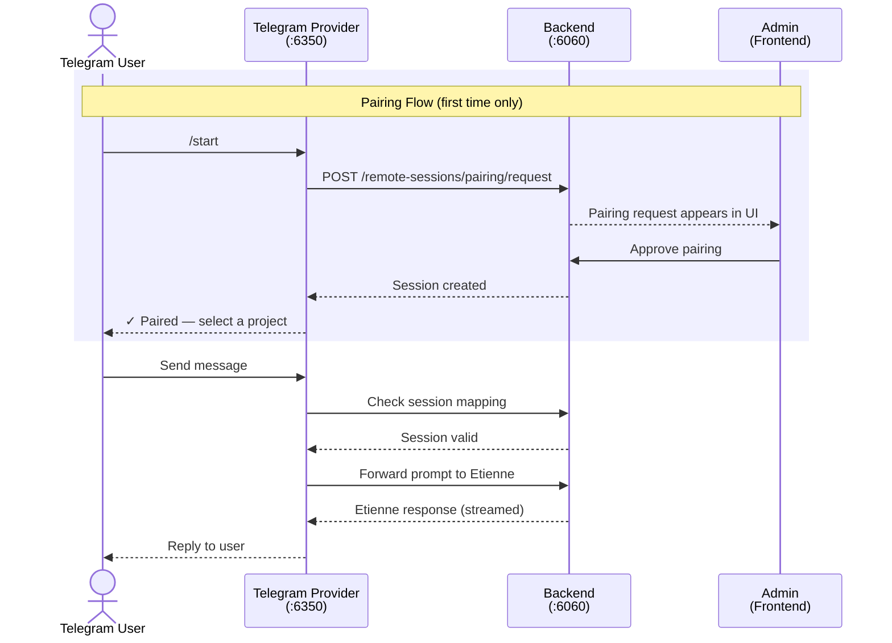
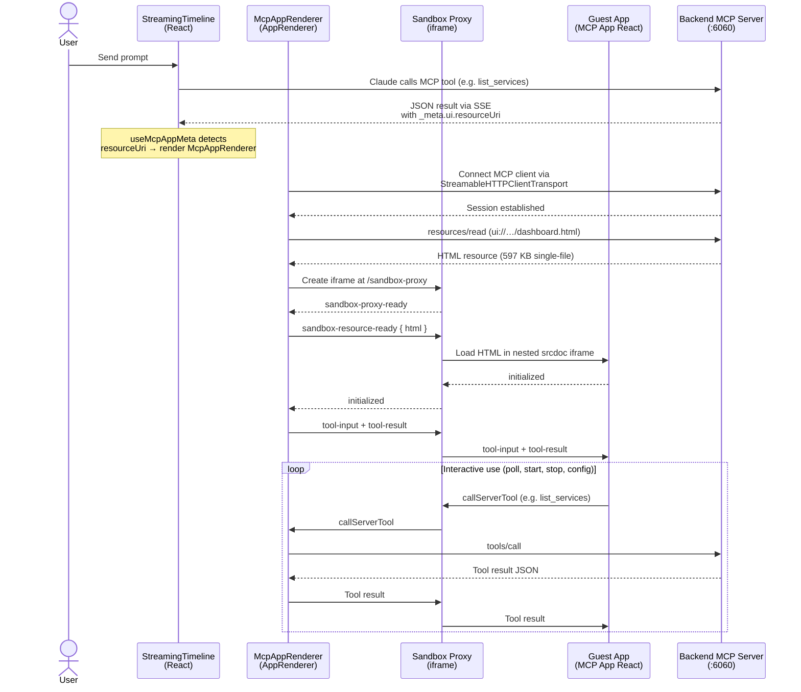

<div align="center">

</div>

# Etienne - AI Harness Integration Layer

## What it does in one sentence

Etienne is an **integration harness** around a **coding harness** to build user friendly agent interactions:

<div align="center">

</div> 

<br>

> Etienne showcases how to attach typical business requirements to a 
> **coding agent harness** in order to enable a non-technical user 
> to interact with the agent using a refined UI.

<br>

<div align="center">

</div> 

<br>

This setup addresses the use case **business collaborator agent** working on local data.

The user interface is available for these languages:
* English (US)
* German (DE)
* Chinese (mandarin)

Etienne's UI is build around **role based access control** with these basic roles (can be enhanced):

<div align="center">

</div> 

Etienne uses different **roles to have clear responsibilities defined** - it is usually NOT deployed as a personal AI assistant where the admin and the user role would be the same person.

## Holy Crab! Is it like...???

The following comparison illustrates the conceptual differences between Etienne and OpenClaw as of early 2026:

<div align="center">

</div> 

## The Etienne Manifesto: It's all about Engineering, not LLM magic!

Here are the guiding principles for Etienne, and why I believe it matters:

<div align="center">

</div> 

**Focused on usability and simplicity.** I build it because I like to use it myself. And one day, I might build an entirely different business on top of it. If the builder doesn't enjoy the tool, nobody will.

**Aware of its place in a bigger world.** Etienne doesn't try to be everything. It's designed to run inside an agentic OS — something like OpenAI Frontier — which handles all the infrastructure burdens I don't want to reinvent: prompt injection detection and prevention, data access policies, audit trails for compliance. Etienne is the agent experience layer. The platform handles the plumbing.

**Deterministic where it counts.** Here's the quiet revolution: Etienne introduces traditional control mechanisms into the agentic world. CRON jobs for scheduling. Finite state machines for workflows. Ontology graphs for knowledge acquisition. Decision graphs built on top of those ontologies. An internal agent event bus combined with external triggers — email, MQTT, webhooks. 

**Isolated by design.** Every task lives inside a project. Knowledge graphs, decision graphs, workflows, data — all of it is scoped to a defined mission statement. No bleed. No confusion. No agent accidentally applying restaurant marketing logic to your medical practice.

**Composable everywhere.** Use standard agent skills to enhance process knowledge. Use MCP tools to enhance data access. Use file previewers and editors to let users manipulate complex results directly — modifying a CAD object, controlling a robot, reviewing a financial model. The agent doesn't just produce output. It produces editable output.

**Built for continuous improvement.** Project-level knowledge graphs and decision graphs can be promoted to the company level — managed as Microsoft Fabric IQ objects and rules. Agent skills developed in one project can be submitted to an administrator for review, then published to a local skill store, making them available to every other user. The system learns. Not in the fuzzy, hand-wavy way that LLMs "learn." In the structured, auditable, improvable way that actual organizations need.

**Respectful of security.** Etienne provides a role-based access control core around APIs and UI, adaptable to any existing identity management system — EntraID, Okta, whatever your company already runs. It supports Git-controlled versioning, backup and restore, and defined releases aligned to basic compliance rules. Event logs and settings live in defined, inspectable, auditable places. Your IT department won't love it on day one. But they won't block it either.


## Table of Contents

- [Built for Artifacts](#built-for-artifacts)
- [Built around Skills](#built-around-skills)
- [Built for Connectivity](#built-for-connectivity)
- [Focused on local Data and Services](#focused-on-local-data-and-services)
- [Self-Healing Capabilities](#self-healing-capabilities)
- [Managed Etienne](#managed-etienne)
- [Memory](#memory)
- [The Web: searching, scraping and browsing](#the-web-searching-scraping-and-browsing)
- [Main Components](#main-components)
- [The Agent and the outside World](#the-agent-and-the-outside-world)
- [Securing the Agent against Prompt Injection](#securing-the-agent-against-prompt-injection)
- [IT Budget Situation](#it-budget-situation)
- [Extended Use Case: Prototyping together with your Customer](#extended-use-case-prototyping-together-with-your-customer)
- [Demo Videos](#demo-videos)
  - [Brainstorming with Etienne](#brainstorming-with-etienne)
  - [Creating a new project with Etienne](#creating-a-new-project-with-etienne)
- [Etienne Articles on LinkedIn](#etienne-articles-on-linkedin)
- [Setup](#setup)
  - [API Keys](#api-keys)
  - [Checkpoints](#checkpoints)
  - [OAuth Server (Authentication)](#oauth-server-authentication)
  - [Starting up the services](#starting-up-the-services)
- [User Authentication in the Frontend UI](#user-authentication-in-the-frontend-ui)
- [API Endpoints](#api-endpoints)
- [Knowledge Base Feature](#knowledge-base-feature)
  - [Architecture](#architecture)
  - [Entity Extraction & Storage Flow](#entity-extraction--storage-flow)
  - [Customizable Schema & Prompts](#customizable-schema--prompts)
  - [Query Capabilities](#query-capabilities)
  - [Data Visualization](#data-visualization)
  - [Storage Requirements & Setup](#storage-requirements--setup)
  - [Use Cases](#use-cases)
- [Context Management / Metadata Layer](#context-management--metadata-layer)
  - [Why Use Context Management?](#why-use-context-management)
  - [Filesystem Context](#filesystem-context)
  - [Vector Store Context](#vector-store-context)
  - [Knowledge Graph Context](#knowledge-graph-context)
  - [Session-Level Context Switching](#session-level-context-switching)
- [Observability](#observability)
  - [Configuration](#configuration)
  - [Starting Phoenix Locally](#starting-phoenix-locally)
  - [Traced Information](#traced-information)
  - [Viewing Traces](#viewing-traces)
- [Spec-driven Development](#spec-driven-development)
  - [Claude Control (inner agentic cycle)](#claude-control-inner-agentic-cycle)
  - [Complementary Features (to the agentic cycle)](#complementary-features-to-the-agentic-cycle)
  - [Other](#other)
- [File Type Previewers](#file-type-previewers)
  - [Supported File Types](#supported-file-types)
  - [How It Works](#how-it-works)
- [Messenger Integration](#messenger-integration)
  - [Architecture](#architecture-1)
  - [Configuration](#configuration-1)
  - [Usage Guide](#usage-guide)
- [MCP UI](#mcp-ui)
  - [Architecture Flow](#architecture-flow)
  - [Key Files](#key-files)
  - [Adding a New MCP App](#adding-a-new-mcp-app)
  - [Sandbox Proxy](#sandbox-proxy)
- [Budget Tracking](#budget-tracking)
  - [How It Works](#how-it-works)
  - [Cost Calculation](#cost-calculation)
  - [Configuration (.env)](#configuration-env)
  - [Storage](#storage)
  - [UI Dashboard](#ui-dashboard)
  - [Real-time Updates](#real-time-updates)
- [Maintainer](#maintainer)

# Built for Artifacts

Of of the most valuable UI features is to work side by side with the agent on **complex results** (=artifact).

<div align="center">

</div>

Many configurator or data exploration use cases greatly benefit from this kind of workflow:

1. **Describe** your problem in the chat pane
2. **AI agent generates first draft** and presents it in the artifacts pane
3. **User refines draft** either by clicking directly on a detail in the artifacts pane OR by asking the agent to make the change

This main **collaboration feature** sets Etienne apart from other agents like OpenClaw, which is focused on a command/execution pattern via a simple messenger user interface.

# Built around Skills

<div align="center">

</div>

This isn't science fiction. This is skill-based AI agent development, and it's about to change how your organization works with AI. What's even better: Agent Skills work across vendors. So if you later switch from an OpenAI-based solution to an Anthropic-based one — or any other provider — your investment in skills is preserved. No lock-in. No starting over.

### A Skill Is Simpler Than You Think (And That's the Point)

<div align="center">

</div>

At its core, an agent skill is just two things working together:

* **A markdown file** written by a business expert — describing what to do, when to do it, and why it matters, in plain language anyone can read and understand.
* **Code snippets** (Python, JavaScript, or any language) contributed by an IT engineer — providing the technical muscle to execute that expertise.

That's it. Business knowledge meets technical capability in a single, portable folder.

<div align="center">

</div>

When a user describes their task, the agent doesn't just process words — it recognizes which skill matches the situation, loads the relevant business expertise, and seamlessly translates the user's intent into the right technical execution. The business expert's judgment guides the engineer's code. The result? AI that doesn't just respond — it understands your business.

### A Real Lifecycle: From Creation to Continuous Improvement

This is where things get exciting. Let me walk you through how this works in practice with Etienne:

<div align="center">

</div>

#### Step 1 — The IT Admin Builds or Selects a Skill
An administrator curates skills — either building them from scratch with domain experts or selecting proven ones from a shared repository. Every skill is security-checked and technology-approved before it enters the company's skill store.

<div align="center">

</div>

#### Step 2 — The User Picks What They Need
Business users browse the approved skill catalog and select the ones relevant to their current project. The skill is copied into their project directory. No installation headaches. No waiting on IT tickets. Self-service, but with guardrails.

<div align="center">

</div>

#### Step 3 — The Agent Uses the Skill
From this point on, the agent automatically applies the skill whenever the user's task calls for it. The user focuses on their work; the agent handles the expertise-to-technology translation behind the scenes.

#### Step 4 — The Skill Evolves Through Use
Here's where the magic happens: as the agent works within a project, it can refine and improve the skill based on real-world usage. A generic "financial report analysis" skill might become a finely tuned "Q3 EMEA margin analysis" skill — adapted to the user's actual needs. At this point, it truly becomes the user's skill.

<div align="center">

</div>

#### Step 5 — The Best Improvements Flow Back
When a user discovers that their refined skill is significantly better, they can submit it back to the IT administrator. The admin reviews the changes, validates them, updates the central repository — and suddenly, every team in the organization can benefit from one user's practical discovery.

**This is agentic learning with human supervision at its best.**

### Why This Matters: Five Guarantees That Change Everything
Let's be clear about what this lifecycle delivers:

* **Understandable**. Skills are expressed in markdown. Not in opaque model weights. Not in mysterious embeddings. In plain language that any business stakeholder can read, review, and challenge. When your compliance team asks "what does the AI actually do?" — you hand them the skill file.
* **Battle-tested**. Every improvement comes from a real user solving a real problem in a real project. This isn't theoretical optimization. It's field-proven refinement.
* **Intentional**. Skill updates don't happen silently in the background. A user consciously decides to submit an improvement. A human makes the choice.
* **Reviewed**. The four-eyes principle applies. An admin reviews every submitted change before it enters the repository. No unvetted modifications reach other users.
* **Safe to deploy**. Updated skills don't retroactively change existing results in a user's project. The rollout is safe because users must opt-in to updates through their project settings. Think of it as software updates — only on a higher abstraction level.

### The Skills Store: Enterprise-Grade Management
Behind the scenes, administrators have access to a Skills Store — a management interface where they oversee the entire skill portfolio. Each skill carries rich metadata that goes beyond the open standard, allowing companies to define their own strategies for evolving, versioning, and distributing skills across the organization.

<div align="center">

</div>

Etienne also adds practical extensions to the formal standard that business environments demand:

* **Technical dependencies** — a clear list of system requirements (npm packages, Python libraries, or other artifacts) that must be present on the agent's host system. No guesswork about what needs to be installed.
* **Environment variables** — explicit declarations of which API keys, tokens, or configuration values the skill needs. After installing a skill, a user can securely provide their personal credentials scoped exclusively to their project.

This means IT knows exactly what a skill requires before deployment, and users maintain control over their own credentials and configurations.

# Built for Connectivity

## Event Bus Components — Integrated AI Agent Architecture

The Integrated AI Agent Architecture connects three existing systems through a shared ZeroMQ event bus,
enabling a **perceive → contextualize → decide → act → remember agent loop**.

| System | Role | Metaphor |
|--------|------|----------|
| **CMS** (Event-Handling) | Sensory Layer | Eyes & ears — perceives what's happening now |
| **DSS** (Ontology-Core) | Memory & Reasoning | Brain — stores knowledge, provides context |
| **SWE** (Stateful-Workflows) | Motor Layer | Hands — executes deliberate multi-step actions |
| **Agent Bus** | Nervous System | Connects all components via messages |

## Architecture Diagram


[More info...](/backend/src/agent-bus/EVENT_BUS_COMPONENTS.md)

# Focused on Data and Local Services

Etienne's data structures are build around the idea of keeping things local and separated. This might be a strange concept of self-containment if you are a cloud developer and your daily-business is dealing with shared services like databases. 

## Workspace & Projects

Etienne expects all the user data inside a single local **workspace directory** (or in case of Docker deployment a single mount). The subdirectories in the workspace are the **projects**. 

While in advanced use cases the agent can work cross-project the default setting for the **coding agent's root directory** is set at project level.

Inside the workspace the usual . convention applies: The user cannot see any internal files or directories starting with a . character.

<div align="center">

</div>

Only the admin role can see these files via the UI:

<div align="center">

</div>

All relevant settings and data are kept on project level to ensure two features:
* **Right to forget** if sensitive data was processed inside one project, it will be purged when the directory is deleted
* **Portability** users can exchange a complete project by simply copying the directory

## Service Control

The user interface provides access to the process-manager API which is responsible of starting/stopping local servers on different ports.

<div align="center">

</div>

This feature is not so much targeted at human usage, but to give the agent the ability to decide which services to ramp up: There is an MCP server with a MCP App(UI) which enables the user to access service control also in the chat pane.

## Project-aware Services

All of the local **services treat projects like tenants**: they store their data (also temp files) in subdirectories of the project folder and serve them from this location.

<div align="center">

</div>

In the example above we can see the RDF store ("knowledge graph") log and data files inside a project's directory.


# Self-Healing Capabilities

As this project is built around the most sophisticated coding harness, one feature comes to your mind quite immediatelly: "Can't the agent fix its own code when there's some kind of error?"

> Not every error is an error though - this is why
> we should add a proper safeguard by using the human
> 4 eyes principle: No code part of the vital agent functionalities
> should be fixed automatically!

Etienne gives our agent the ability to patch its own source code when you report problems — with full human oversight at every critical step. You can open the **issue tracker** from the project menu:

<div align="center">

</div>

**Here's the workflow:** A user files an issue describing what's broken. An admin reviews it, sets priority, and authorizes the AI agent to investigate. Because the data (which probably caused the error) is still in the project directory, the agent — Claude Opus 4.5 via the Claude Agent SDK — can directly analyze data, source code, logs, and configuration "in-place", it can identify the root cause, and can create a minimal code patch. Depending on the risk level, the patch is either applied automatically or presented to the admin for review. After patching, the affected service restarts and the system verifies the fix worked. If it didn't, automatic rollback kicks in.



This is not a copilot suggesting changes for you to implement. This is an embedded repair system that lives inside our agent, understands our code at the deepest level, and acts on explicit human authorization.

**Four safety layers** ensure you're always in control:
1. **Admin approval gates** — no agent action starts without explicit authorization
2. **Agent-level guardrails** — dangerous commands blocked, file edits restricted to the application directory
3. **Pre-patch snapshots** with automatic rollback on verification failure
4. **Immutable audit trail** — every agent action is logged (who approved, what changed, what happened)

**Graduated autonomy** lets admins build trust incrementally across four levels: from observe-only (Level 0) where the agent only diagnoses and suggests fixes, to fully automatic patching with rollback guarantees (Level 3). New deployments always start at Level 0.



The immune system our agent never had — with a human hand on the switch.

To enable self-healing on a project, activate the **self-healing** skill from the skill store. It guides users through creating structured issue reports with title, description, reproduction steps, and expected vs. actual behavior — all submitted to an admin for review before any automated repair is triggered.


# Managed Etienne

You can install Etienne locally, deploy it using the Docker (after you have built it from Docker the file provided) or get it hosted on AWS:

<div align="center">

</div>

[Managed Etienne Landing Page](https://etienne-agent.replit.app/)

# Memory

Etienne provides an exchangable endpoint to extract memories from a user prompt and store them inside the project.

Memory extraction is activated per default and can be accessed via the green memory card icon below the app bar.

<div align="center">

</div>

Memories are stored per project and not globally in the default configuration.

The extraction prompt is adjustable to sharpen the focus to certain business domain relevant information.

# The Web: Searching, Scraping and Browsing

Use the **web-scraping skill** to enable the agent to interact with websites on the internet.

<div align="center">

</div>

It uses these technologies by default:

* **Web search**: The default tool included in Claude Code or Codex. Uses the search index of Anthropic or OpenAI.

* **Web scraping**: Uses the Scrapling GitHub project which is fast and can process Javascript sites. It is a common choice for red-teaming tasks.

* **Web browsing**: Uses Vercel's [agent-browser](https://github.com/vercel-labs/agent-browser) package, a headless browser automation CLI designed for AI agents. Pre-installed in the Docker image via `npm install -g agent-browser` with Chromium pre-downloaded. It is a good choice for cooperative sites and a token saver (compared to pure Playwright implementations). The browser daemon can be managed from the service console. Keep in mind that it is not suited to interact with websites which deploy anti-bot/anti-agent techniques like captchas or fingerprinting!

# Main Components

This repo contains 3 mandatory servers, 6 optional servers and many modules.

Modules can be removed if their functionality is not required (e. g. A2A Client, Observability, SMTP IMAP).

<div align="center">

</div>

The following diagram shows the essential internal and external ports of a deployed Etienne instance:

<div align="center">

</div>

While the workbench (React frontend) serves as the primary user interface, messengers can optionally be added as secondary/mobile user interfaces.

# The Agent and the outside World

Etienne is built to maximize what an AI agent can do outwardly in commercial and operational contexts.

Etienne focuses on professional automation protocols in a single deployment, which is what commercial environments actually run on.

<div align="center">

</div>

Etienne extends the system boundary itself by implementing and exposing new interfaces such as MCP servers, API endpoints, or web applications.

Etienne is about turning an agent into infrastructure.

# Securing the Agent against Prompt Injection

Prompt injection is the #1 security threat to AI agents right now.

When Etienne connects to tools and databases, every user input becomes a potential attack. Malicious prompts can trick it into leaking data, bypassing safety rules, or executing unintended actions.

The solution: 
A **security gateway** that sits between users and our AI models.

It scans every request real-time, blocking attacks before they reach your systems. Simple concept, but here's the reality most vendors won't share:

Security isn't a one-time fix. New attack patterns emerge daily. 

Effective protection requires:
✅ Always-on cloud infrastructure (for speed)
✅ Continuous threat updates (not static rules)
✅ Active learning (adapting to new risks)

This means your security layer becomes a complex system itself. But that's the cost of staying protected.

<div align="center">

</div>

Start your security journey with understanding these services:
* NeuralTrust API Gateway
* Google ModelArmorAPI
* AWS Bedrock Guardrails

# IT Budget Situation
This project is in the middle between "Buy a complete AI agent solution" and "Build an AI agent framework from scratch". You should extend/modify it using Claude Code.

<div align="center">

</div>

It proposes to focus your development efforts on the business layer instead on the AI layer.

# Extended Use Case: Prototyping together with your Customer
As a forward deployed engineer you can bring a complete working AI business solution to the meeting with your customer. The Etienne frontend in combination with Claude Code for live modifications allows you to prototype solutions in real-time.

<div align="center">

</div>

# Demo Videos

## Brainstorming with Etienne

<div align="center">

</div>

[Watch Etienne walking the user through a mindmap creation process](https://youtu.be/cT1jMUM_vtk)

## Creating a new project with Etienne

<div align="center">

</div>

[See the basic project settings and how a live website is created from specifications](https://youtu.be/I9aNyB07AaA)

# Experimental features

## Decision Support Studio

<div align="center">

</div>

Decision support is one of the most advanced features of Etienne. You must start the **Knowledge Graph and the Vector Store services** before you will be able to use it:

<div align="center">

</div>

Additionally the **decision-support skill** needs to be activated on your project:

<div align="center">

</div>

Then open the decision support studio window from the project menu:

<div align="center">

</div>

Currently you have to add entity instances manually using "+ Add Entity":

<div align="center">

</div>


# Etienne Articles on LinkedIn
<table>
<tr>
  <td width="220">
    
  </td>
  <td>
    <b><a href="https://www.linkedin.com/pulse/ontologies-agents-art-knowing-what-do-ralph-navasardyan-qqr8f/" target="_blank">Ontologies, Agents, and the Art of Knowing What to Do</a></b>
    <p style="color:#999"><small>
There's a concept buried inside Palantir Foundry that most people never talk about. They talk about the data integration. The pipelines. The price tag. But the genuinely interesting idea — the one that separates Foundry from a very expensive data warehouse — is something called the Ontology core.

And once you understand it, you'll never look at AI agents the same way.</small>
    </p>
  </td>
</tr>
<tr>
  <td width="220">
    
  </td>
  <td>
    <b><a href="https://www.linkedin.com/pulse/formal-guarantees-vs-flexible-composition-choosing-ai-navasardyan-hhf8f/?lipi=urn%3Ali%3Apage%3Ad_flagship3_publishing_published%3BYaOWcdYmQTea5Nn4p8LHNg%3D%3D" target="_blank">Formal Guarantees vs. Flexible Composition: Choosing the Right AI Workflow Architecture</a></b>
    <p style="color:#999"><small>
  Welcome to the great AI architecture debate of 2026: LLM Event Loops vs. Hierarchical Agent Trees vs. Finite State Machines. Three approaches. Three different answers to the same question: Who should control your workflow - your LLM, your code, or a formal state machine?</small>
    </p>
  </td>
</tr>
<tr>
  <td width="220">
    
  </td>
  <td>
    <b><a href="https://www.linkedin.com/pulse/why-your-ai-agents-compliance-process-might-secret-ralph-navasardyan-6yxnf/?lipi=urn%3Ali%3Apage%3Ad_flagship3_publishing_published%3BfrZezl85SnO2qtvbbXaAuQ%3D%3D" target="_blank">Why Your AI Agent's Compliance Process Might Be Your Secret Competitive Advantage</a></b>
    <p style="color:#999"><small>
  Etienne takes a different approach. Instead of treating compliance as the annoying thing you do after building something cool, it treats your requirements document as the single source of truth from day one.</small>
    </p>
  </td>
</tr>
<tr>
  <td width="220">
    
  </td>
  <td>
    <b><a href="https://www.linkedin.com/pulse/from-chatbots-colleagues-rbac-engineered-context-ralph-navasardyan-vdsmf/?lipi=urn%3Ali%3Apage%3Ad_flagship3_publishing_published%3BFcvig7gzTIOhrd18bgWBYQ%3D%3D" target="_blank">From Chatbots to Colleagues: RBAC and Engineered Context as the Missing Layer</a></b>
    <p style="color:#999"><small>
  Etienne is designed as a professional collaborator inside a company environment. It operates on private files, inside a workspace that is subdivided into projects, and assumes a clear separation between technical stewardship and business usage. That separation is enforced through RBAC and amplified through deliberate context engineering.</small>
    </p>
  </td>
</tr>
<tr>
  <td width="220">
    
  </td>
  <td>
    <b><a href="https://www.linkedin.com/pulse/building-etienne-how-we-turned-claude-code-20-ai-agent-ralph-g%C3%B6llner-qpw0e/" target="_blank">Building Etienne: How We Turned Claude Code 2.0 into an AI Agent Platform</a></b>
    <p style="color:#999"><small>
    Anthropic wants to build something that sounds like science fiction: a virtual colleague that actually works like a real teammate - thinking through complex problems, remembering bad ideas to avoid them in the future, making decisions based on your private data, and getting things done over hours or days, not seconds.</small>
    </p>
  </td>
</tr>
<tr>
  <td></td>
  <td>
    <b><a href="https://www.linkedin.com/pulse/understanding-etienne-complementing-claude-codes-agentic-g%C3%B6llner-4ivwe/" target="_blank">Understanding Etienne: Complementing Claude Agent SDK's Agentic Loop</a></b>
    <p style="color:#999"><small>
    In my previous article, I illustrated how you can leverage Claude Code's agentic loop by attaching it to your own user interface and business logic. Basically: "Here's how to get the engine running." But here's the thing nobody tells you about AI agents: Getting them to work is easy. Getting them to work in production requires solving a dozen unsexy problems that have nothing to do with AI.</small>
    </p>
  </td>
</tr>
<tr>
  <td></td>
  <td>
    <b><a href="https://www.linkedin.com/pulse/feeding-etienne-condition-monitoring-ai-agents-ralph-navasardyan-usdef/" target="_blank">Feeding Etienne: Condition Monitoring with AI Agents</a></b>
    <p style="color:#999"><small>
    Picture this: It's Monday morning, and somewhere in Hamburg, a businessman named Thomas is still in his bathrobe, sipping coffee while his AI agent named Etienne is already hard at work. Not because Thomas programmed it to start at 6 AM, but because the world started talking to it - and Etienne was hungry.</small>
    </p>
  </td>
</tr>
<tr>
  <td></td>
  <td>
    <b><a href="https://www.linkedin.com/pulse/etiennes-scrapbook-how-transform-human-intent-agentic-navasardyan-jjtpe/" target="_blank">Etienne's Scrapbook: How to transform Human Intent into Agentic Attention</a></b>
    <p style="color:#999"><small>
    This article describes how to move beyond single prompts to orchestrate complex, multi-faceted projects with AI agents.</small>
    </p>
  </td>
</tr>
<tr>
  <td></td>
  <td>
    <b><a href="https://www.linkedin.com/pulse/etienne-getting-picky-why-90-production-ai-agent-ralph-navasardyan-i2fee/" target="_blank">Etienne is getting picky: Why 90% of Production AI Agent Systems Are Basically Expensive Random Number Generators</a></b>
    <p style="color:#999"><small>
    Context failures have overtaken model failures as the primary cause of AI agent breakdowns. After analyzing production systems from Anthropic, Google, and leading AI engineering teams, one pattern emerges: the quality of your context management directly determines agent reliability.</small>
    </p>
  </td>
</tr>
<tr>
  <td></td>
  <td>
    <b><a href="https://www.linkedin.com/pulse/etiennes-memories-how-claude-code-based-ai-agents-over-navasardyan-sryie/" target="_blank">Etienne's Memories: How Claude Agent SDK AI Agents Build Knowledge Over Time</a></b>
    <p style="color:#999"><small>
    Anthropic didn't call it "Agentic Learning"—but they built something arguably more sophisticated. In October 2025, the company unveiled a distributed, file-based learning system that enables Claude to accumulate expertise across sessions, projects, and entire organizations. This architecture combines hierarchical memory files, on-demand skill loading, persistent task tracking, and iterative error correction into what may be the most practical approach to AI agent learning yet developed.</small>
    </p>
  </td>
</tr>
<tr>
  <td></td>
  <td>
    <b><a href="https://www.linkedin.com/pulse/how-etienne-solves-ais-last-mile-problem-bringing-ai-data-ralph-a97ue/" target="_blank">How Etienne Solves AI's Last Mile Problem: Bringing AI to Where the Data Lives</a></b>
    <p style="color:#999"><small>
    The world's most valuable data - patient records, proprietary algorithms, classified research, industrial secrets - sits locked behind security perimeters where cloud AI can never reach. Even when data access isn't restricted, professional workflows demand AI that understands specialized artifacts like DICOM scans, financial models, and CAD drawings—not generic file processors that treat domain expertise like raw text. </small>
    </p>
  </td>
</tr>
<tr>
  <td></td>
  <td>
    <b><a href="https://www.linkedin.com/pulse/etienne-after-dark-how-a2a-accidentally-started-ai-rave-navasardyan-4ufmf/" target="_blank">Etienne after Dark: How A2A accidentally started an AI Rave</a></b>
    <p style="color:#999"><small>
    As a general AI agent, Etienne could reason, plan, decompose tasks, and orchestrate workflows all day long. But the real world doesn’t run on reasoning alone. It runs on invoices, shipping quotes, compliance checks, pricing engines, calendars, databases, and services with very specific opinions about how things should be done. So Etienne did what any competent orchestrator would do: it stopped pretending to be everything and started calling specialists. </small>
    </p>
  </td>
</tr>
<tr>
  <td></td>
  <td>
    <b><a href="https://www.linkedin.com/pulse/dressing-up-etienne-how-integrate-ai-agents-your-ralph-navasardyan-g3bte/" target="_blank">Dressing Up Etienne: How to integrate AI Agents with your Customer's Business Workflows</a></b>
    <p style="color:#999"><small>
    Many AI agent projects crash and burn when they meet the harsh reality of real-world implementation. What looked brilliant in an isolated demo gets rejected faster than a soggy sandwich – either by employees frustrated with poor usability or IT teams pulling their hair out over integration nightmares. This article walks you through a step-by-step approach to successfully weaving AI agents into your customer's existing technical and organizational fabric - based on my 20 years experience in enterprise consulting.</small>
    </p>
  </td>
</tr>
<tr>
  <td></td>
  <td>
    <b><a href="https://www.linkedin.com/pulse/swipe-right-smart-agents-etiennes-guide-digital-data-navasardyan-ofmhe/" target="_blank">Swipe Right on Smart Agents: Etienne's Guide to Digital Romance with Real-World Data</a></b>
    <p style="color:#999"><small>
    Meet Etienne - not your typical bachelor, but an open-source AI agent build with Anthropic's Agent SDK who's about to get hitched to the real world! Unlike those chatbots that live in isolation, Etienne knows how to mingle at the party, check his calendar, and even remember where he put his keys. So join the wild data party with Etienne and his hangover buddy Claude!</small>
    </p>
  </td>
</tr>
<tr>
  <td></td>
  <td>
    <b><a href="https://www.linkedin.com/pulse/fearing-etienne-how-forward-deployed-genai-engineers-navasardyan-v9wje/" target="_blank">Fearing Etienne: How Forward-Deployed GenAI Engineers Will Replace Consulting and Software Development Teams</a></b>
    <p style="color:#999"><small>
   The traditional consulting-to-development pipeline is dead. One forward-deployed engineer with the right AI toolbox can deliver production systems in a few days. This article explores the forward-deployed engineer's secret weapon: exploiting AI systems' ability to self-reproduce while adapting to any business domain.</small>
    </p>
  </td>
</tr>
<tr>
  <td></td>
  <td>
    <b><a href="https://www.linkedin.com/pulse/etienne-everywhere-using-telegram-microsoft-teams-ui-navasardyan-ut0ae/" target="_blank">Etienne Everywhere: Using Telegram and Microsoft Teams as an Alternative UI</a></b>
    <p style="color:#999"><small>
    That’s why Etienne supports messengers as an alternative UI - specifically Telegram and Microsoft Teams. Etienne is represented by a bot in both messengers.</small>
    </p>
  </td>
</tr>
<tr>
  <td></td>
  <td>
    <b><a href="https://www.linkedin.com/pulse/onboarding-etienne-next-best-thing-pip-boy-until-drop-navasardyan-vcuee/" target="_blank">Onboarding Etienne: The Next Best Thing to a Pip-Boy until the Nukes drop!</a></b>
    <p style="color:#999"><small>
    This article introduces the first steps with Etienne: an open-source seed project built on the Anthropic Agent SDK. Etienne is a personal, fully customizable agentic system that runs close to your data and depends only on an AI model exposing an Anthropic-compatible message API. No platform lock-in. No mandatory cloud brain. Just an agent you can actually own.</small>
    </p>
  </td>
</tr>
<tr>
  <td></td>
  <td>
    <b><a href="https://www.linkedin.com/pulse/diagnosing-etienne-inside-black-box-ai-agent-behavior-navasardyan-hqf7e/" target="_blank">Diagnosing Etienne: Inside the Black Box of AI Agent Behavior</a></b>
    <p style="color:#999"><small>
   AI agents no longer solve problems along a single, inspectable path. Each day adds new options: generate and execute code on the fly, delegate subtasks to MCP-backed tools, contract external specialists via A2A, chain services that themselves invoke other services. The agent’s action space is no longer a tree. It is a graph that keeps expanding while the agent is already moving through it. What used to be a prompt-and-response system now behaves like a distributed system assembled at runtime.</small>
    </p>
  </td>
</tr>
<tr>
  <td></td>
  <td>
    <b><a href="https://www.linkedin.com/pulse/beyond-mes-how-general-ai-agents-deliver-custom-ralph-navasardyan-p1mtf/" target="_blank">Beyond MES: How General AI Agents Deliver Custom Manufacturing Solutions On Demand</a></b>
    <p style="color:#999"><small>
   Manufacturing professionals often find themselves caught between two unsatisfying options: expensive, rigid MES implementations or cobbling together spreadsheets and manual processes. But there's a third path emerging - one that combines the sophistication of custom software with the accessibility of a conversation.</small>
    </p>
  </td>
</tr>
</table>

# Setup

## API Keys
We use **Anthropic Sonnet 4.5** via console account (default). To use OpenAI models (GPT-5-Codex, GPT-5-mini), configure the LiteLLM proxy.

You need to create an .env file inside the backend directory:
```
# Anthropic API Key (used for direct Claude API calls when aiModel=claude)
ANTHROPIC_API_KEY=sk-ant-api03-...AA

# Local data directory root for all projects
WORKSPACE_ROOT=C:/Data/GitHub/claude-multitenant/workspace

# Only used for deep research module (optional), enter any string but don't remove(!)
OPENAI_API_KEY=34343434343434

# Memory Management Configuration
MEMORY_MANAGEMENT_URL=http://localhost:6060/api/memories
MEMORY_DECAY_DAYS=6

# Budget Control Configuration
COSTS_CURRENCY_UNIT=EUR
COSTS_PER_MIO_INPUT_TOKENS=3.0
COSTS_PER_MIO_OUTPUT_TOKENS=15.0

# Checkpoint Provider Configuration
CHECKPOINT_PROVIDER=gitea
GITEA_URL=http://localhost:3000
GITEA_USERNAME=your.user@gitea.local
GITEA_PASSWORD=****
GITEA_REPO=workspace-checkpoints
```

## Checkpoints

The checkpoint feature requires **Gitea** to be installed and running on `localhost:3000`. Checkpoints create versioned backups of your project workspace and store them in a Gitea repository.

**Prerequisites:**
- Gitea server running on port 3000
- Valid Gitea user account (configured in `.env`)

**Configuration:**
The checkpoint system uses environment variables in `.env`:
- `CHECKPOINT_PROVIDER` - Provider type: `gitea` (default) or `git` (fallback)
- `GITEA_URL` - Gitea server URL (default: `http://localhost:3000`)
- `GITEA_USERNAME` - Gitea user email for authentication
- `GITEA_PASSWORD` - Gitea user password
- `GITEA_REPO` - Repository name for checkpoints (default: `workspace-checkpoints`)

**Provider Options:**

1. **Gitea Provider** (default, recommended)
   - Stores checkpoints in a Gitea repository at `localhost:3000`
   - Creates one repository with project folders (e.g., `workspace-checkpoints/project1/`, `workspace-checkpoints/project2/`)
   - Uses Gitea REST API for all operations
   - Works on Windows/Linux without Docker
   - Handles large files (>1MB) via raw download endpoint

2. **Git Provider** (fallback)
   - Stores checkpoints in a local git repository inside the Docker container
   - Located at `/workspace/.checkpoints` in the container
   - Uses git commands via Docker exec (development) or direct shell (production)
   - Requires `claude-code` Docker container to be running
   - Legacy option maintained for backwards compatibility

**How it works:**
- Each checkpoint is a tarball (`.tar.gz`) of the project directory
- Checkpoints are tracked in `.etienne/checkpoints.json` manifest file
- The manifest stores checkpoint metadata: timestamp, commit message, and git commit hash
- Restore operations extract the tarball and overwrite project files (except `checkpoints.json`)

To switch to the Git provider, set `CHECKPOINT_PROVIDER=git` in your `.env` file.

## OAuth Server (Authentication)

The frontend requires authentication via a lightweight OAuth/JWT server running on port 5950.

**Starting the OAuth server:**
```bash
cd oauth-server
npm install
npm run dev
```

**Default credentials:**
| Username | Password | Role |
|----------|----------|------|
| admin | admin123 | admin |
| user | user123 | user |
| guest | guest123 | guest |

**User management:**

Users are configured in `oauth-server/config/users.json`. To add or change a password, generate a bcrypt hash:
```bash
cd oauth-server
npm run hash-password YourNewPassword123
```

Copy the output hash into the `passwordHash` field in `users.json`.

**Token behavior:**
- Access tokens expire after 15 minutes (configurable in `users.json`)
- Refresh tokens expire after 7 days
- "Remember me" stores tokens in localStorage; otherwise sessionStorage

## Starting up the services

Start the OAuth server on :5950
```
cd oauth-server
npm i
npm run dev
```
Start the backend on :6060
```
cd backend
npm i
npm run dev
```
Start the frontend on :5000
```
cd frontend
npm i
npm run dev
```
Then **open your browser** with http://localhost:5000

# User Authentication in the Frontend UI

The frontend requires authentication before use. You must start the OAuth server manually before accessing the application.

**Quick Start:**
1. Start the OAuth server (see "Starting up the services" above)
2. Open http://localhost:5000 in your browser
3. Login with username `user` and password `user123`

**Managing Users:**

Users and credentials are configured in [`oauth-server/config/users.json`](oauth-server/config/users.json). Each user has a username, bcrypt-hashed password, role, and display name.

**Available Roles:**
- `guest` - Read-only access
- `user` - Full chat and project access
- `admin` - All permissions including user management

**Creating Password Hashes:**

To add a new user or change a password, generate a bcrypt hash using the provided script:

```bash
cd oauth-server
npm run hash-password MyNewPassword123
```

This outputs a hash like `$2b$10$...` which you copy into the `passwordHash` field in [`users.json`](oauth-server/config/users.json).

**Example users.json entry:**
```json
{
  "id": "u4",
  "username": "newuser",
  "passwordHash": "$2b$10$your-generated-hash-here",
  "role": "user",
  "displayName": "New User",
  "enabled": true
}
```

# API Endpoints 

* [Full API Reference](api.md)
* [Live API Documentation (ReDoc)](http://localhost:6060/docs)

# Knowledge Base Feature

The Knowledge Base feature provides a hybrid semantic search system combining **RDF knowledge graphs** and **vector stores** for intelligent information retrieval. It enables storing, querying, and visualizing structured knowledge extracted from documents.

## Architecture

The system consists of three microservices:

1. **Backend API** (`/backend` - NestJS on port 6060)
   - Coordinates between vector store and RDF store services
   - Handles entity extraction using OpenAI GPT-4.1-mini
   - Generates embeddings using OpenAI text-embedding-3-small
   - Provides unified REST API for knowledge graph operations

2. **Vector Store Service** (`/vector-store` - Python FastAPI on port 7100)
   - Multi-tenant ChromaDB server with project isolation
   - Each project gets dedicated ChromaDB instance: `workspace/<project>/knowledge-graph/chroma.sqlite3`
   - Uses cosine similarity for semantic search (configured via `hnsw:space: cosine`)
   - Persistent storage with HNSW indexing for fast retrieval
   - RESTful API: `/api/v1/{project}/collections/{collection}/...`

3. **RDF Store Service** (`/rdf-store` - Node.js Quadstore on port 7000)
   - Multi-tenant RDF triple store with LevelDB backend
   - Stores entities and relationships as RDF triples
   - Supports SPARQL 1.1 queries for graph traversal
   - Persistent storage: `workspace/<project>/knowledge-graph/` (LevelDB files)
   - RESTful API with SPARQL endpoint

## Entity Extraction & Storage Flow

Documents uploaded to the Knowledge Base are automatically processed:

1. **Upload** → Backend API receives markdown content
2. **Embedding Generation** → OpenAI creates vector embeddings (text-embedding-3-small)
3. **Vector Storage** → Document + embedding stored in ChromaDB via HTTP API
4. **Entity Extraction** (optional, if "Use Graph Layer" enabled):
   - OpenAI GPT-4.1-mini extracts entities using custom or default schema
   - Entities parsed from structured JSON response
5. **RDF Storage** → Entities and relationships stored as triples via Quadstore HTTP API
6. **Deduplication** → Entities deduplicated by type and ID before RDF insertion

## Customizable Schema & Prompts

Each project can customize entity extraction behavior:

**Entity Schema** (`.etienne-entity-schema.json`):
- Define entity types (e.g., Company, Employee, Technology, Product)
- Specify JSON schema for structured extraction
- Configure relationships between entity types
- Stored as RDF ontology definitions

**Extraction Prompt** (`.etienne-extraction-prompt.md`):
- Custom instructions for the AI extraction model
- Define extraction rules and guidelines
- Specify output format and entity criteria
- Fallback to default if not configured

Configuration files location:
```
workspace/<project>/knowledge-graph/
├── .etienne-entity-schema.json      # RDF ontology schema
└── .etienne-extraction-prompt.md    # Entity extraction prompt
```

## Query Capabilities

The Knowledge Base supports multiple query interfaces:

1. **Similarity Search** (Primary Interface)
   - Semantic search using ChromaDB cosine similarity
   - OpenAI embeddings for query vectorization
   - Configurable threshold filter (default: 20% minimum similarity)
   - Results sorted by similarity descending
   - Displays: Document ID, content preview, similarity score, graph layer status

2. **Natural Language Search** (Graph Layer)
   - Translates natural language to SPARQL automatically
   - Uses GPT-4 for query translation
   - Example: "Who works at which company?"

3. **SPARQL Queries** (Graph Layer)
   - Direct SPARQL query execution against Quadstore
   - Full SPARQL 1.1 specification support
   - Graph pattern matching and filtering

4. **Hybrid Search**
   - Combines vector similarity (70% weight) and graph queries (30% weight)
   - Provides comprehensive results from both systems
   - Merged and ranked by relevance score

## Data Visualization

The frontend provides an interactive graph visualization:

- **Graph Viewer**: Renders entities and relationships as interactive nodes/edges
- **Node Click**: Displays source documents containing clicked entities
- **Statistics Dashboard**: Shows entity counts, document counts, and RDF triple counts
- **Monaco Editor**: Inline SPARQL query editor with syntax highlighting

## Storage Requirements & Setup

**Services Required**:

1. **ChromaDB Vector Store** (port 7100):
   ```bash
   cd vector-store
   pip install -r requirements.txt
   python multi-tenant-chromadb.py
   ```
   - Uses ChromaDB 1.3.4+ with HNSW indexing
   - Persistent storage: `workspace/<project>/knowledge-graph/chroma.sqlite3`
   - Automatically configures cosine similarity for all collections

2. **Quadstore RDF Store** (port 7000):
   ```bash
   cd rdf-store
   npm install
   node server.js
   ```
   - Uses Quadstore with LevelDB backend
   - Persistent storage: `workspace/<project>/knowledge-graph/` (LevelDB)
   - SPARQL 1.1 query support

**External API Dependencies**:
- OpenAI API: Required for embeddings (`text-embedding-3-small`) and entity extraction (`gpt-4.1-mini`)
- Configured via `OPENAI_API_KEY` in backend `.env`

**Data Location**:
```
workspace/<project>/knowledge-graph/
├── chroma.sqlite3              # ChromaDB vector embeddings
├── CURRENT                     # LevelDB descriptor files
├── LOCK                        # LevelDB lock
├── LOG                         # LevelDB transaction log
├── MANIFEST-*                  # LevelDB manifest
└── *.ldb, *.log               # LevelDB SSTable files (RDF triples)
```

## Use Cases

- **Document Knowledge Extraction**: Upload research documents, extract entities automatically
- **Relationship Mapping**: Discover connections between people, companies, and technologies
- **Semantic Search**: Find documents by meaning, not just keywords
- **Graph Queries**: Answer complex questions requiring multi-hop reasoning
- **Custom Ontologies**: Define domain-specific entity types and relationships

# Context Management / Metadata Layer

The Context Management system provides fine-grained control over which data sources Claude Code can access during task execution. By applying tags to files, vector documents, and knowledge graph entities, you can create named contexts that scope the agent's view to only relevant information.

## Why Use Context Management?

- **Reduce Token Costs**: Limit Claude's filesystem and knowledge base access to only relevant files/data
- **Improve Response Quality**: Focus the agent on specific domains or project areas
- **Multi-tenant Isolation**: Separate customer data, departments, or project phases
- **Privacy & Security**: Exclude sensitive files or documents from specific sessions

## Filesystem Context

**a) Why to use?**

When working on large projects with hundreds of files, filesystem contexts allow you to tag files by domain (e.g., `frontend`, `backend`, `docs`) and create contexts that include/exclude specific tags. This prevents Claude from reading irrelevant files and reduces token consumption.

**b) How to apply in the UI**

1. Navigate to the **Filesystem** panel
2. Right-click any file or folder to open the context menu
3. Select **"Manage Tags"** to add tags like `api`, `frontend`, `tests`, etc.
4. Open **Project Menu → Context/Tagging** (or click the tag icon in the app bar)
5. Create a new context with:
   - **Include files with tags**: Select tags like `frontend`, `ui`
   - **Exclude files with tags**: Select tags like `tests`, `legacy`
6. Switch to the created context using the **Context Switcher** in the app bar

**c) How it affects the agent's data access internally**

When a context is active for a session, the backend filters the filesystem tree returned to Claude Code based on tag rules:
- Files with matching include tags are shown
- Files with exclude tags are hidden, even if they match include tags
- The agent can only read, edit, or reference files within the scoped view
- API endpoint: `GET /api/workspace/:project/contexts/:contextId/scope` returns filtered file paths

## Vector Store Context

**a) Why to use?**

Vector stores contain embedded documents for semantic search. By tagging documents (e.g., `product-docs`, `customer-feedback`, `internal-wiki`), you can create contexts that limit which document collections Claude can search through, improving search relevance and reducing API costs.

**b) How to apply in the UI**

1. When uploading documents to the **Knowledge Graph Browser**, add tags during upload
2. Alternatively, tag existing documents via the document management interface
3. Open **Project Menu → Context/Tagging**
4. Create a new context and configure:
   - **Vector document tags**: Select tags like `product-docs`, `api-specs`
5. Activate the context using the **Context Switcher**

**c) How it affects the agent's data access internally**

When a context with vector tag filters is active:
- Semantic search queries are restricted to documents matching the specified tags
- The vector store filters results by metadata tags before computing similarity scores
- Only matching documents contribute to the agent's knowledge retrieval
- ChromaDB metadata filter: `where: { "tags": { "$in": ["selected-tag"] } }`

## Knowledge Graph Context

**a) Why to use?**

Knowledge graphs store structured entities (People, Companies, Products) and relationships extracted from documents. Contexts allow you to scope queries to specific entity types or tagged subgraphs, enabling domain-specific reasoning while excluding unrelated data.

**b) How to apply in the UI**

1. Ensure entities are tagged during ingestion (e.g., `project-alpha`, `Q4-2024`)
2. Open **Project Menu → Context/Tagging**
3. Create a new context and configure:
   - **Entity tags**: Select tags like `project-alpha`, `customer-facing`
   - **Entity types**: Select types like `Person`, `Company`, `Product`
4. Activate the context via the **Context Switcher**

**c) How it affects the agent's data access internally**

When a knowledge graph context is active:
- SPARQL queries are automatically filtered by entity type and tag predicates
- Only entities matching the context's type/tag filters are returned
- Relationship traversal is limited to entities within scope
- Example SPARQL filter: `?entity rdf:type <Company> . ?entity etienne:hasTag "project-alpha"`
- Natural language to SPARQL translation includes context filters automatically

### Session-Level Context Switching

Each chat session maintains its own active context independently. This enables:
- **Multi-user scenarios**: Different users working on the same project with different data scopes
- **Task isolation**: Switch contexts mid-conversation without affecting other sessions
- **Context comparison**: Run the same query in different contexts to compare results

The active context is stored in session metadata (`GET /api/sessions/:project/:sessionId/context`) and applied automatically to all data access operations during that session.

# Observability

The backend supports OpenTelemetry-based observability for monitoring LLM conversations and tool usage. When enabled, traces are sent to an OTLP-compatible collector like [Arize Phoenix](https://phoenix.arize.com/).

## Configuration

Set these environment variables in `backend/.env`:

| Variable | Description | Default |
|----------|-------------|---------|
| `OTEL_ENABLED` | Set to `"true"` to enable telemetry | (disabled) |
| `PHOENIX_COLLECTOR_ENDPOINT` | Base URL of the OTLP collector | `http://localhost:6006` |
| `OTEL_SERVICE_NAME` | Service name in traces | `etienne` |

## Starting Phoenix Locally

```bash
docker run -d --name phoenix -p 6006:6006 -p 4317:4317 arizephoenix/phoenix:latest
```

Then enable telemetry:

```bash
# Add to backend/.env
OTEL_ENABLED=true
PHOENIX_COLLECTOR_ENDPOINT=http://localhost:6006
```

## Traced Information

The implementation follows [OpenInference Semantic Conventions](https://github.com/Arize-ai/openinference) for LLM-specific attributes.

**Conversation Spans (Agent):**
- `llm.model_name`, `llm.provider`, `llm.system`
- `llm.token_count.prompt`, `llm.token_count.completion`, `llm.token_count.total`
- `input.value`, `output.value` (prompt and response)
- `session.id`, `project.name`, `user.id`
- `agent.tools_used`, `agent.tool_call_count`

**Tool Spans (nested under conversation):**
- `tool.name`, `tool.parameters`, `tool.output`
- `tool.status` (success/error), `tool.duration_ms`
- `tool.error_message` (if applicable)

### Viewing Traces

1. Open Phoenix UI at `http://localhost:6006`
2. Navigate to the Traces view
3. Filter by `project.name` or `session.id` to find specific conversations
4. Click on a trace to see the conversation span with nested tool spans

# Spec-driven Development

This project follows a specification-driven development approach. All features are documented as Product Requirements Documents (PRDs) in the `/requirements-docs` folder. Below is a comprehensive overview of all features, categorized by their role in the system.

## Claude Control (inner agentic cycle)

These features directly control or modify how Claude Code operates internally:

* **Subagents** ([/requirements-docs/prd-subagents.md](requirements-docs/prd-subagents.md))
  Enables creation and management of specialized subagents that Claude can delegate tasks to autonomously. Each subagent is defined with a name, description, custom system prompt, restricted tool access, and model selection. Subagents allow for specialized workflows like code review, testing, and debugging to be triggered automatically based on context.

* **Permissions** ([/requirements-docs/prd-permissions.md](requirements-docs/prd-permissions.md))
  Provides granular control over which tools Claude Code can use through a configurable permissions system. Permissions are stored per-project in `.claude/permissions.json` and define allowed tools with glob patterns (e.g., `Write(./**/*.py)`, `Bash(python3:*)`). This enables sandboxing and safety constraints for different project contexts.

* **MCP Servers** ([/requirements-docs/prd-mcp-servers.md](requirements-docs/prd-mcp-servers.md))
  Enables integration of Model Context Protocol (MCP) servers to extend Claude's capabilities with external tools and data sources. Each project can configure MCP servers in `.mcp.json` with settings for transport type (SSE/HTTP/STDOUT), authentication, and endpoints. MCP servers provide custom tools that become available to Claude during task execution.

* **Dynamic Python MCP Tools** (Hot-Reloadable)
  Enables users and agents to create Python-based MCP tools directly in project directories that are automatically discovered and served by the existing MCP server without restart. Tools placed in `.etienne/tools/*.py` are detected via file watcher, parsed for metadata, and exposed as `py_<toolname>` tools. Supports automatic pip dependency installation from `requirements.txt`. See [Dynamic Python MCP Tools](#dynamic-python-mcp-tools) section below for details.

* **Interceptors** ([/requirements-docs/prd-interceptors.md](requirements-docs/prd-interceptors.md))
  Implements real-time tracking and tracing of Claude Code's behavior through hooks and events. All tool calls (PreToolUse/PostToolUse) and system events are captured, stored in-memory, and streamed to the frontend via SSE. This provides complete visibility into the agentic cycle for debugging, monitoring, and understanding Claude's decision-making process.

* **Cancel and Limit Agentic Cycle** ([/requirements-docs/prd-cancel-and-limit-agentic-cycle.md](requirements-docs/prd-cancel-and-limit-agentic-cycle.md))
  Provides user control over long-running agentic loops through configurable max-turns limits and a process abortion mechanism. Users can set a maximum number of agentic cycles (default: 5, 0=unlimited) and abort running processes via a stop button. This prevents runaway costs and allows quick iteration during development.

* **Strategy** ([/requirements-docs/prd-strategy.md](requirements-docs/prd-strategy.md))
  Allows per-project customization of Claude's system prompt through a `.claude/CLAUDE.md` file. Users can edit the strategy file directly in a Monaco editor to define the agent's role, behavior, domain knowledge, and task-specific instructions. This enables tailoring Claude's behavior for different project types and workflows.

* **Input Guardrails** ([/requirements-docs/prd-input-guardrails.md](requirements-docs/prd-input-guardrails.md))
  Implements a plugin-based system to detect and redact sensitive information from user input before it reaches the AI model. Built-in plugins detect credit cards (with Luhn validation), IP addresses (IPv4/IPv6), emails, URLs, and IBANs. Each project can configure which guardrails are active via `.etienne/input-guardrails.json`.

* **Output Guardrails** ([/requirements-docs/prd-output-guardrails.md](requirements-docs/prd-output-guardrails.md))
  Provides LLM-based post-processing to inspect and redact policy violations from Claude Code's responses. Uses a customizable prompt with GPT-4o-mini to detect violations, replace them with placeholders, and emit violation events to the frontend. When enabled, response streaming is disabled to allow buffering and content modification before delivery.

## Complementary Features (to the agentic cycle)

These features enhance or support the agentic cycle but don't directly control it:

* **Session Management** ([/requirements-docs/prd-session-management.md](requirements-docs/prd-session-management.md))
  Implements multi-session conversation management with automatic summarization and persistence. Sessions are stored in separate JSONL files (`.etienne/chat.history-<sessionId>.jsonl`) with a session index in `chat.sessions.json`. Users can start new sessions, resume previous conversations, and view AI-generated summaries of past sessions.

  **Named Session Routing:** Automated callers (Scheduler, Condition Monitor, Workflow Entry Actions) route their output to fixed named sessions instead of appending to whichever user session happens to be the most recent. This prevents automated output from polluting interactive conversations. Each named session (`Scheduled Tasks`, `Condition Monitoring`, `Workflow Actions`) is created on first use with a deterministic ID and pinned to the top of the session drawer with a distinct icon and colored border. Remote Sessions (Telegram/Teams) retain the original most-recent-session behavior since they represent interactive conversations from external providers.

* **Scheduling Subsystem** ([/requirements-docs/prd-scheduling-subsystem.md](requirements-docs/prd-scheduling-subsystem.md))
  Provides cron-based task scheduling using NestJS Schedule to automatically invoke Claude Code with predefined prompts. Task definitions include name, prompt, cron expression, and timezone. Execution history tracks timestamp, response, errors, duration, and token usage. Supports daily, weekly, or custom scheduling patterns.

* **Checkpoints** ([/requirements-docs/prd-checkpoints.md](requirements-docs/prd-checkpoints.md))
  Implements Git-based backup and restore functionality for project workspaces. Creates versioned snapshots of project files with descriptive commit messages, stores them in `/workspace/.checkpoints`, and allows rolling back to any previous state. Operates via Docker exec in development and direct Git commands in production.

* **Budget Control** ([/requirements-docs/prd-budget-control.md](requirements-docs/prd-budget-control.md))
  Tracks and visualizes AI inference costs on a per-project basis. Records input/output tokens and calculates costs based on configurable rates in `.env`. Displays real-time budget indicators with percentage-based icons (0-100%) and alerts when limits are exceeded. Stores detailed cost history in `.etienne/costs.json` sorted from newest to oldest.

* **Long-term Memory** ([/requirements-docs/prd-long-term-memory.md](requirements-docs/prd-long-term-memory.md))
  Implements agentic memory extraction and retrieval using GPT-4o-mini for fact extraction from conversations. Stores structured memories in `.etienne/memories.json` with automatic decay based on configurable time windows. Supports memory search, update, and deletion. Extracted facts include personal information, preferences, goals, habits, skills, and context.

* **Chat Persistence** ([/requirements-docs/prd-chat-persistence.md](requirements-docs/prd-chat-persistence.md))
  Provides persistent storage of chat history and initial assistant greetings. Chat messages are stored in `chat.history.json` with timestamps, role indicators (user/agent), message content, and cost data. Assistant greetings are configured per-project in `assistant.json` and displayed as the first message when loading a project.

## Other

UI/UX features, administrative tools, and system utilities:

* **System Diagnosis** ([/requirements-docs/prd-system-diagnosis.md](requirements-docs/prd-system-diagnosis.md))
  Implements health checks for the backend and Claude Code Docker container. Frontend polls `/api/claude/health` every 10 seconds to detect issues like missing Docker, container not running, or unsupported Claude versions. Displays persistent markdown-formatted toast notifications with troubleshooting instructions when errors are detected.

* **Help System** ([/requirements-docs/prd-help-system.md](requirements-docs/prd-help-system.md))
  Provides contextual background information through dismissible toast components. Each component displays markdown-formatted help text with optional icons, stored in `/public/background-info/data.json`. Help toasts appear in key UI sections (strategy, permissions, integrations, interceptors, filesystem) and can be toggled on/off in settings.

* **Filesystem** ([/requirements-docs/prd-filesystem.md](requirements-docs/prd-filesystem.md))
  Displays project file structure in a hierarchical tree view using MUI SimpleTreeView. Shows folders with expand/collapse icons and files with document icons. Provides a refresh button to reload the tree structure. Backend API returns sorted directory listings with all files and folders in the project workspace.

* **Structured Chat Responses** ([/requirements-docs/prd-structured-chat-responses.md](requirements-docs/prd-structured-chat-responses.md))
  Migrates from plain text streaming to structured event-based response handling. Parses Claude Code stdout into specialized components for user messages, tool calls (with running/complete states), permission requests (with approve/deny buttons), errors, and subagent activity. Maintains the existing interceptors system for hooks and events.

* **Live HTML Preview** ([/requirements-docs/prd-live-html-preview.md](requirements-docs/prd-live-html-preview.md))
  Provides real-time preview of HTML files in an iframe with automatic refresh when files are modified. Listens for PostHook events via the interceptors system and reloads the preview when Claude makes changes to HTML files. Uses sandboxed iframes with controlled permissions for security.

* **Refactoring File Explorer** ([/requirements-docs/prd-refactoring-fileexplorer.md](requirements-docs/prd-refactoring-fileexplorer.md))
  Enhances the filesystem component with drag-and-drop file uploads, inline renaming, file/folder deletion, and drag-to-move functionality. Implements Material Design styled tree with folder open/closed states and document icons. Backend API supports DELETE, POST, and PUT operations for file management in `/api/workspace/:project/files/`.

* **Frontend State** ([/requirements-docs/prd-frontend-state.md](requirements-docs/prd-frontend-state.md))
  Manages frontend state persistence using localStorage to remember the currently loaded project. Controls UI element visibility and enabled/disabled states based on whether a project is loaded. Validates that stored projects exist in the workspace on startup and gracefully handles missing projects.

# File Type Previewers

The frontend includes specialized preview components for various file types through the [FilePreviewHandler](frontend/src/services/FilePreviewHandler.js) service. When files are selected in the filesystem browser, they are automatically opened in the appropriate viewer component within the Artifacts pane.

## Supported File Types

| File Extension | Viewer Component | Description |
|----------------|------------------|-------------|
| `.html`, `.htm` | [LiveHTMLPreview](frontend/src/components/LiveHTMLPreview.jsx) | Renders HTML files in a sandboxed iframe with automatic refresh on file changes |
| `.json` | [JSONViewer](frontend/src/components/JSONViewer.jsx) | Displays JSON data with syntax highlighting and formatting |
| `.md` | [MarkdownViewer](frontend/src/components/MarkdownViewer.jsx) | Renders Markdown files with full formatting support |
| `.mermaid` | [MermaidViewer](frontend/src/components/MermaidViewer.jsx) | Renders Mermaid diagrams (flowcharts, sequence diagrams, etc.) |
| `.research` | [ResearchDocument](frontend/src/components/ResearchDocument.jsx) | Specialized viewer for research documents with structured content |
| `.jpg`, `.jpeg`, `.png`, `.gif` | [ImageViewer](frontend/src/components/ImageViewer.jsx) | Displays images at original size with extracted header metadata (dimensions, bit depth, color type, compression) |
| `.xls`, `.xlsx` | [ExcelViewer](frontend/src/components/ExcelViewer.jsx) | Interactive Excel spreadsheet viewer using SheetJS and wolf-table with multi-sheet support, scrollable/resizable cells, Roboto font, and read-only mode |

## How It Works

1. **FilePreviewHandler** detects file extensions and publishes `FILE_PREVIEW_REQUEST` events to the event bus
2. **ArtifactsPane** listens for these events, closes the filesystem drawer, and switches to the "Artifacts" tab
3. **FilesPanel** renders the appropriate viewer component based on the file extension
4. For unsupported file types, content is displayed as plain text with monospace formatting

The preview system is integrated with the [Interceptors](requirements-docs/prd-interceptors.md) feature to automatically refresh previews when files are modified by Claude Code.

# Messenger Integration

Etienne supports external messaging platform integration, allowing users to interact with projects directly from messaging apps like Telegram. The system uses a secure pairing mechanism where all users are blocked by default until explicitly approved by an admin.

## Architecture



**Components:**
- **Telegram Provider** (`/telegram`) - Grammy-based bot using long polling, handles messages and media uploads
- **Remote Sessions Module** (`/backend/src/remote-sessions`) - Manages session mappings and pairing requests
- **Frontend Pairing Modal** - Admin approval interface for new user pairing requests

### Configuration

Create a `.env` file in the `/telegram` directory:

```env
# Required: Telegram Bot Token from @BotFather
TELEGRAM_BOT_TOKEN=your-bot-token-here

# Optional: Backend URL (default: http://localhost:6060)
BACKEND_URL=http://localhost:6060
```

To create a Telegram bot:
1. Open Telegram and search for **@BotFather**
2. Send `/newbot` and follow the prompts
3. Copy the bot token provided by BotFather

## Usage Guide

**Starting the Provider:**
```bash
cd telegram
npm install
npm run dev   # Development mode
```

**Pairing Flow:**
1. User sends `/start` to the Telegram bot
2. A pairing request appears in the Etienne web UI
3. Admin clicks **Approve** or **Deny** in the modal dialog
4. Once approved, user can select a project and start chatting

**Available Commands:**
| Command | Description |
|---------|-------------|
| `/start` | Begin pairing or show current status |
| `/status` | Show current session status |
| `/projects` | List available projects |
| `/disconnect` | Disconnect from Etienne |
| `/help` | Show available commands |

**Project Selection:**
```
project 'project-name'
```

**Sending Files:**
Users can send photos, documents, videos, and audio files which are automatically uploaded to the project's `.attachments` folder.

**More information:** See [telegram/README.md](telegram/README.md) for complete documentation including troubleshooting and development guides.

# MCP UI

MCP tools can serve interactive UIs directly inside the chat timeline. When a tool carries a `_meta.ui.resourceUri`, its result is rendered as a full MCP App (sandboxed iframe) instead of plain JSON, giving the user buttons, forms and live data right where the conversation happens.

One use case it the configuration of Etienne which can be optionally managed using the etienne configuration MCP tool:

<div align="center">

</div> 

The integration uses [`@mcp-ui/client`](https://github.com/idosal/mcp-ui) on the host side (React frontend) and [`@modelcontextprotocol/ext-apps`](https://github.com/modelcontextprotocol/ext-apps) inside the iframe (guest app).

## Architecture Flow



## Key Files

| Layer | File | Purpose |
|-------|------|---------|
| Backend | [etienne-configuration-tools.ts](backend/src/mcpserver/etienne-configuration-tools.ts) | Tool definitions with `_meta.ui.resourceUri`, resource HTML loader |
| Backend | [mcp-server-factory.service.ts](backend/src/mcpserver/mcp-server-factory.service.ts) | Registers resource handlers (`resources/list`, `resources/read`), exposes `getToolAppMeta()` |
| Backend | [mcp-server.controller.ts](backend/src/mcpserver/mcp-server.controller.ts) | `GET /mcp/tool-app-meta` endpoint for frontend discovery |
| Backend | [types.ts](backend/src/mcpserver/types.ts) | `McpResource` interface, `ToolGroupConfig.resources` |
| Frontend | [McpAppRenderer.jsx](frontend/src/components/McpAppRenderer.jsx) | Wraps `AppRenderer`, connects MCP client to backend |
| Frontend | [useMcpAppMeta.js](frontend/src/hooks/useMcpAppMeta.js) | Fetches tool-app metadata, maps both raw and `mcp__`-prefixed names |
| Frontend | [StreamingTimeline.jsx](frontend/src/components/StreamingTimeline.jsx) | Detects MCP App tools, renders `McpAppRenderer` inline |
| MCP App | [mcp-app-etienne-config/server.ts](mcp-app-etienne-config/server.ts) | Standalone MCP App server (development/testing) |
| MCP App | [mcp-app-etienne-config/src/mcp-app.tsx](mcp-app-etienne-config/src/mcp-app.tsx) | React dashboard UI (Services + Configuration tabs) |

## Adding a New MCP App

1. Create a React app under `mcp-app-<name>/` using `vite-plugin-singlefile` to produce a single HTML file in `dist/`
2. In your tool definition, add `_meta: { ui: { resourceUri: 'ui://<name>/dashboard.html' } }` to the entry tool
3. Register a `McpResource` in the tool group's config inside `mcp-server-factory.service.ts` with a `loadContent` function pointing at the built HTML
4. Add the group to `mcp-server-registry.json`
5. The frontend picks it up automatically via `/mcp/tool-app-meta`

## Sandbox Proxy

`AppRenderer` from `@mcp-ui/client` requires a **sandbox proxy** — a small HTML page that bridges `postMessage` communication between the host and a nested iframe containing the MCP App HTML. This provides iframe isolation so the guest app cannot access the host page's DOM, cookies, or storage.

**How it works:**

```
Host (AppRenderer on :5000)
  │
  └─ <iframe src="/sandbox-proxy?contentType=rawhtml">   ← proxy iframe
       │
       └─ <iframe srcdoc="...">                          ← MCP App HTML
            │
            └─ postMessage ↔ proxy ↔ host (JSON-RPC)
```

1. `AppRenderer` creates an iframe pointing at the proxy URL
2. The proxy signals readiness via `{ method: "ui/notifications/sandbox-proxy-ready" }`
3. The host sends the MCP App HTML via `{ method: "ui/notifications/sandbox-resource-ready", params: { html } }`
4. The proxy loads the HTML into a nested `srcdoc` iframe with `sandbox="allow-scripts"`
5. All subsequent JSON-RPC messages (tool calls, size changes, etc.) are forwarded bidirectionally

**Configuration:**

The proxy is served by a Vite middleware plugin at `/sandbox-proxy` on the same origin (port 5000). No additional ports are required, making it Docker-compatible.

| File | Purpose |
|------|---------|
| [sandbox_proxy.html](frontend/public/sandbox_proxy.html) | The proxy HTML — receives HTML via `postMessage`, creates nested iframe, forwards messages |
| [vite.config.js](frontend/vite.config.js) | `mcpSandboxProxyPlugin` serves `sandbox_proxy.html` at `/sandbox-proxy` via Vite middleware |
| [McpAppRenderer.jsx](frontend/src/components/McpAppRenderer.jsx) | Passes `sandbox={{ url: new URL('/sandbox-proxy', origin) }}` to `AppRenderer` |

**Note:** The `@mcp-ui/client` library checks whether the proxy origin matches the host origin. For `AppRenderer` (used for full MCP Apps with bidirectional tool calls), same-origin proxies work correctly. The origin check only blocks same-origin in `HTMLResourceRenderer` (a simpler component not used here).

# Budget Tracking

Etienne tracks AI inference costs per project and enforces a global budget limit across all projects.

<div align="center">

</div>

The budget pane can be activated from the app bar.

## How It Works

- **Always-on tracking**: Token usage is recorded for every Claude request regardless of whether the budget limit is enabled. Each cost entry includes a timestamp, session ID, input/output tokens, per-request cost, and accumulated cost.
- **Session-based counting**: A "task" in the budget dashboard corresponds to a distinct chat session (identified by `sessionId`), not an individual API call. The dashboard shows the number of unique sessions, not raw request counts.
- **Global budget limit**: The configured limit applies to the **sum of costs across all projects** in the workspace, not per-project. This prevents circumventing the budget by splitting work across projects.
- **Pre-flight enforcement**: Before processing any chat request (direct, streamed, or unattended), the backend checks whether the global budget has been exceeded and rejects the request if so.
- **Default settings**: Budget monitoring is enabled by default with a limit of 200 €.

## Cost Calculation

Costs are computed from token counts using configurable rates:

```
cost = (inputTokens / 1,000,000) × COSTS_PER_MIO_INPUT_TOKENS
     + (outputTokens / 1,000,000) × COSTS_PER_MIO_OUTPUT_TOKENS
```

## Configuration (.env)

| Variable | Default | Description |
|----------|---------|-------------|
| `COSTS_CURRENCY_UNIT` | `EUR` | Currency code shown in the UI (EUR, USD, GBP, JPY) |
| `COSTS_PER_MIO_INPUT_TOKENS` | `3.0` | Cost per million input tokens |
| `COSTS_PER_MIO_OUTPUT_TOKENS` | `15.0` | Cost per million output tokens |

## Storage

Each project stores its data under the `.etienne/` directory:

| File | Purpose |
|------|---------|
| `.etienne/costs.json` | Array of cost entries (newest first), one per API call |
| `.etienne/budget-monitoring.settings.json` | `{ enabled, limit }` — budget on/off and limit value |

## UI Dashboard

The budget indicator in the header bar shows a percentage icon (0–100 %) based on global spend vs. limit. Clicking it opens a drawer with:

- **Stacked progress bar** — blue portion represents all other projects, red represents the current project
- **Tiles** — tokens used, tokens remaining (estimated), sessions completed, average cost per session
- **Recent Activity** — collapsible table of the last 10 cost entries (collapsed by default)
- **Budget Settings** — dialog to change the limit; includes a "Reset token counters" checkbox (enabled by default) that clears cost history for all projects when saved

## Real-time Updates

The frontend subscribes to an SSE stream (`/api/budget-monitoring/:project/stream`) that pushes `budget-update` events whenever a new cost entry is recorded. On each event the UI also re-fetches global totals to keep the stacked bar accurate.

# Maintainer
Brought to you by **[e-ntegration GmbH](https://e-ntegration.de)**, Nürnberg, Germany.

<div align="center">

</div>

<div align="center">

</div>

**Happy building!**