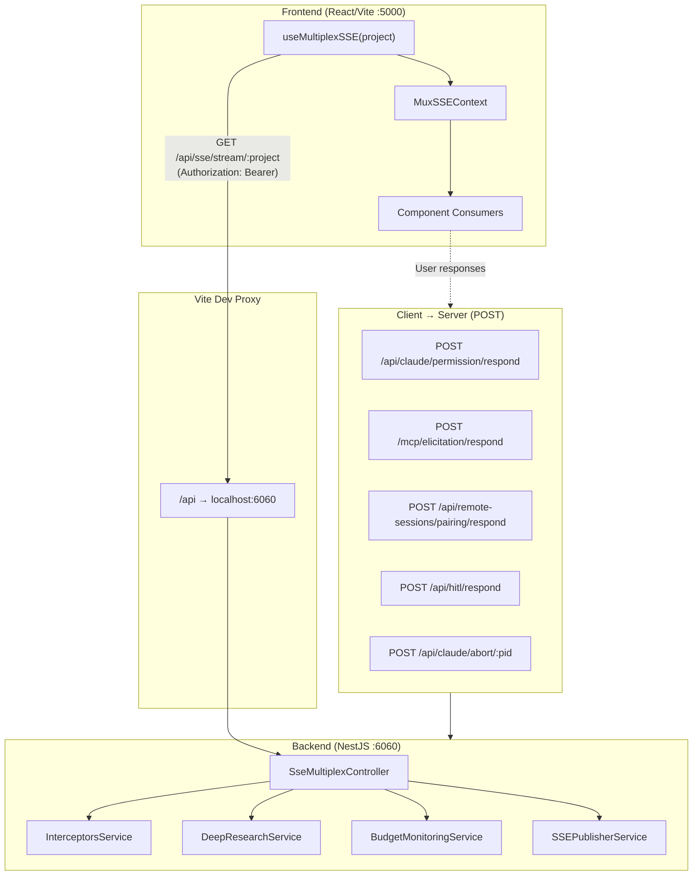
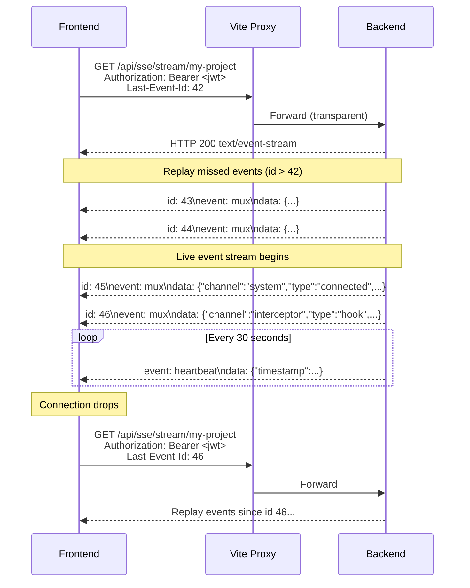
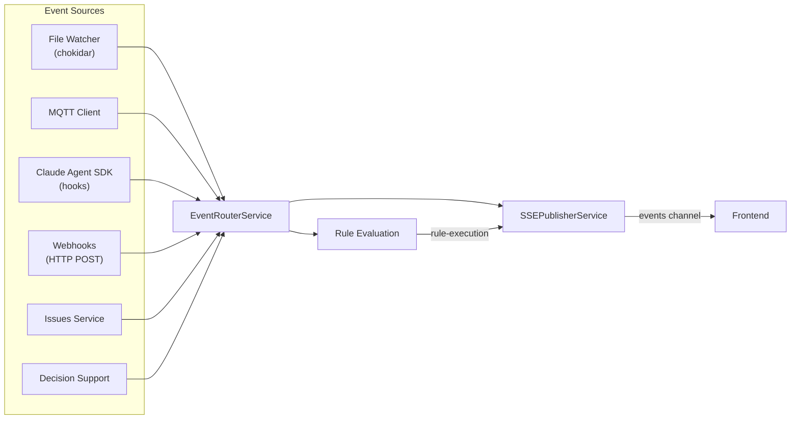
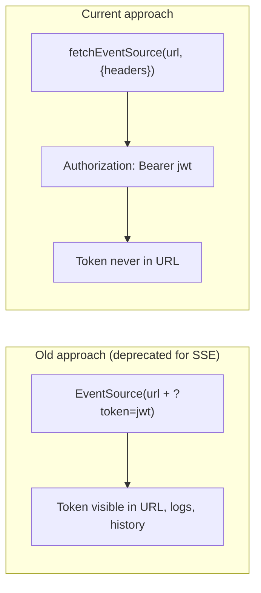
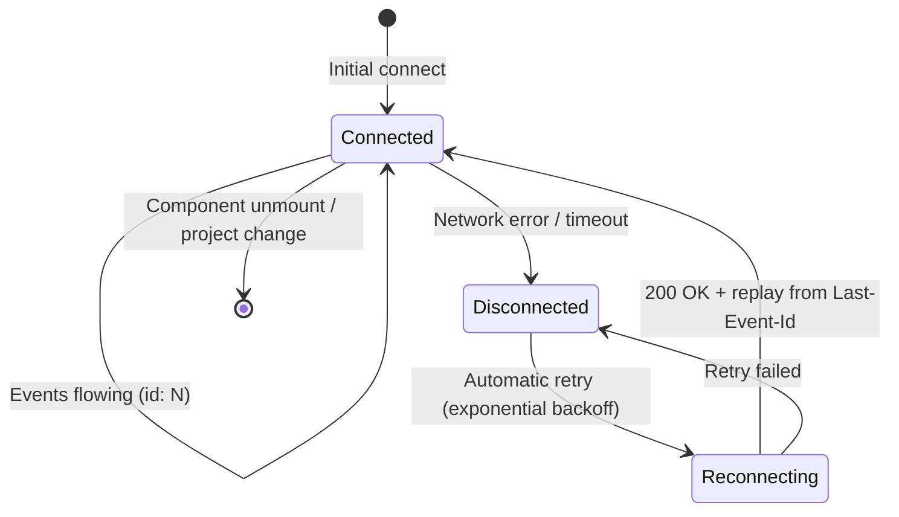
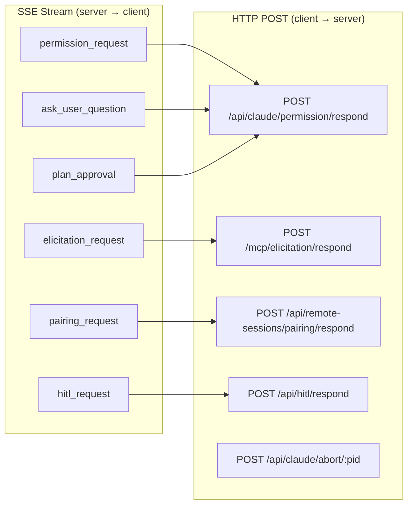
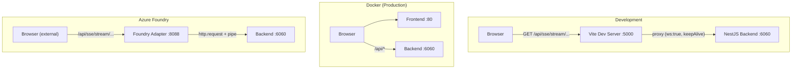

# SSE Communication Protocol: Frontend ↔ Backend

This document describes the Server-Sent Events (SSE) based real-time communication protocol between the React frontend and the NestJS backend.

## Architecture Decision: Why SSE (Not WebSocket)

We evaluated WebSocket as an alternative and decided to stay with SSE for these reasons:

| Criterion | SSE | WebSocket |
|-----------|-----|-----------|
| Performance | Equal for our workload (small JSON, ~90% server→client) | No measurable gain |
| Proxy compatibility | Transparent through any HTTP proxy | Requires explicit upgrade handling |
| Azure/Foundry adapter | Works without changes | Would require non-trivial rewrite |
| NestJS integration | Native `@Sse()` + Observable pattern | Requires separate `@WebSocketGateway` |
| Browser reconnection | Built-in with `Last-Event-Id` | Manual implementation needed |
| OpenAPI docs | SSE endpoints appear in Swagger | WebSocket requires separate AsyncAPI |

**Mitigations for SSE pain points:**
1. Auth token exposure → Replaced `EventSource` with `@microsoft/fetch-event-source` (supports `Authorization` headers)
2. Unreliable reconnection → Added sequence IDs and `Last-Event-Id` replay
3. Untyped protocol → Added shared TypeScript/JSDoc type definitions

---

## High-Level Architecture



---

## Connection Lifecycle



---

## Wire Format

### Multiplexed Events (sequenced)

Every domain event is wrapped in the `mux` envelope with a monotonically increasing sequence ID:

```
id: 127
event: mux
data: {"channel":"interceptor","type":"permission_request","payload":{...}}

```

The `id` field enables reliable reconnection via `Last-Event-Id`.

### Heartbeat (not sequenced)

Heartbeats keep the connection alive and are NOT assigned a sequence ID (they are ephemeral):

```
event: heartbeat
data: {"timestamp":1715000000000}

```

---

## Channels

### Channel: `interceptor`

Claude Code SDK hooks and interactive events for the active project.

| Event Type | Payload | Description |
|------------|---------|-------------|
| `hook` | SDK hook event | Pre/PostToolUse hooks |
| `event` | SDK lifecycle event | UserPromptSubmit, Notification, Stop, etc. |
| `elicitation_request` | `{id, message, requestedSchema, toolName}` | MCP tool requesting user input |
| `permission_request` | `{id, requestId, toolName, toolInput, suggestions?}` | Tool permission approval |
| `ask_user_question` | `{id, question, ...}` | Claude asking the user a question |
| `plan_approval` | `{id, plan, ...}` | Plan mode exit approval request |
| `chat_message` | `{id, message, ...}` | Chat message from Claude |
| `hitl_request` | `{id, action, context, ...}` | Human-in-the-loop verification |

### Channel: `interceptor-global`

Global interceptor events not tied to a specific project (e.g., Telegram pairing).

| Event Type | Payload | Description |
|------------|---------|-------------|
| `pairing_request` | `{id, service, username, ...}` | Remote session pairing request |

### Channel: `research`

Deep research progress events.

| Event Type | Payload | Description |
|------------|---------|-------------|
| `Research.started` | Session metadata | Research session initiated |
| `Research.created` | Response object | Response created |
| `Research.in_progress` | Progress data | Research in progress |
| `Research.web_search.in_progress` | Query info | Web search started |
| `Research.web_search.searching` | Query + status | Actively searching |
| `Research.web_search.completed` | Results summary | Search completed |
| `Research.output_item.added` | Item metadata | New output item |
| `Research.output_item.done` | Final item | Output item complete |
| `Research.content_part.added` | Content part | Content part started |
| `Research.content_part.done` | Final content | Content part complete |
| `Research.reasoning.delta` | `{delta: string}` | Reasoning text chunk |
| `Research.output_text.delta` | `{delta: string}` | Output text chunk |
| `Research.output_text.done` | `{text: string}` | Final output text |
| `Research.completed` | Final response | Research complete |
| `Research.error` | `{error: string}` | Research failed |

### Channel: `budget`

Cost monitoring updates.

| Event Type | Payload | Description |
|------------|---------|-------------|
| `budget-update` | `{project, timestamp, currentCosts, numberOfSessions, currency}` | Budget state change |

### Channel: `events`

Condition monitoring, prompt/workflow execution, and service status.

| Event Type | Payload | Description |
|------------|---------|-------------|
| `event` | InternalEvent | Raw event published (see Event Sources below) |
| `rule-execution` | Rule match details | When a rule triggers on an event |
| `prompt-execution` | `{status, promptId?, error?}` | Prompt execution lifecycle |
| `workflow-execution` | `{status, workflowId?, stepName?, error?}` | Workflow state transitions |
| `script-execution` | Script result | Async script completed |
| `chat-refresh` | `{}` | Signal to refresh chat UI |
| `service-status` | Service state | MQTT/file-watcher/scheduler status |

#### Event Sources (InternalEvent producers)

The `event` type on the `events` channel carries an `InternalEvent` payload. These events are produced by various backend services:



##### File Watcher Events

The `FileWatcherService` uses chokidar to monitor the workspace directory and emits events when files or directories change. These flow through the `events` channel as `InternalEvent` payloads.

| Event Name | Group | Source | Payload |
|------------|-------|--------|---------|
| `File Created` | Filesystem | File Watcher | `{path, absolutePath, timestamp}` |
| `File Modified` | Filesystem | File Watcher | `{path, absolutePath, timestamp}` |
| `File Deleted` | Filesystem | File Watcher | `{path, absolutePath, timestamp}` |
| `Directory Created` | Filesystem | File Watcher | `{path, absolutePath, timestamp}` |
| `Directory Deleted` | Filesystem | File Watcher | `{path, absolutePath, timestamp}` |

**Watcher configuration:**
- Watches: `workspace/` directory (up to 10 levels deep)
- Ignores: hidden files/dirs, `node_modules`, `.git`, `.etienne`, `out/`
- Stabilization: 500ms threshold, 100ms poll interval (avoids partial-write events)
- Events are scoped to a project based on the first directory segment

##### MQTT Events

| Event Name | Group | Source | Payload |
|------------|-------|--------|---------|
| `MQTT Message Received` | MQTT | MQTT Client | `{message, qos, retain}` |

Topic field is populated with the MQTT topic (e.g., `/sensors/coffeemachine`).

##### Claude Agent SDK Events

| Event Name | Group | Source | Payload |
|------------|-------|--------|---------|
| `UserPromptSubmit` | Claude Code | Claude Agent SDK | Prompt data |
| `Notification` | Claude Code | Claude Agent SDK | Notification content |
| `Stop` | Claude Code | Claude Agent SDK | Stop reason |
| `SubagentStop` | Claude Code | Claude Agent SDK | Subagent info |
| `SessionStart` | Claude Code | Claude Agent SDK | Session metadata |
| `file_added` | Claude Code | Claude Agent SDK | `{path, tool}` |
| `file_changed` | Claude Code | Claude Agent SDK | `{path, tool}` |

##### Webhook Events (external HTTP POST)

External systems can publish events via `POST /api/events/:project/webhook`:

```json
{
  "name": "Deployment Completed",
  "group": "CI/CD",
  "source": "GitHub Actions",
  "payload": { "commit": "abc123", "status": "success" }
}
```

##### InternalEvent Structure

All events on the `events` channel share this structure:

```typescript
interface InternalEvent {
  id: string;            // UUIDv4 (auto-generated)
  timestamp: string;     // ISO 8601 (auto-generated)
  name: string;          // e.g., "File Created", "MQTT Message Received"
  group: string;         // e.g., "Filesystem", "MQTT", "Claude Code"
  source: string;        // e.g., "File Watcher", "MQTT Client"
  topic?: string;        // Optional topic (MQTT, webhooks)
  payload: any;          // Event-specific data
  projectName?: string;  // Project scope
  correlationId?: string; // Causal chain tracing
}
```

### Channel: `system`

Connection lifecycle.

| Event Type | Payload | Description |
|------------|---------|-------------|
| `connected` | `{project, channels: [...]}` | Initial connection acknowledgment |

---

## Authentication



The frontend uses `@microsoft/fetch-event-source` which supports custom headers via the `fetch()` API. The JWT is sent as a standard `Authorization: Bearer <token>` header.

**Token refresh on 401:** If the SSE connection receives a 401, the `onopen` handler attempts a token refresh via `POST /auth/refresh` before retrying.

**Backend guard:** The `JwtAuthGuard` extracts tokens from either:
1. `Authorization: Bearer <token>` header (preferred)
2. `?token=<token>` query parameter (fallback for iframe/video src)

---

## Reliable Reconnection



### Sequence Numbering

Every `mux` event is assigned a monotonically increasing `id` (per project). The backend maintains a ring buffer of the last 100 events per project.

### Reconnection Flow

1. Connection drops → `fetchEventSource` retries with exponential backoff
2. On reconnect, the `Last-Event-Id` header is automatically sent (tracked in `lastEventIdRef`)
3. Backend receives `Last-Event-Id`, replays all buffered events with `id > lastEventId`
4. Normal streaming resumes after replay

### Buffer Limits

- **Backend replay buffer:** 100 events per project (ring buffer, oldest evicted)
- **InterceptorsService ReplaySubject:** 10 events, 30-second TTL (for late-subscribing channels)

If the client disconnects for longer than the buffer retains events, some events may be lost. For critical events (permission requests, elicitation), the backend holds the request open until a response is received — so they will be re-emitted on the next session.

---

## Client-to-Server Communication

While SSE is unidirectional (server → client), the frontend sends responses back to the backend via standard HTTP POST endpoints:



| Request Type | POST Endpoint | Request Body |
|-------------|---------------|--------------|
| Permission response | `/api/claude/permission/respond` | `{id, requestId, permission, toolName, reasoning?}` |
| Elicitation response | `/mcp/elicitation/respond` | `{id, answer}` |
| Pairing response | `/api/remote-sessions/pairing/respond` | `{id, accepted}` |
| HITL response | `/api/hitl/respond` | `{id, approved, reason?}` |
| Abort process | `/api/claude/abort/:pid` | (empty) |

---

## Frontend Usage

### Hook API

```javascript
import useMultiplexSSE from '../hooks/useMultiplexSSE';
import { useMuxSSE } from '../contexts/MuxSSEContext';

// In a top-level component:
const mux = useMultiplexSSE(currentProject);

// In any child component (via context):
const mux = useMuxSSE();

// Subscribe to all events on a channel:
mux.on('interceptor', '*', (payload, type) => {
  console.log(`Interceptor event: ${type}`, payload);
});

// Subscribe to a specific event type:
mux.on('research', 'Research.output_text.delta', (payload) => {
  appendText(payload.delta);
});

// Unsubscribe:
mux.off('research', 'Research.output_text.delta', handler);

// Check connection state:
if (mux.connected.current) { /* ... */ }
```

### Component Consumers

| Component | Channel | Event Types |
|-----------|---------|-------------|
| `Interceptors.jsx` | `interceptor`, `interceptor-global` | `*` (all) |
| `EventHandling.jsx` | `events` | `*` (all) |
| `ResearchDocument.jsx` | `research` | `*` (all) |
| `useTabStateSSE.js` | `events` | `prompt-execution`, `chat-refresh` |

---

## Proxy Architecture



### Vite Dev Proxy (vite.config.js)

```javascript
proxy: {
  '/api': {
    target: 'http://localhost:6060',
    changeOrigin: true,
    ws: true,
    agent: new Agent({ maxSockets: 50, keepAlive: true })
  }
}
```

The `keepAlive: true` and `maxSockets: 50` ensure SSE connections are not prematurely closed and concurrent connections are supported.

### Azure Foundry Adapter

The Foundry adapter on port 8088 uses raw `http.request()` with stream piping, which transparently passes SSE responses without buffering. The `X-Accel-Buffering: no` header is set by the backend to prevent proxy buffering.

---

## Type Definitions

### Backend (TypeScript)

Types are defined in `backend/src/sse-multiplex/sse-mux.types.ts`:

```typescript
import { MuxChannel, MuxEventType, MuxEnvelope } from './sse-mux.types';
```

### Frontend (JSDoc)

Types are defined in `frontend/src/hooks/sse-mux.types.js`:

```javascript
/** @typedef {import('./sse-mux.types').MuxChannel} MuxChannel */
/** @typedef {import('./sse-mux.types').MuxEnvelope} MuxEnvelope */
```

Both files define the same protocol — keep them in sync when adding new channels or event types.

---

## Adding a New Channel

1. **Backend:** Create a service that exposes an RxJS Observable/Subject
2. **Backend types:** Add the channel name to `MuxChannel` and event types to the appropriate union in `sse-mux.types.ts`
3. **Backend controller:** Subscribe to the new service in `SseMultiplexController.stream()` and add the channel to the default set
4. **Frontend types:** Mirror the new types in `frontend/src/hooks/sse-mux.types.js`
5. **Frontend:** Subscribe in your component via `mux.on('new-channel', 'event-type', handler)`

### Example: Adding a "notifications" channel

```typescript
// Backend: sse-multiplex.controller.ts
if (requested.has('notifications')) {
  const sub = this.notificationsService
    .getStream(project)
    .subscribe((event) => send('notifications', event.type, event.data));
  subscriptions.push(sub);
}
```

```javascript
// Frontend: MyComponent.jsx
const mux = useMuxSSE();
useEffect(() => {
  const handler = (payload, type) => { /* ... */ };
  mux.on('notifications', '*', handler);
  return () => mux.off('notifications', '*', handler);
}, [mux]);
```

---

## Operational Notes

### Connection Limits
- The multiplexed SSE uses **1 connection per project** (not per channel)
- This avoids the browser's HTTP/1.1 limit of 6 concurrent connections per origin
- Additional SSE connections exist for per-prompt streaming (`/api/claude/streamPrompt/sdk`) which are short-lived

### Headers Set by Backend
```
Content-Type: text/event-stream
Cache-Control: no-cache
Connection: keep-alive
X-Accel-Buffering: no
```

### Monitoring
- Console logs: `[MuxSSE] Connected for project <name>` on successful connection
- Console warnings: `[MuxSSE] connection error, will retry` on disconnection
- Heartbeat every 30s keeps proxies from timing out idle connections

### Security
- JWT tokens are sent via `Authorization` header (not exposed in URLs)
- `authSSEUrl()` still exists for non-SSE authenticated resources (iframe src, video src)
- Backend validates JWT on every connection establishment via `JwtAuthGuard`

---

## Key Files

| File | Purpose |
|------|---------|
| `backend/src/sse-multiplex/sse-multiplex.controller.ts` | SSE endpoint with multiplexing + sequence IDs |
| `backend/src/sse-multiplex/sse-mux.types.ts` | TypeScript type definitions for the protocol |
| `backend/src/sse-multiplex/sse-multiplex.module.ts` | NestJS module wiring |
| `backend/src/interceptors/interceptors.service.ts` | Interceptor events (ReplaySubject) |
| `backend/src/deep-research/deep-research.service.ts` | Research events (ReplaySubject) |
| `backend/src/budget-monitoring/budget-monitoring.service.ts` | Budget events (Subject) |
| `backend/src/event-handling/publishers/sse-publisher.service.ts` | Event handling publisher |
| `backend/src/auth/jwt-auth.guard.ts` | JWT validation (header + query fallback) |
| `frontend/src/hooks/useMultiplexSSE.js` | Fetch-based SSE client with reconnection |
| `frontend/src/hooks/sse-mux.types.js` | JSDoc type definitions |
| `frontend/src/contexts/MuxSSEContext.jsx` | React context provider |
| `frontend/src/services/api.js` | API client + `authSSEUrl` for non-SSE resources |
| `frontend/vite.config.js` | Dev proxy configuration |
