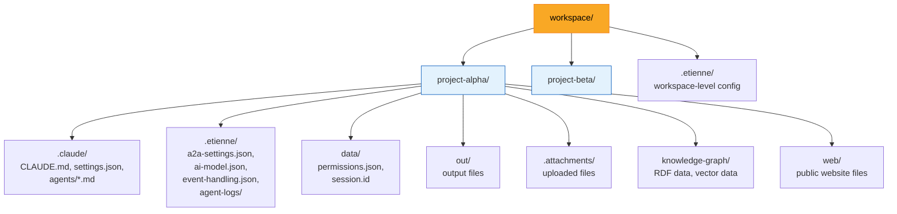
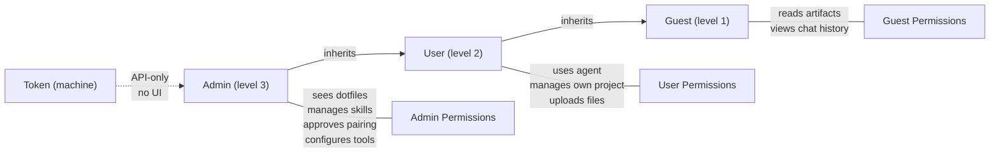

# ADR-001: Project Isolation and Multi-Tenancy

**Status:** Accepted
**Date:** 2026-05-06

## Context

Enterprise AI agent platforms risk data leakage across tenants and projects. When multiple users or departments share an agent system, knowledge graphs, chat histories, workflow state, and configuration can bleed between contexts. Etienne needed an isolation model where data separation, portability, and the "right to forget" are architectural guarantees -- not afterthoughts.

The target deployment model spans local developer workstations, Docker containers, and Azure Foundry microVMs, requiring an isolation strategy that works identically across all environments.

## Decision

All user data lives inside a single **workspace directory**. Each subdirectory within the workspace is a **project** (tenant). Every service -- RDF store, vector store, sessions, knowledge graphs, event logs, chat history, memories -- stores its data within the project directory it belongs to. Configuration lives in dotfile directories (`.claude/`, `.etienne/`). The user-visible filesystem hides dotfiles; only the admin role can see them.



### Key principles

- **Right to forget**: Deleting a project directory purges all associated data -- chat history, knowledge graphs, embeddings, event logs, configuration. No orphaned data remains in external systems.
- **Portability**: Copying a project directory transfers the complete state. A project can be moved between Etienne instances or archived as a ZIP file.
- **Cross-project isolation**: The coding agent's root directory is set at project level by default. Cross-project work is possible but must be explicitly enabled.
- **Dotfile convention**: Internal files and directories starting with `.` are hidden from the user role in the file explorer. Only the admin role can see `.claude/`, `.etienne/`, `.mcp.json`, etc.

## Consequences

**Positive:**
- Data isolation is enforced by the filesystem, the simplest and most auditable mechanism
- No shared database means no accidental cross-tenant queries
- Backup and restore is a filesystem copy operation
- Compliance with data residency requirements is straightforward (the workspace directory determines data location)
- Project deletion is complete and verifiable

**Negative:**
- Cross-project analytics or search requires explicit federation logic
- Workspace-level features (e.g., global skill store, user orders) need a separate `.etienne/` directory at workspace root
- Storage efficiency is lower than shared databases (some data structures are duplicated per project)

## Implementation Details

### Project structure

```
workspace/<project-name>/
├── .claude/                   # Coding agent configuration
│   ├── CLAUDE.md              # System prompt / role definition
│   ├── settings.json          # Agent-specific hooks and config
│   └── agents/                # Subagent definitions
│       └── <agent>.md
├── .etienne/                  # Etienne platform configuration
│   ├── a2a-settings.json      # Agent-to-agent config
│   ├── ai-model.json          # Alternative model selection
│   ├── intent-router.json     # Intent-to-workflow mappings
│   ├── event-handling.json    # CMS rules configuration
│   ├── pi-mcp-bridge.json     # Pi-mono MCP allowlist
│   └── agent-logs/            # Agent bus trace logs (JSONL)
├── .mcp.json                  # MCP server configuration
├── .attachments/              # User-uploaded files
├── data/
│   ├── permissions.json       # Tool permission allowlist
│   └── session.id             # Current session identifier
├── out/                       # Agent output files
├── web/                       # Public website files (Flask)
└── skills/                    # Project-level skills (copied from store)
```

### Role-based access control



Roles are enforced via `@Roles()` decorator and `RolesGuard` on NestJS endpoints. JWT tokens carry the user's role, mapped from the authentication provider (local OAuth server, Azure Entra ID group membership, or AWS Cognito groups).

### Project-scoped services

All local services treat projects like tenants:

| Service | Data location within project |
|---------|------------------------------|
| RDF Store (Quadstore) | `knowledge-graph/` |
| Vector Store (ChromaDB) | `knowledge-graph/vector-store/` |
| Chat Sessions | `data/` (JSONL files) |
| Event Logs | `.etienne/event-log/` |
| Agent Bus Logs | `.etienne/agent-logs/` |
| Checkpoints | `.etienne/checkpoints.json` |
| Memories | `.etienne/memories/` |
| Scrapbook | `.etienne/scrapbook/` |

### Key source files

- `backend/src/claude/claude.service.ts` -- project directory validation (`ensureProject`)
- `backend/src/content-management/` -- project file CRUD and dotfile filtering
- `backend/src/projects/` -- project listing, creation, deletion
- `backend/src/sessions/` -- project-scoped chat session persistence

## Base Value Alignment

| Base Value | Alignment |
|-----------|-----------|
| **1. Data Isolation** | **Primary ADR** -- this is the foundational decision for data isolation |
| **2. Exchangeable Inner Harness** | Neutral. Project structure accommodates all five harnesses via `.claude/`, `.codex/`, `.opencode/`, etc. |
| **3. Rich Configuration** | Project-scoped `.mcp.json`, `.etienne/` configs, and `data/permissions.json` provide per-project tool and service configuration |
| **4. Composable Services** | All optional services (RDF, vector, Flask) store data in the project directory, enabling independent deployment |
| **5. Agentic Engineering** | Project creation via the UI wizard is partially agentic; the agent can modify its own `.claude/CLAUDE.md` and skill files |

**Violations:** None. This ADR is the primary expression of base value 1.
