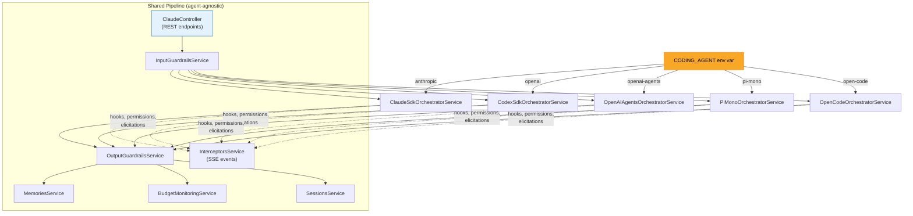
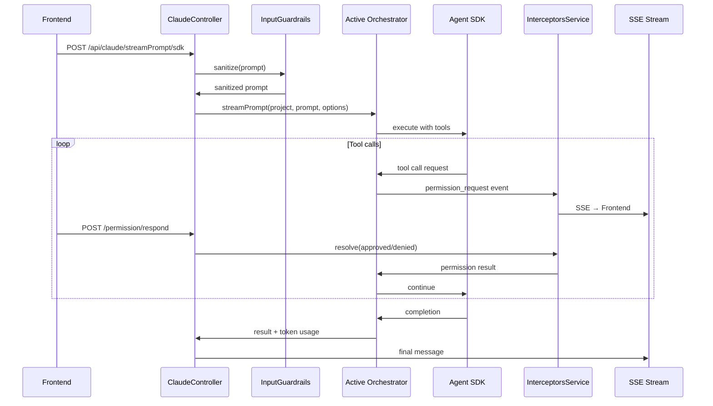

# ADR-002: Inner Harness Design -- Exchangeable Coding Agent Orchestrators

**Status:** Accepted
**Date:** 2026-05-06

## Context

The market for coding agent harnesses is evolving rapidly. Locking into a single vendor (Anthropic Claude Code SDK) would create strategic risk. Etienne is designed as an **outer harness** (UI and integration layer) around an **inner harness** (coding agent SDK). The inner harness must be exchangeable without affecting the frontend, SSE communication, permission flows, guardrails, budget tracking, or session management.

Five coding agent SDKs are currently supported: Anthropic Claude Agent SDK, OpenAI Codex, OpenAI Agents SDK, Pi-Mono, and OpenCode. Each has different capabilities, but the outer harness must present a unified interface to the rest of the system.

## Decision

Each inner harness is implemented as an **orchestrator** that follows a common service pattern. A single environment variable `CODING_AGENT` selects the active orchestrator at startup. The `ClaudeController` -- despite its name -- is agent-agnostic: it delegates to whichever orchestrator the configuration selects. `CodingAgentConfigurationService` provides runtime agent-type detection, config directory resolution, and mission file mapping.

### Orchestrator pattern

Each orchestrator implements:
1. **Orchestrator Service** -- prompt execution, streaming, tool coordination
2. **Session Manager** -- session lifecycle, token tracking, file persistence
3. **Permission Adapter** (where needed) -- bridges SDK-specific permission mechanisms to the shared SSE pipeline

### Prompt execution flow

## Consequences

**Positive:**
- Switching agent SDKs requires changing one environment variable -- zero frontend changes
- New SDKs can be added by implementing the orchestrator pattern without modifying the shared pipeline
- Feature gaps in one SDK don't block the platform (users can switch to another)
- Enables A/B testing of different coding agents on the same infrastructure

**Negative:**
- The "lowest common denominator" problem: some SDK features (e.g., Claude's native subagents) can't be fully abstracted
- Pi-mono requires custom bridge code (MCP bridge, subagent simulation, permission bridge), deviating from the pure interface ideal
- The `ClaudeController` naming is confusing -- it handles all agents, not just Claude

## Implementation Details

### Coding agent feature matrix

| Feature | Anthropic | Codex | OpenAI Agents | Pi-Mono | OpenCode |
|---|:-:|:-:|:-:|:-:|:-:|
| **Subagents** | Native SDK | Understands defs | Agents-as-tools | Simulated (Task tool) | Native (agent system) |
| **MCP tools** | Native | Native | Native | Bridge (tools only) | Native |
| **MCP resources/prompts/sampling** | Yes | Yes | Partial | No | Yes |
| **Agent skills** | agentskills.io | Via AGENTS.md | Via AGENTS.md | Via skills dir | Native skill tool |
| **Elicitations** | AskUserQuestion tool | No | No | Via beforeToolCall | question tool |
| **Plan mode** | Built-in | No | No | No | Custom modes |
| **Multi-provider models** | Anthropic only | OpenAI only | OpenAI only | 50+ providers | 75+ providers |
| **LSP / code intelligence** | No | No | No | No | 30+ languages |
| **Permission prompts** | canUseTool callback | No | No | beforeToolCall bridge | permission.asked events |
| **Session resume** | Yes | Yes | No | Yes | Yes (SQLite) |
| **Guardrails** | Yes | Yes | Yes | Partial | Yes |

### Agent-specific configuration directories

Each orchestrator stores its configuration in a harness-specific directory within the project:

| Agent | Config directory | Mission file |
|-------|-----------------|-------------|
| Anthropic | `.claude/` | `CLAUDE.md` |
| Codex | `.codex/` | `AGENTS.md` |
| OpenAI Agents | `.openai-agents/` | `AGENTS.md` |
| Pi-Mono | `.pi-mono/` | `AGENTS.md` |
| OpenCode | `.opencode/` | `AGENTS.md` |

### Key source files

- `backend/src/coding-agent-configuration/coding-agent-configuration.service.ts` -- runtime agent type detection, config directory mapping
- `backend/src/claude/claude.controller.ts` -- agent-agnostic REST endpoints
- `backend/src/claude/sdk/claude-sdk-orchestrator.service.ts` -- Anthropic orchestrator
- `backend/src/claude/codex-sdk/codex-sdk-orchestrator.service.ts` -- Codex orchestrator
- `backend/src/claude/openai-agent-sdk/openai-agents-orchestrator.service.ts` -- OpenAI Agents orchestrator
- `backend/src/claude/pi-mono-sdk/pi-mono-orchestrator.service.ts` -- Pi-Mono orchestrator
- `backend/src/claude/opencode-sdk/opencode-sdk-orchestrator.service.ts` -- OpenCode orchestrator

## Base Value Alignment

| Base Value | Alignment |
|-----------|-----------|
| **1. Data Isolation** | Each harness respects project boundaries via the shared session and file management pipeline |
| **2. Exchangeable Inner Harness** | **Primary ADR** -- this is the foundational decision for harness exchangeability |
| **3. Rich Configuration** | Per-harness config directories and mission files provide harness-specific tuning within the shared framework |
| **4. Composable Services** | Orchestrators can be added/removed independently; unused SDKs carry no runtime cost |
| **5. Agentic Engineering** | The system prompt (CLAUDE.md/AGENTS.md) and skill files are designed to be created and refined by the agent itself |

**Violations:** Pi-mono requires custom bridge extensions (MCP bridge, subagent tool simulation, permission bridge) that deviate from the pure "identical interface" ideal. This is a known trade-off: Pi-mono's multi-provider model support (50+ providers, OAuth subscription auth) justifies the additional bridge code.
