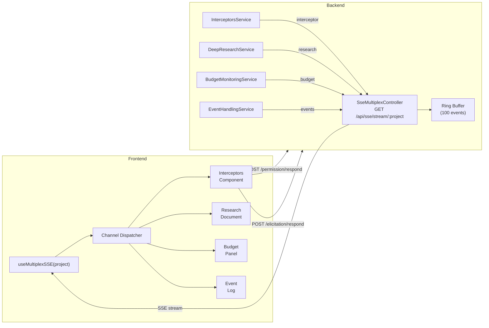
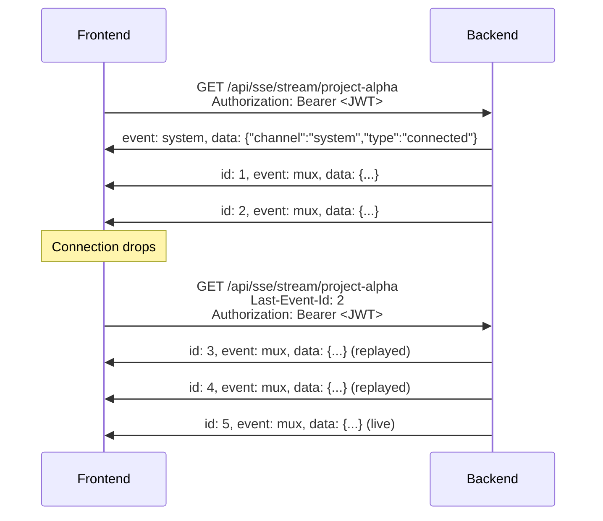

# ADR-003: SSE Communication Protocol

**Status:** Accepted
**Date:** 2026-05-06

## Context

Real-time communication between the React frontend and NestJS backend is critical for interactive agent sessions. The frontend must receive streaming token output, permission requests, elicitation prompts, budget updates, file change notifications, research progress, and HITL verification requests -- all in real time.

WebSocket was evaluated and rejected. The workload is approximately 90% server-to-client (agent output, events, notifications). HTTP proxies and CDNs handle SSE transparently without special configuration. NestJS has native SSE support via `@Sse()` decorator. WebSocket would require additional infrastructure (sticky sessions, proxy upgrades) without proportional benefit.

A key constraint is the browser's HTTP/1.1 limit of 6 concurrent connections per origin. Multiple SSE connections (one per channel) would quickly exhaust this limit, leaving no capacity for REST API calls.

## Decision

Use **multiplexed Server-Sent Events** over a single connection per project. All event types are routed through named **channels** within one SSE stream. A 100-event **ring buffer** per project enables reliable reconnection via the `Last-Event-Id` header. The client uses `@microsoft/fetch-event-source` to support `Authorization: Bearer` headers (the native `EventSource` API does not support custom headers).



### Wire format

Every event follows the multiplexed envelope format:

```
id: 127
event: mux
data: {"channel":"interceptor","type":"permission_request","payload":{...}}
```

- **id**: Monotonically increasing sequence number (per project, wraps at ring buffer size)
- **event**: Always `mux` (allows a single `addEventListener` on the client)
- **data**: JSON envelope with `channel`, `type`, and `payload`

### Heartbeat (unsequenced)

```
event: heartbeat
data: ""
```

Sent every 30 seconds to keep the connection alive through proxies and load balancers.

## Consequences

**Positive:**
- Single connection per project avoids the browser 6-connection limit
- `Last-Event-Id` replay provides reliable reconnection without custom protocol logic
- SSE works through HTTP proxies, CDNs, and reverse proxies without configuration
- JWT in `Authorization` header -- never exposed in URL query parameters
- NestJS `@Sse()` decorator provides native support with RxJS observables
- Heartbeats prevent proxy timeout (commonly 60s or 120s)

**Negative:**
- SSE is unidirectional (server-to-client); client-to-server communication requires separate POST endpoints
- Ring buffer size (100 events) limits replay window; long disconnections may miss events
- No binary frame support (all payloads are JSON text)

## Implementation Details

### Channels

| Channel | Purpose | Event types |
|---------|---------|-------------|
| `interceptor` | SDK hooks and project-specific interaction events | `hook`, `event`, `permission_request`, `elicitation_request`, `ask_user_question`, `plan_approval`, `pairing_request`, `chat_message`, `hitl_request` |
| `interceptor-global` | Cross-project events (e.g., Telegram pairing) | `pairing_request` |
| `research` | Deep research progress streaming | `search`, `reasoning`, `output`, `sources` |
| `budget` | Cost monitoring updates | `budget-update` |
| `events` | CMS rule execution, file changes, workflow events | `condition_executed`, `prompt_executed`, `workflow_executed`, `chat_refresh` |
| `system` | Connection lifecycle | `connected` |

### Reconnection sequence



### Client-to-server communication

Since SSE is server-to-client only, user responses are sent via dedicated POST endpoints:

| SSE event type | Response endpoint |
|---------------|-------------------|
| `permission_request` | `POST /api/claude/permission/respond` |
| `elicitation_request` | `POST /mcp/elicitation/respond` |
| `pairing_request` | `POST /api/remote-sessions/pairing/respond` |
| `hitl_request` | `POST /api/hitl/respond` |
| `plan_approval` | `POST /api/claude/plan/respond` |
| `ask_user_question` | `POST /api/claude/ask-user/respond` |
| (abort) | `POST /api/claude/abort/:pid` |

### Token refresh on 401

When the SSE connection receives a 401 response, the client:
1. Calls `POST /auth/refresh` with the refresh token
2. Receives a new access token
3. Reconnects with the new `Authorization: Bearer` header and `Last-Event-Id`

### Key source files

- `backend/src/sse-multiplex/sse-multiplex.controller.ts` -- SSE endpoint, ring buffer, heartbeat
- `backend/src/sse-multiplex/sse-mux.types.ts` -- shared type definitions
- `backend/src/interceptors/interceptors.service.ts` -- hook/event buffering and broadcast
- `frontend/src/hooks/useMultiplexSSE.js` -- client-side SSE connection management
- `frontend/src/contexts/MuxSSEContext.jsx` -- React context sharing SSE state
- `SSE-between-frontend-and-backend.md` -- full protocol specification

## Base Value Alignment

| Base Value | Alignment |
|-----------|-----------|
| **1. Data Isolation** | SSE streams are project-scoped; each connection is bound to a single project |
| **2. Exchangeable Inner Harness** | The SSE pipeline is agent-agnostic; all five orchestrators publish through `InterceptorsService` |
| **3. Rich Configuration** | Channel subscriptions are configurable per connection via query parameters |
| **4. Composable Services** | SSE is a standard HTTP protocol requiring no additional infrastructure beyond the NestJS backend |
| **5. Agentic Engineering** | The SSE protocol was itself designed and documented with agentic engineering support |

**Violations:** None.
