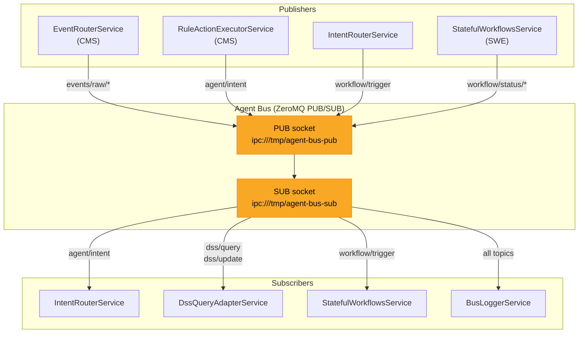
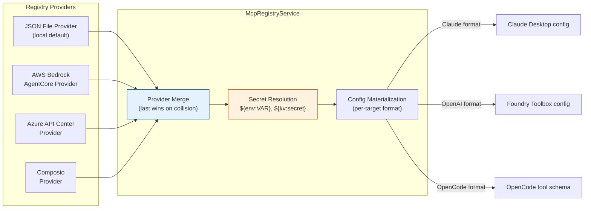
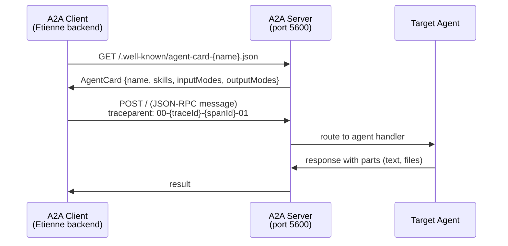
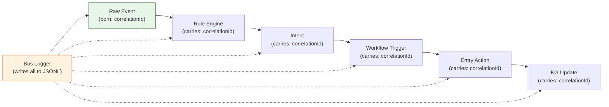

# ADR-004: Service Connectivity -- Agent Bus, MCP Registry, and A2A

**Status:** Accepted
**Date:** 2026-05-06

## Context

An AI agent platform must connect to external tools, other agents, and internal services. Three distinct connectivity needs exist:

1. **Internal event routing** between the CMS (condition monitoring), DSS (decision support), and SWE (workflow engine) subsystems
2. **External tool discovery and invocation** across multiple governance registries
3. **Inter-agent communication** for distributed multi-agent scenarios

Each connectivity layer has different characteristics: internal events require low-latency pub/sub, tool registries require secure credential management, and inter-agent messaging requires discovery and trace propagation.

## Decision

Three connectivity subsystems, each optimized for its use case:

### 1. ZeroMQ Agent Bus (internal)

PUB/SUB messaging via IPC sockets for internal event routing between CMS, DSS, and SWE.



**Topic namespaces:**
| Topic pattern | Publisher | Subscriber | Purpose |
|--------------|-----------|------------|---------|
| `events/raw/*` | EventRouterService | BusLoggerService | Raw inbound events |
| `agent/intent` | RuleActionExecutorService | IntentRouterService | LLM-classified intents |
| `workflow/trigger` | IntentRouterService | StatefulWorkflowsService | Workflow activation |
| `workflow/status/*` | StatefulWorkflowsService | BusLoggerService | Workflow lifecycle |
| `dss/query` | ContextInjectorService | DssQueryAdapterService | Knowledge graph queries |
| `dss/update` | Various | DecisionSupportService | Knowledge updates |

Every message carries a `correlationId` (UUIDv4) and `projectName` for full traceability.

### 2. MCP Tool Registry (external tools)

Provider-based architecture for discovering and configuring MCP servers from multiple governance sources.



**Secret placeholder syntax:**
- `${env:VAR_NAME}` -- resolve from environment variable
- `${kv:secret-name}` -- resolve from secrets manager (Azure Key Vault, AWS SM, OpenBao)
- `${kv:secret-name@v1}` -- pinned secret version

Placeholders are resolved at materialization time (not load time), so missing secrets are detected when the tool is actually used.

### 3. A2A Protocol (inter-agent)

Google's Agent-to-Agent protocol for inter-agent communication with discovery and observability.



## Consequences

**Positive:**
- ZeroMQ IPC sockets provide sub-millisecond latency for internal events with no network exposure
- MCP registry providers are independently deployable -- the JSON file provider works fully offline
- A2A protocol enables collaboration with external agents from other platforms
- Correlation IDs provide end-to-end traceability from raw event to knowledge graph update
- Secret placeholders support deferred resolution, avoiding credential exposure at config load time

**Negative:**
- ZeroMQ requires platform-specific socket paths (IPC on Unix, TCP on Windows)
- Cloud MCP providers (AWS Bedrock, Azure API Center, Composio) introduce optional remote dependencies
- A2A protocol is still emerging; breaking changes are possible

## Implementation Details

### ZeroMQ platform adaptation

| Platform | PUB socket | SUB/PULL socket |
|----------|-----------|-----------------|
| Unix/Docker | `ipc:///tmp/agent-bus-pub` | `ipc:///tmp/agent-bus-sub` |
| Windows | `tcp://127.0.0.1:5557` | `tcp://127.0.0.1:5558` |

### Correlation ID lifecycle



Trace retrieval: `GET /api/agent-bus/:project/trace/:correlationId`

### MCP registry provider interface

```typescript
interface IMcpRegistryProvider {
  listServers(): Promise<McpServerEntry[]>;
  getServer(name: string): Promise<McpServerEntry | undefined>;
  isAvailable(): Promise<boolean>;
}
```

Providers are registered with priority ordering. On name collision, the last registered provider wins.

### Key source files

- `backend/src/agent-bus/event-bus.service.ts` -- ZeroMQ PUB/SUB, topic routing, correlation IDs
- `backend/src/agent-bus/bus-logger.service.ts` -- JSONL trace logging per service per project
- `backend/src/mcp-registry/core/mcp-registry.service.ts` -- aggregating registry with provider merge
- `backend/src/mcp-registry/core/provider.interface.ts` -- provider interfaces
- `backend/src/mcp-registry/secrets/secret-resolver.ts` -- placeholder resolution chain
- `backend/src/mcp-registry/providers/` -- all four provider implementations
- `a2a-server/src/server.ts` -- A2A test server with agent registry
- `backend/src/a2a-client/a2a-client.service.ts` -- outbound A2A messaging

## Base Value Alignment

| Base Value | Alignment |
|-----------|-----------|
| **1. Data Isolation** | ZeroMQ bus is IPC/localhost only, no network exposure. MCP configs and A2A settings are per-project. |
| **2. Exchangeable Inner Harness** | All orchestrators use the same MCP registry and A2A client; connectivity is harness-independent |
| **3. Rich Configuration** | MCP registry and A2A settings are the primary configuration layer for tool and agent integration |
| **4. Composable Services** | Each connectivity layer can be selectively enabled. Cloud MCP providers are optional. |
| **5. Agentic Engineering** | MCP tool registration and A2A agent configuration can be performed by the agent via built-in tools |

**Violations:** The AWS Bedrock AgentCore, Azure API Center, and Composio MCP providers introduce optional cloud dependencies. Mitigated by: (a) the JSON file provider works fully offline, (b) cloud providers are opt-in, (c) all providers implement `isAvailable()` for graceful degradation.
