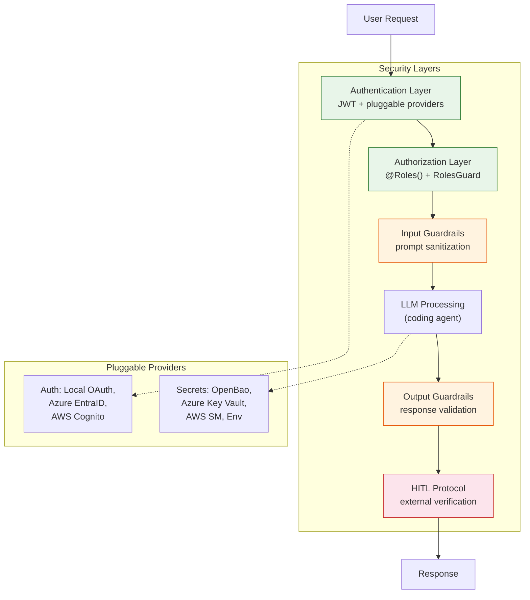
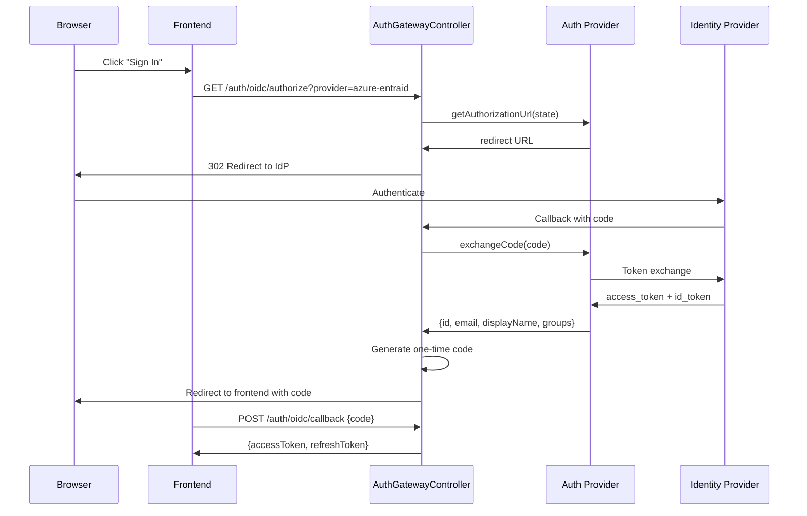
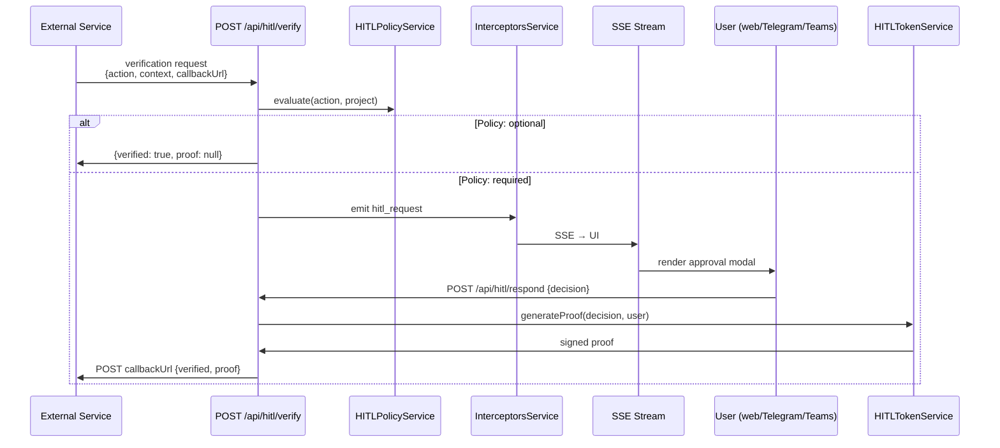

# ADR-005: Security Architecture

**Status:** Accepted
**Date:** 2026-05-06

## Context

An AI agent with filesystem access, tool execution, and external connectivity requires defense in depth. Threats include prompt injection, unauthorized API calls, secret exposure, privilege escalation, and unintended agent actions. The security model must support multiple deployment environments (local, Docker, Azure Foundry) and multiple identity providers without changing the application code.

## Decision

Multi-layered security with pluggable providers at each layer:

1. **Authentication** -- JWT with pluggable identity providers
2. **Authorization** -- Role-based access control (RBAC) with hierarchical roles
3. **Input Guardrails** -- Prompt sanitization before LLM processing
4. **Output Guardrails** -- Response validation after LLM processing
5. **HITL Protocol** -- Human-in-the-loop verification for external agent requests
6. **Secrets Management** -- Pluggable vault providers with fallback chain

## Consequences

**Positive:**
- Every layer is independently configurable and testable
- Pluggable providers allow deployment in any environment (local, Azure, AWS) without code changes
- HITL protocol provides interoperability with external agent frameworks (Oracle, AWS Nova Act, CrewAI)
- Secrets never appear in logs, URLs, or SSE payloads

**Negative:**
- Multiple security layers add request latency (input + output guardrails each invoke external APIs)
- Cloud auth providers (EntraID, Cognito) and cloud secrets managers (Key Vault, AWS SM) introduce remote dependencies
- HITL protocol is still evolving (v0.8); future spec changes may require migration

## Implementation Details

### Authentication flow

**Provider selection** via `AUTH_PROVIDER` environment variable:
| Value | Provider | Identity source |
|-------|----------|----------------|
| `local` (default) | OAuth server (:5950) | Local user database (`/users/` directory) |
| `azure-entraid` | Azure Entra ID | Microsoft Graph API group membership |
| `aws-cognito` | AWS Cognito | `cognito:groups` JWT claim |

**Role mapping:** Admin groups configurable via `AUTH_PROVIDER_ADMIN_GROUPS` environment variable. Users in these groups receive the `admin` role; all others receive `user`.

### HITL Protocol (v0.8)

**Verification policies** per project (`.claude/hitl-config.json`):
- `optional` -- auto-approve
- `required` -- always require human decision
- `step_up_only` -- required only for elevated-risk actions (pattern matching)

### Secrets management

Provider selection via `SECRET_VAULT_PROVIDER` environment variable:

| Value | Provider | Notes |
|-------|----------|-------|
| `openbao` (default) | OpenBao (HashiCorp Vault fork) | KV Secrets Engine v2, runs locally |
| `azure-keyvault` | Azure Key Vault | ClientSecretCredential, auto underscore-to-hyphen |
| `aws` | AWS Secrets Manager | Standard credential chain, optional prefix |
| `env` | Environment variables | Always available as fallback |

**Fallback chain:** Primary provider → `EnvProvider` (always appended). If the primary provider can't resolve a secret, the system falls back to environment variables.

### Key source files

- `backend/src/auth/auth-gateway.controller.ts` -- provider routing
- `backend/src/auth/providers/` -- Azure EntraID, AWS Cognito implementations
- `backend/src/auth/guards/jwt-auth.guard.ts` -- JWT validation
- `backend/src/auth/guards/roles.guard.ts` -- RBAC enforcement
- `backend/src/input-guardrails/` -- prompt sanitization
- `backend/src/output-guardrails/output-guardrails.service.ts` -- response validation
- `backend/src/hitl-protocol/hitl-protocol.service.ts` -- HITL verification flow
- `backend/src/hitl-protocol/hitl-policy.service.ts` -- policy evaluation
- `backend/src/secrets-manager/secrets-manager.service.ts` -- provider selection and fallback

## Base Value Alignment

| Base Value | Alignment |
|-----------|-----------|
| **1. Data Isolation** | Per-project HITL policies, per-project permissions, secrets never leave the backend |
| **2. Exchangeable Inner Harness** | Security layers wrap all orchestrators equally -- no harness-specific security code |
| **3. Rich Configuration** | Auth provider, secrets provider, guardrail settings, HITL policies all configurable per environment and per project |
| **4. Composable Services** | OAuth server is a standalone service; guardrails can be enabled/disabled independently |
| **5. Agentic Engineering** | HITL config files and permission files are designed to be agent-manageable |

**Violations:** Cloud auth providers (Azure EntraID, AWS Cognito) and cloud secrets managers (Azure Key Vault, AWS Secrets Manager) introduce remote dependencies. Mitigated by: local OAuth server and OpenBao are the defaults; cloud providers are opt-in for enterprise deployments.
