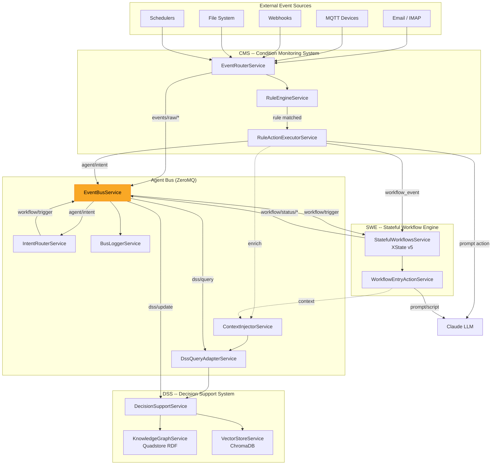
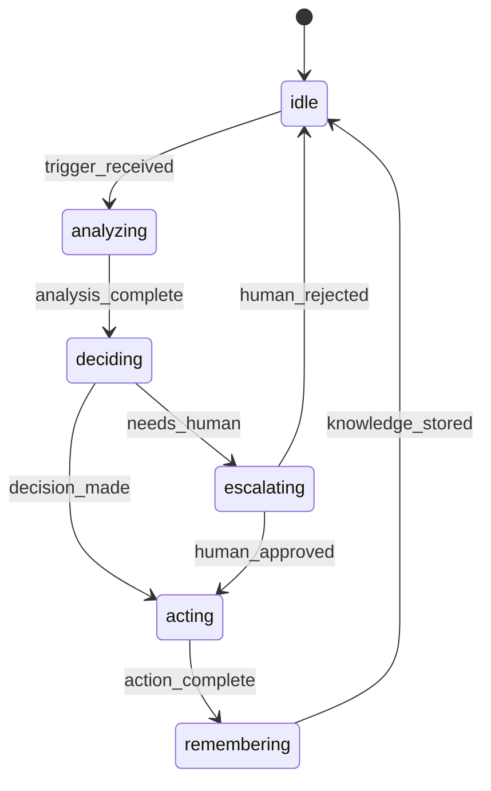

# ADR-006: Event-Driven Architecture -- CMS/DSS/SWE Triad

**Status:** Accepted
**Date:** 2026-05-06

## Context

A proactive AI agent must react to events from multiple sources -- filesystem changes, IoT devices (MQTT), emails (IMAP), webhooks, schedulers, and its own tool usage. Pure prompt-response patterns are insufficient for continuous monitoring and autonomous action. The agent needs a cognitive loop: **perceive -> contextualize -> decide -> act -> remember**.

This requires three subsystems working in concert: a sensory layer that detects what's happening, a reasoning layer that provides context and memory, and a motor layer that executes deliberate multi-step actions.

## Decision

Three interconnected systems form the cognitive triad, connected via the ZeroMQ agent bus (see ADR-004):

| System | Role | Metaphor |
|--------|------|----------|
| **CMS** (Condition Monitoring System) | Sensory Layer | Eyes and ears -- perceives what's happening |
| **DSS** (Decision Support System) | Memory and Reasoning | Brain -- stores knowledge, provides context |
| **SWE** (Stateful Workflow Engine) | Motor Layer | Hands -- executes deliberate multi-step actions |



## Consequences

**Positive:**
- The agent can autonomously react to real-world events (email arrival, file changes, sensor data) without human prompting
- Knowledge graph provides persistent, queryable context that survives session restarts
- Stateful workflows guarantee deterministic multi-step execution with explicit state transitions
- Correlation IDs enable end-to-end traceability from raw event to knowledge graph update
- All event processing is local and project-scoped

**Negative:**
- Three interconnected systems increase operational complexity
- Rule configuration requires understanding five condition types
- XState v5 workflows have a learning curve for non-technical users
- The JSONL log format requires custom tooling for analysis

## Implementation Details

### Rule engine: five condition types

The CMS rule engine evaluates incoming events against conditions to determine actions:

| Condition type | Mechanism | Example |
|---------------|-----------|---------|
| **Simple** | Pattern matching on event fields with wildcards | `name: "File Created"`, `payload.extension: ".pdf"` |
| **Semantic** | Vector similarity on payload text (threshold 0.86) | "Detect emails about urgent supply chain issues" |
| **Knowledge-Graph** | SPARQL queries against the RDF store | "Fire if the sender is a known VIP customer" |
| **Compound** | AND/OR/NOT logical combinations with optional time windows | "File created AND email received within 5 minutes" |
| **Temporal** | Time-of-day and day-of-week constraints | "Only during business hours (Mon-Fri 08:00-18:00)" |

### Event schema

```typescript
interface InternalEvent {
  id: string;           // UUID
  timestamp: string;    // ISO 8601
  name: string;         // e.g., "File Created"
  topic?: string;       // e.g., "/sensors/temperature"
  group: string;        // "Filesystem", "MQTT", "Claude Code"
  source: string;       // Provider source identifier
  payload: object;      // Event-specific data
  projectName?: string;
  correlationId?: string; // UUID, born in EventRouterService
}
```

### Rule action types

| Action | Effect |
|--------|--------|
| `prompt` | Execute an LLM prompt with context variables from the event |
| `workflow_event` | Directly trigger a workflow transition in SWE |
| `intent` | Classify the event via LLM and route to intent-based workflows |
| `script` | Execute a Python or JavaScript script |
| `notification` | Send an admin notification via SSE |

### Event sources

| Source | Technology | Configuration |
|--------|-----------|--------------|
| Filesystem | Chokidar (10 levels deep, 500ms stabilization) | Automatic for project directories |
| MQTT | MQTT.js client | Connection string in `.etienne/event-handling.json` |
| Email | IMAP polling | Connection string in `.env` (SMTP/IMAP settings) |
| Webhooks | `POST /api/events/:project/webhook` | Endpoint per project |
| Schedulers | Node-cron | CRON expressions in scheduler configuration |
| Claude Code | SDK hooks (PreToolUse, PostToolUse) | Automatic via InterceptorsService |

### Event storage policy

Events are ephemeral by default. Only events that trigger a rule are persisted:
- **JSONL log file**: `workspace/<project>/.etienne/event-log/<date>.jsonl`
- **Vector store**: Embedded for semantic search (if vector store is running)
- **RDF store**: Metadata triples (if RDF store is running)

### Workflow engine (XState v5)

Workflows are defined as JSON state machines:



Entry actions on each state can execute LLM prompts or scripts, enabling the workflow to combine deterministic state transitions with LLM-powered decision-making.

### Key source files

- `backend/src/event-handling/core/event-router.service.ts` -- event ingestion and routing
- `backend/src/event-handling/core/rule-engine.service.ts` -- five condition types
- `backend/src/event-handling/core/rule-action-executor.service.ts` -- action dispatch
- `backend/src/agent-bus/event-bus.service.ts` -- ZeroMQ pub/sub
- `backend/src/agent-bus/bus-logger.service.ts` -- JSONL trace logging
- `backend/src/ontology-core/decision-support.service.ts` -- DSS knowledge queries
- `backend/src/stateful-workflows/stateful-workflows.service.ts` -- XState v5 execution
- `backend/src/stateful-workflows/workflow-entry-action.service.ts` -- state entry handlers

## Base Value Alignment

| Base Value | Alignment |
|-----------|-----------|
| **1. Data Isolation** | All event logs, rules, and workflow state are stored in the project directory |
| **2. Exchangeable Inner Harness** | Rule actions invoke the active orchestrator (whichever is selected by `CODING_AGENT`) |
| **3. Rich Configuration** | Rules, workflows, and event sources are JSON configuration files per project |
| **4. Composable Services** | Event sources (MQTT, IMAP) are independently deployable optional services |
| **5. Agentic Engineering** | Rule creation, workflow definition, and knowledge graph population can be agent-guided |

**Violations:** None. The entire event-driven architecture operates locally within the project scope.
