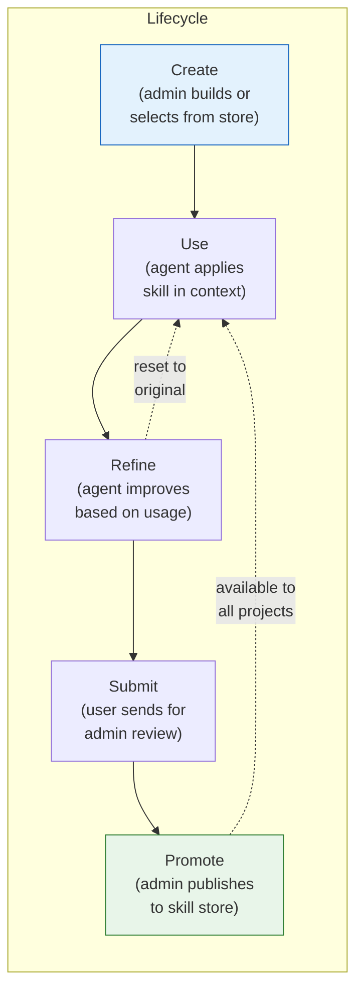
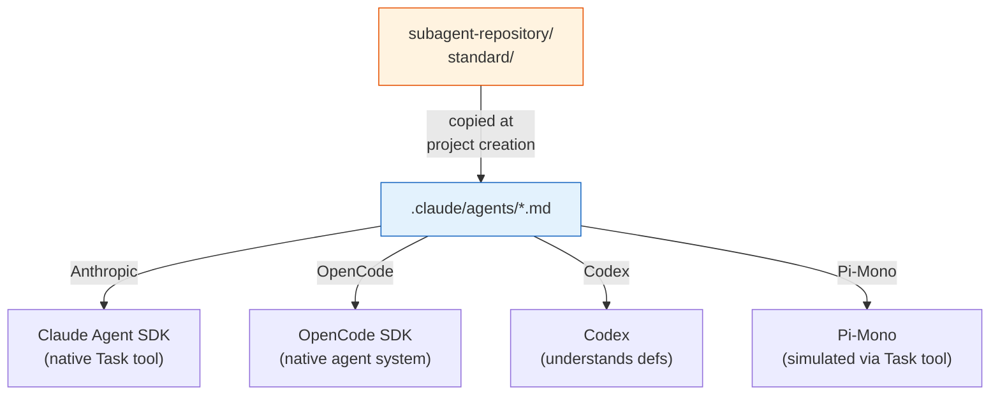
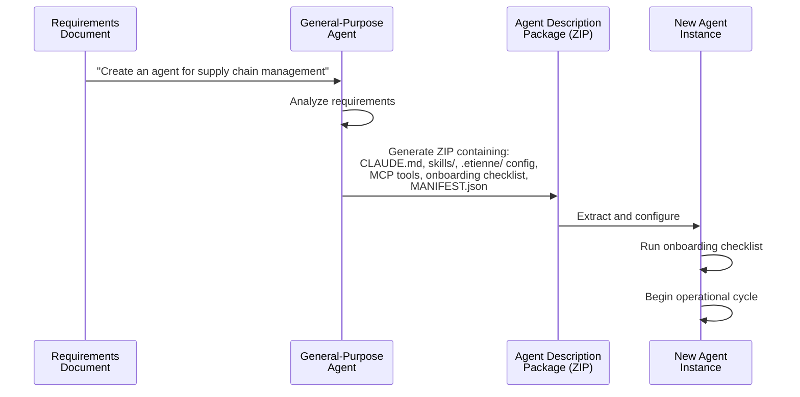

# ADR-007: Agentic Behaviour -- Skills, Subagents, Personas, and A2A

**Status:** Accepted
**Date:** 2026-05-06

## Context

Agent intelligence comes not from the LLM alone but from structured knowledge injection. The agent needs reusable domain expertise (skills), parallel workers (subagents), complete agent identities (personas), and inter-agent communication (A2A). These mechanisms must be portable across coding agent vendors (base value 2) and manageable by non-technical users.

The challenge is balancing vendor-specific features (e.g., Claude's native subagent support via `Task` tool) with the platform's commitment to exchangeable inner harnesses.

## Decision

Four agentic behaviour systems, all based on filesystem artifacts within the project directory:

### 1. Agent Skills

Skills follow the **agentskills.io** specification: a markdown file describing the business logic plus optional code snippets for technical execution. Skills are portable across coding agent vendors.



**Skill structure:**
```
skill-repository/
├── standard/               # Included in every project
│   ├── agent-identity/     # Agent self-awareness
│   ├── document-search/    # Document parsing (LiteParse)
│   ├── office-and-pdf-documents/
│   ├── public-website/     # Flask-based web publishing
│   ├── schedule-task/      # CRON scheduling
│   ├── user-orders/        # Task tracking
│   ├── web-scraping/       # Web interaction
│   └── wiki/               # Documentation generation
│   └── optional/           # User-selectable
│       ├── self-healing/
│       └── ...
```

Each skill directory contains a `SKILL.md` file with:
- Trigger conditions (when the skill should be applied)
- Business logic (domain expertise in plain language)
- Code snippets (technical implementation)
- Dependencies (npm/pip packages, environment variables)

### 2. Subagents

Subagent definitions live in `.claude/agents/*.md`. Each file defines a specialized worker with its own system prompt and tool set.



**Cross-harness translation:** Subagent definitions in `.claude/agents/*.md` are automatically translated to each harness's native format. Anthropic uses them via the `Task` tool natively. OpenCode translates them to its agent system format. Codex can parse and understand the definitions. Pi-mono simulates subagents via a custom Task tool that spawns nested sessions.

### 3. Agent Personas

Personas are complete agent identities created from business requirements documents. The Agent Design Prompt (ADP) process transforms a requirements document into a deployable agent.



Persona packages are stored in `workspace/.agent-persona-repository/` and extracted during project creation via `PersonaManagerService`.

### 4. CLAUDE.md as System Prompt

The `.claude/CLAUDE.md` file (or `AGENTS.md` for non-Anthropic harnesses) serves as the project's system prompt and role definition. It is:
- Created during project setup (from persona or template)
- Editable via the UI by the admin
- Modifiable by the agent itself during skill refinement
- Mapped to the appropriate filename by `CodingAgentConfigurationService`

## Consequences

**Positive:**
- Skills are portable across vendors (agentskills.io specification)
- Business experts can author skills in markdown without coding
- Personas enable "business requirements to deployed agent" in five steps
- Subagent definitions work across all five harnesses (with varying fidelity)
- The four-eyes principle (user submit -> admin review -> publish) ensures quality control

**Negative:**
- Skill quality depends heavily on the markdown authoring quality
- Cross-harness subagent translation is lossy (e.g., Pi-mono can't do true parallel delegation)
- Persona creation requires a general-purpose agent that understands its own architecture (bootstrapping challenge)

## Implementation Details

### Skill store metadata

Each skill in the store carries metadata beyond the standard:
- **Technical dependencies**: npm packages, Python libraries, system binaries
- **Environment variables**: API keys, tokens, configuration values
- **Version**: Semantic versioning for tracked evolution
- **Scope**: `standard` (always included), `optional` (user-selectable)

### A2A integration (cross-reference ADR-004)

A2A enables Etienne to discover and communicate with external agents:
- **Discovery**: `GET /.well-known/agent-card-{name}.json` returns capabilities
- **Messaging**: JSON-RPC messages with text and file parts
- **Tracing**: W3C `traceparent` header for OpenTelemetry propagation
- **Per-project config**: `.etienne/a2a-settings.json` (enable/disable agents, connection details)

### Key source files

- `skill-repository/` -- standard and optional skill definitions
- `subagent-repository/standard/` -- reusable subagent definitions
- `backend/src/skills/skills.service.ts` -- skill registry and lifecycle
- `backend/src/subagents/` -- subagent management and cross-harness translation
- `backend/src/persona-manager/persona-manager.service.ts` -- persona creation and extraction
- `backend/src/a2a-client/a2a-client.service.ts` -- outbound A2A messaging
- `backend/src/a2a-settings/` -- per-project A2A configuration

## Base Value Alignment

| Base Value | Alignment |
|-----------|-----------|
| **1. Data Isolation** | Skills, subagents, and personas are stored in the project directory filesystem |
| **2. Exchangeable Inner Harness** | Skills work across vendors (agentskills.io). Subagents auto-translated. CLAUDE.md/AGENTS.md mapped per harness. |
| **3. Rich Configuration** | Skill metadata, persona definitions, A2A settings provide rich agent behaviour configuration |
| **4. Composable Services** | A2A is an optional module. Skills can be selectively enabled per project. |
| **5. Agentic Engineering** | Skills and personas are designed to be created, refined, and published by the agent itself |

**Violations:** A2A protocol requires network communication with external agents, introducing a remote dependency. Mitigated by: A2A is an optional module, external agents must be registry-approved by admin, and per-project A2A settings allow selective agent enablement.
