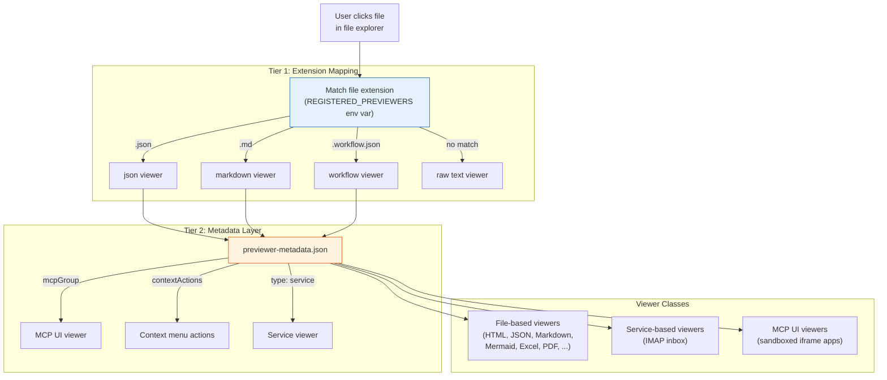
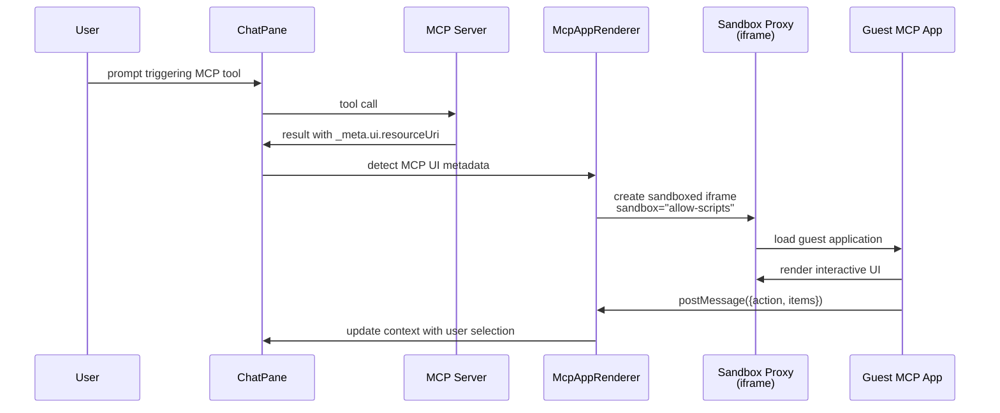

# ADR-008: UX Components and Customization

**Status:** Accepted
**Date:** 2026-05-06

## Context

The platform serves two distinct user profiles: power users who want full control and visibility (admin/developer persona) and end users who want simplicity and focus (business user persona). File previewers must handle 20+ file types across different categories (documents, data, diagrams, multimedia). MCP tools increasingly need interactive UIs beyond text responses. Context menus must be conditional, multilingual, and role-aware.

## Decision

Three UX subsystems address these needs:

### 1. Previewer Manager

A **two-tier architecture** for resolving and rendering file previews:



**Three viewer classes:**

| Class | Rendering | Example |
|-------|-----------|---------|
| **File-based** (default) | Frontend React component per extension | JSON tree, Markdown rendered, Mermaid diagram |
| **Service-based** | Backend service provides content | IMAP inbox (fetched from mail server) |
| **MCP UI** | Sandboxed iframe running MCP app | Budget donut chart, service control panel |

**Compound extensions** (e.g., `.workflow.json`, `.artifacts.md`) are matched before simple extensions, allowing specialized viewers for domain-specific file conventions.

### 2. MCP UI Integration

Interactive MCP tool UIs rendered in sandboxed iframes:



**Key components:**
- `@mcp-ui/client` library with `AppRenderer` component
- `StreamableHTTPClientTransport` for MCP server communication
- Sandbox proxy (`/sandbox-proxy`) enforces script-only sandbox
- Two modes: `McpAppRenderer` (tool results) and `McpUIPreview` (file previews)
- Bidirectional communication via `postMessage` API

### 3. Context Menu System

Declarative, conditional, multilingual, role-aware context menus attached to previewers:

```json
{
  "conditions": [
    { "field": "extension", "value": ".json" },
    { "field": "pathContains", "value": "knowledge-graph" }
  ],
  "minRole": "admin",
  "labels": {
    "en": "Export to RDF",
    "de": "Nach RDF exportieren",
    "zh": "导出到RDF"
  },
  "icon": "codicon-export",
  "action": "modal:rdf-export"
}
```

Actions can trigger frontend modals, call MCP tools, or navigate to other views. Each action has conditions that must all be satisfied for the action to appear.

### 4. Two UX Modes

| Mode | Trigger | Layout |
|------|---------|--------|
| **Verbose** (default) | `VITE_UX_TYPE=verbose` | Full AppBar with title, budget, scheduling, theme toggle, project selector. ChatPane header with new-chat, plan/work toggle, notification bell, settings. |
| **Minimalistic** | `VITE_UX_TYPE=minimalistic` | Hidden AppBar and ChatPane header. Resizable left sidebar (200-600px) with: new chat, settings modal, 3 recent projects, 5 recent sessions, latest notifications. |

Toggle at runtime with **Ctrl+U** (persisted in `localStorage`). Language cycling with **Ctrl+L** (English, German, Italian, Chinese).

## Consequences

**Positive:**
- Adding a new file previewer requires only an extension mapping entry and optional metadata -- no new React components needed for simple viewers
- MCP UI apps can provide rich interactive experiences without modifying the core frontend
- Context menus are data-driven (JSON configuration), not code-driven
- Two UX modes address both power-user and end-user needs from the same codebase
- Multilingual support is built into the context menu system (4 languages)

**Negative:**
- The two-tier previewer architecture requires understanding both the extension mapping and metadata layers
- MCP UI sandbox isolation limits direct DOM access between host and guest
- The `REGISTERED_PREVIEWERS` environment variable format is not self-documenting

## Implementation Details

### Supported file type previewers

| Viewer | Extensions | Category |
|--------|-----------|----------|
| json | `.json` | Data |
| jsonl | `.jsonl` | Data |
| markdown | `.md` | Documents |
| mermaid | `.mermaid` | Diagrams |
| html | `.html`, `.htm` | Web |
| excel | `.xlsx`, `.xls`, `.csv` | Spreadsheets |
| pdf | `.pdf` | Documents |
| docx | `.docx` | Documents |
| image | `.png`, `.jpg`, `.gif`, `.svg`, `.webp` | Media |
| video | `.mp4`, `.webm` | Media |
| workflow | `.workflow.json` | Domain |
| artifacts | `.artifacts.md` | Domain |
| scrapbook | `.scrapbook.json` | Domain |
| prompt | `.prompt.md` | Domain |
| research | `.research.md` | Domain |
| requirements | `.requirements.md` | Domain |
| knowledge | `.knowledge.json` | Domain |
| budget | `.budget.json` | Domain |
| imap | (service-based) | Communication |

### Key source files

- `backend/src/previewers/previewers.service.ts` -- extension mapping and metadata resolution
- `backend/src/previewers/previewer-metadata.json` -- metadata layer configuration
- `frontend/src/components/McpAppRenderer.jsx` -- MCP UI rendering with sandbox
- `frontend/src/components/McpUIPreview.jsx` -- MCP UI in preview pane
- `frontend/src/components/viewerRegistry.jsx` -- viewer component registration
- `frontend/src/services/FilePreviewHandler.js` -- file type routing logic
- `frontend/src/contexts/UxModeContext.jsx` -- verbose/minimalistic mode provider

## Base Value Alignment

| Base Value | Alignment |
|-----------|-----------|
| **1. Data Isolation** | Previewer configurations are project-scoped; MCP UI apps run in sandboxed iframes |
| **2. Exchangeable Inner Harness** | Previewers and MCP UI are agent-agnostic -- they render tool results regardless of which orchestrator produced them |
| **3. Rich Configuration** | Previewer mappings, context actions, UX modes, and MCP UI metadata provide extensive UI customization |
| **4. Composable Services** | Service-based previewers (IMAP) require their respective service to be running; graceful degradation if not |
| **5. Agentic Engineering** | Adding new previewers and context actions is documented with agent-compatible prompts in the README |

**Violations:** None.
