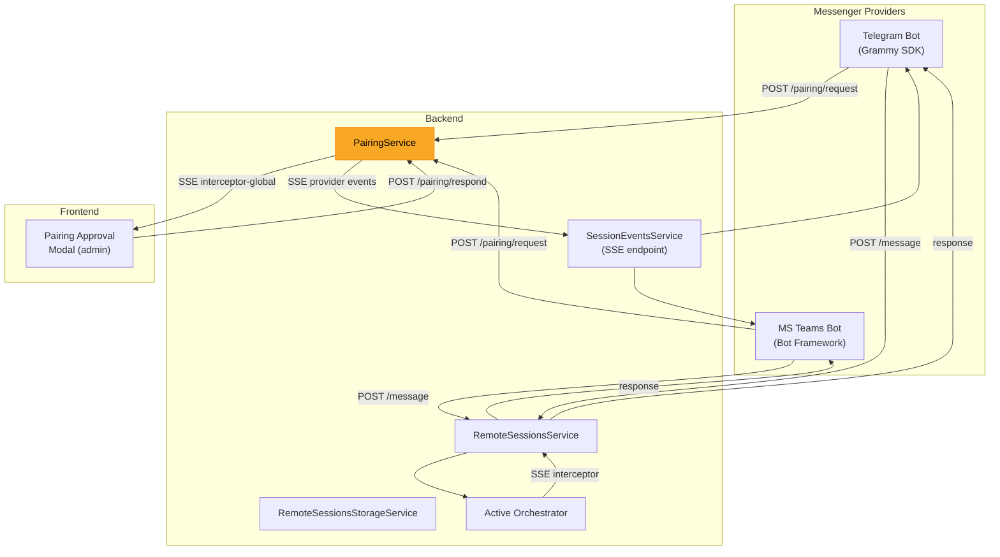
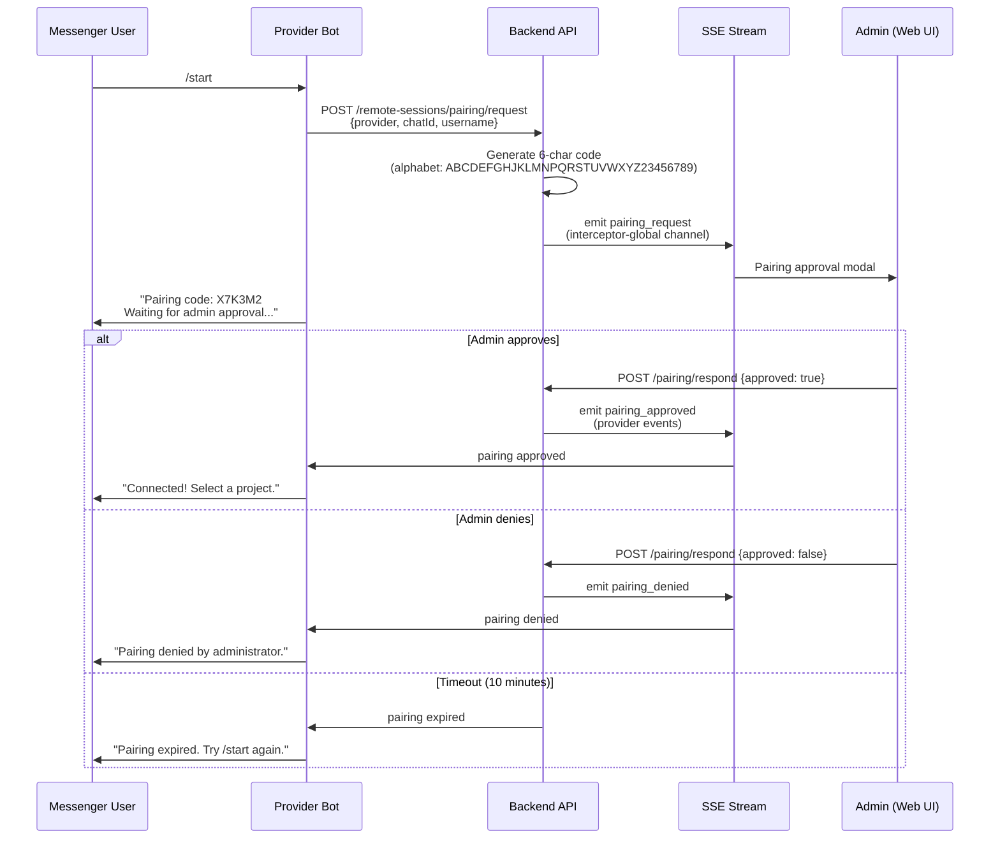
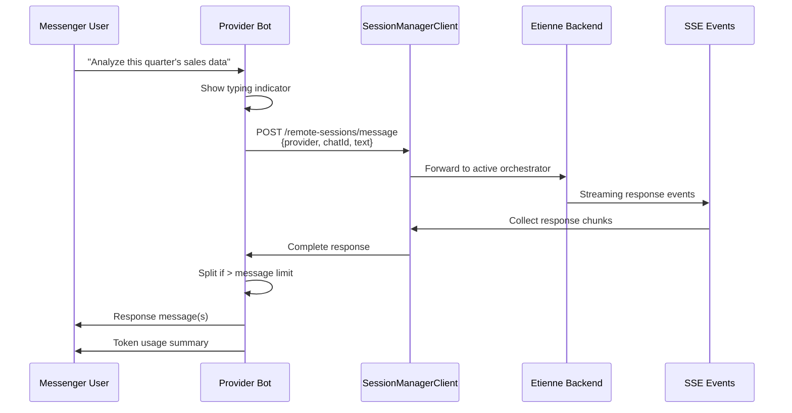

# ADR-009: Messenger Integration -- Teams and Telegram

**Status:** Accepted
**Date:** 2026-05-06

## Context

Business users need mobile and desktop access to the AI agent beyond the web UI. Messenger platforms (Microsoft Teams, Telegram) provide existing user bases, push notification infrastructure, and ubiquitous mobile apps. However, security is paramount: all messenger users must be explicitly approved by an administrator before gaining agent access.

The challenge is bridging asynchronous messenger conversations with the real-time SSE-based backend while maintaining the same security and isolation guarantees as the web frontend.

## Decision

Each messenger is a **standalone provider service** (separate process) that connects to the Etienne backend via two channels:

1. **SSE listener** -- subscribes to `/api/remote-sessions/events/{provider}` for pairing approvals and system events
2. **REST API calls** -- forwards user messages to the backend session manager and receives agent responses

A **pairing protocol** with 6-character alphanumeric codes and mandatory admin approval ensures that no unauthorized user can access the agent.

## Consequences

**Positive:**
- Users can interact with the agent from mobile devices without installing additional apps
- Push notifications from Telegram/Teams alert users to completed tasks or required input
- Admin approval gate prevents unauthorized access
- Each provider is a standalone optional service -- deploying without messengers requires no code changes
- HITL requests render natively (Telegram inline keyboards, Teams Adaptive Cards)

**Negative:**
- Telegram and Teams inherently depend on remote cloud services (Telegram Bot API, Azure Bot Service)
- Messenger UI limitations constrain rich output (no side-by-side artifact editing, limited markdown support)
- Each provider requires external setup (Telegram BotFather token, Azure Bot Service registration)
- Long agent responses must be split into chunks (Teams: 4KB limit, Telegram: 4096 char limit)

## Implementation Details

### Pairing protocol

**Code generation:** 30-character alphabet `ABCDEFGHJKLMNPQRSTUVWXYZ23456789` (excludes ambiguous characters: `0`, `O`, `I`, `l`, `1`). Codes expire after 10 minutes.

### Provider comparison

| Feature | Telegram | MS Teams |
|---------|----------|----------|
| **SDK** | Grammy | Bot Framework (botbuilder) |
| **Transport** | Long polling | Azure Bot Service webhook |
| **Port** | 6350 | 6200 |
| **Rich UI** | Inline keyboards | Adaptive Cards |
| **File support** | Photos, documents, video, audio | Attachments via Bot connector |
| **Message limit** | 4096 characters | ~4KB |
| **Commands** | `/start`, `/status`, `/projects`, `/disconnect`, `/help` | Same set |
| **External setup** | BotFather token | Azure App Registration + Bot Service |
| **HITL rendering** | Inline keyboard buttons | Adaptive Card with action buttons |

### Message flow (after pairing)

### Natural language commands

Beyond slash commands, users can use natural language patterns:
- `project 'project-name'` -- select a project
- `show me <filename>` -- request a file download
- `download <filename>` -- request a file download
- `get <filename>` -- request a file download

### Key source files

- `backend/src/remote-sessions/pairing.service.ts` -- pairing protocol and code generation
- `backend/src/remote-sessions/remote-sessions.service.ts` -- session management
- `backend/src/remote-sessions/session-events.service.ts` -- SSE events for providers
- `backend/src/remote-sessions/remote-sessions-storage.service.ts` -- persistent session storage
- `telegram/src/bot.ts` -- Telegram bot implementation
- `telegram/src/services/session-manager-client.service.ts` -- REST client to backend
- `telegram/src/services/sse-listener.service.ts` -- SSE subscription
- `ms-teams/src/bot.ts` -- Teams bot implementation (TeamsBot extends ActivityHandler)
- `ms-teams/src/services/session-manager-client.service.ts` -- REST client to backend
- `ms-teams/src/services/sse-listener.service.ts` -- SSE subscription

## Base Value Alignment

| Base Value | Alignment |
|-----------|-----------|
| **1. Data Isolation** | Pairing data and session mappings stored locally in the backend. No project data transits through cloud messenger APIs beyond message text. |
| **2. Exchangeable Inner Harness** | Messenger integration is agent-agnostic -- it uses the shared SSE pipeline regardless of which orchestrator is active |
| **3. Rich Configuration** | Each provider has its own `.env` configuration. Pairing is admin-managed. |
| **4. Composable Services** | Each messenger is an optional standalone service, managed via the process manager |
| **5. Agentic Engineering** | The messenger bot code was itself developed with agentic engineering |

**Violations:** Telegram and Teams inherently involve remote service dependencies (Telegram Bot API servers, Azure Bot Service). This is an accepted trade-off: reaching users on their preferred platforms requires using those platforms' APIs. Mitigated by: messenger services are optional, project data beyond message text is not transmitted to messenger APIs, and pairing requires explicit admin approval.
