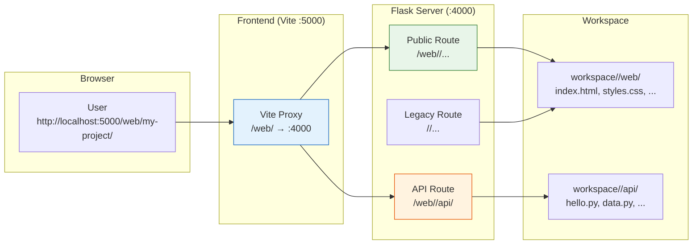
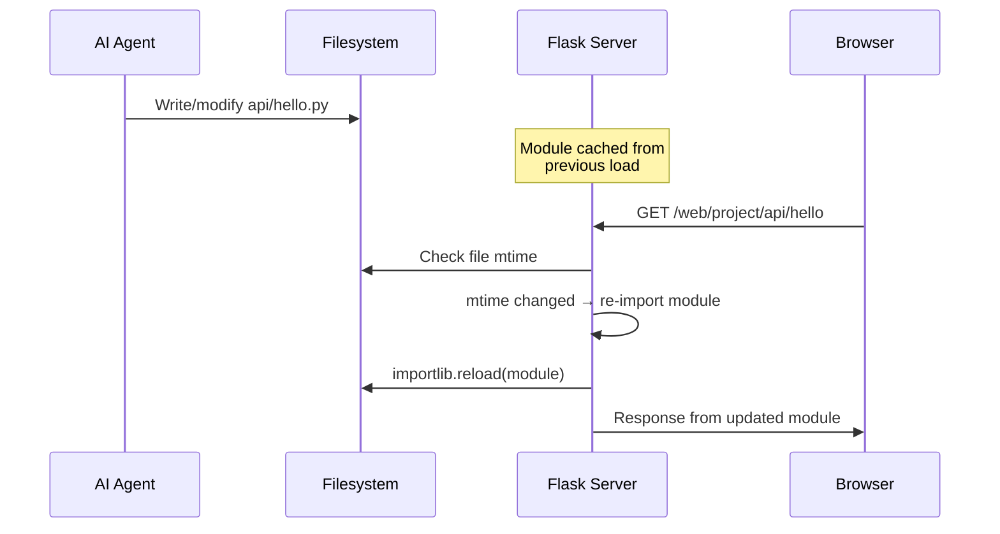

# ADR-010: External Webserver for Public Sites and Dynamic APIs

**Status:** Accepted
**Date:** 2026-05-06

## Context

Projects often need to expose public-facing web content -- landing pages for stakeholders, dashboards for monitoring, or API endpoints for third-party integrations. Building these into the NestJS backend would create tight coupling and require backend restarts for every content change. A lightweight, hot-reloadable server allows the agent to create and iterate on web applications as project artifacts, following the principle that the agent produces **editable, shareable output**.

## Decision

A **Flask server** (Python) on port 4000 provides two capabilities:

1. **Static website hosting** -- serves files from `workspace/<project>/web/` at predictable URLs
2. **Dynamic API endpoints** -- loads Python modules from `workspace/<project>/api/` with automatic hot-reload on file changes

The Vite dev server proxies `/web/` requests to the Flask server, making project websites accessible at `http://localhost:5000/web/<project>/...` during development.



## Consequences

**Positive:**
- The agent can create shareable websites and APIs as project deliverables
- Hot-reload enables rapid iteration without service restarts
- Flask is lightweight and Python-native, aligning with the data science ecosystem
- Project isolation is maintained (each project's content is served from its own directory)
- The `public-website` skill teaches the agent to create React 18 + MUI v5 CDN-based sites

**Negative:**
- Python dependency adds to the runtime requirements (mitigated: included in Docker image)
- No built-in HTTPS (intended to sit behind the main proxy/reverse proxy)
- Hot-reload uses file modification time checks, which may have platform-specific timing issues

## Implementation Details

### URL schema

| URL pattern | Handler | Source directory |
|-------------|---------|-----------------|
| `/web/<project>/` | Public route | `workspace/<project>/web/` |
| `/web/<project>/api/<module>` | Dynamic API | `workspace/<project>/api/<module>.py` |
| `/<project>/` | Legacy route | `workspace/<project>/` (direct access) |
| `/<project>/api/<module>` | Legacy API | `workspace/<project>/api/<module>.py` |

### Dynamic API endpoint patterns

Python files in `workspace/<project>/api/` are dynamically loaded as API modules. Two patterns are supported:

**Pattern 1: Verb functions**
```python
# workspace/my-project/api/hello.py
def get(request=None):
    return {"message": "Hello from GET"}

def post(request):
    data = request.get_json()
    return {"received": data}
```

**Pattern 2: Universal handler**
```python
# workspace/my-project/api/data.py
SUPPORTED_METHODS = ["GET", "POST", "PUT"]

def handle(request):
    if request.method == "GET":
        return {"items": [1, 2, 3]}
    elif request.method == "POST":
        return {"created": True}
```

### Hot-reload mechanism



Modules are re-imported when the file's modification time changes. This is thread-safe using Python's import lock mechanism.

### Public website skill

The `public-website` skill (`skill-repository/standard/public-website/SKILL.md`) guides the agent to create websites with:
- **React 18** loaded from CDN (no build step required)
- **Material UI v5** from CDN for consistent styling
- **Server-relative links** using `/web/<project>/` prefix
- **Responsive design** for mobile and desktop viewing

This enables the agent to produce shareable, interactive web applications as project output -- for example, a customer-facing prototype created during a forward-deployed engineering session.

### Key source files

- `webserver/app.py` -- Flask application with dual routing and hot-reload
- `webserver/README.md` -- webserver documentation
- `skill-repository/standard/public-website/SKILL.md` -- agent skill for website creation
- `frontend/vite.config.js` -- Vite proxy configuration (`/web/` → `:4000`)

## Base Value Alignment

| Base Value | Alignment |
|-----------|-----------|
| **1. Data Isolation** | Each project's web content is served from its own subdirectory; no cross-project content leakage |
| **2. Exchangeable Inner Harness** | The webserver is agent-agnostic; any orchestrator can write files to `web/` and `api/` |
| **3. Rich Configuration** | URL routing and module patterns provide flexible API definition |
| **4. Composable Services** | The Flask server is an optional service, manageable via the process manager UI |
| **5. Agentic Engineering** | The `public-website` skill is a primary example of agent-driven development -- the agent creates complete websites from natural language descriptions |

**Violations:** None.
