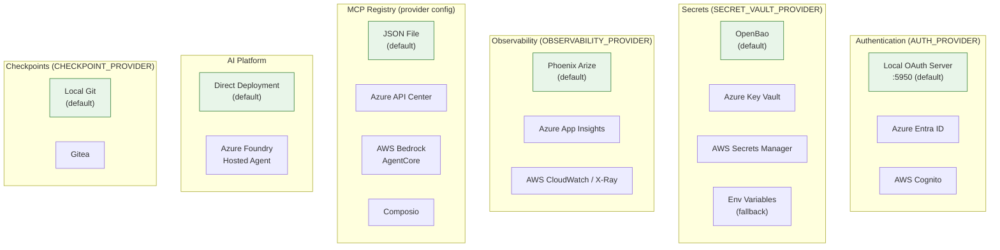
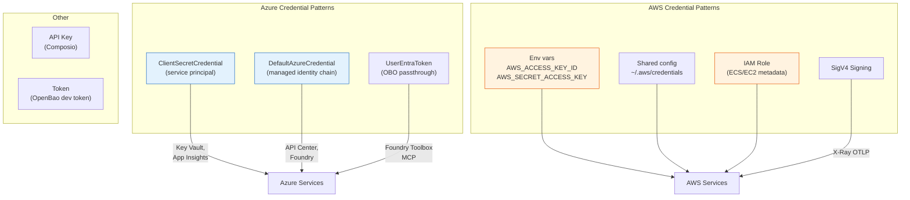
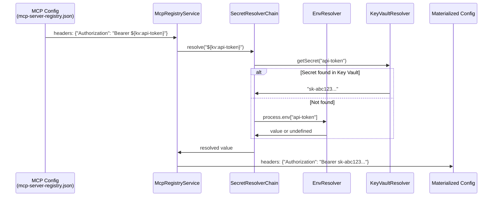

# ADR-011: Cloud Service Integration

**Status:** Accepted
**Date:** 2026-05-06

## Context

Etienne is designed to run locally by default, but enterprise deployments require integration with cloud identity providers, managed secret vaults, observability platforms, tool governance registries, and hosted agent runtimes. Each cloud integration point must be optional, with a local default that works without any cloud configuration. The pattern must be consistent across all integration domains so that switching from local to cloud (or between cloud providers) is a configuration change, not a code change.

## Decision

Every cloud integration point implements a **pluggable provider interface** selected by an environment variable. Each domain has a local default that requires no external setup. Cloud providers are loaded lazily to avoid importing heavy SDKs when they're not active.



## Consequences

**Positive:**
- Every cloud integration is opt-in; the system runs fully locally out of the box
- Switching providers is a single environment variable change
- Heavy cloud SDKs are not loaded unless their provider is active (lazy imports)
- The provider pattern is consistent across all domains, reducing cognitive load
- Fallback chains (e.g., secrets: primary provider -> env vars) ensure graceful degradation

**Negative:**
- Supporting multiple cloud providers per domain increases maintenance surface
- Provider-specific quirks require adapter code (e.g., Azure Key Vault's underscore-to-hyphen naming rule)
- Credential configuration varies significantly between Azure (service principal) and AWS (credential chain)
- Some cloud features (e.g., Foundry's managed identity, API Center's OBO passthrough) have no local equivalent

## Implementation Details

### Provider interfaces and selection

| Domain | Interface | Selection env var | Values |
|--------|-----------|-------------------|--------|
| Authentication | `IAuthProvider` | `AUTH_PROVIDER` | `local` (default), `azure-entraid`, `aws-cognito` |
| Secrets | `ISecretProvider` | `SECRET_VAULT_PROVIDER` | `openbao` (default), `azure-keyvault`, `aws`, `env` |
| Observability | `ISpanExporterProvider` | `OBSERVABILITY_PROVIDER` | `phoenix` (default), `azure`, `aws` |
| MCP Registry | `IMcpRegistryProvider` | Provider config in module | `json-file` (default), plus optional cloud providers |
| Checkpoints | `ICheckpointProvider` | `CHECKPOINT_PROVIDER` | `git` (default), `gitea` |

### Credential patterns per cloud vendor



### Secret placeholder resolution

MCP server configurations and other integration points use placeholder syntax for deferred credential resolution:



**Placeholder syntax:**
| Pattern | Resolution source |
|---------|------------------|
| `${env:VAR_NAME}` | Environment variable |
| `${kv:secret-name}` | Secrets manager (latest version) |
| `${kv:secret-name@v1}` | Secrets manager (pinned version) |
| `${VAR_NAME}` | Legacy shorthand for `${env:VAR_NAME}` |

Placeholders are resolved at **materialization time** (when the config is needed), not at load time. This means missing secrets are detected when the tool is actually invoked, not at startup.

### Azure Foundry adapter

When `FOUNDRY_ENABLED=true`, the Foundry adapter starts an Express server on port 8088 implementing the Foundry hosted agent protocol:

| Endpoint | Protocol | Purpose |
|----------|----------|---------|
| `GET /readiness` | Health check | Foundry liveness probe |
| `POST /responses` | OpenAI Responses API | Foundry client requests |
| `POST /invocations` | Foundry streaming | Direct agent invocation |
| `/api/*`, `/auth/*`, `/mcp/*` | Reverse proxy | Route to NestJS backend (:6060) |

The adapter bridges Foundry session IDs to Etienne process IDs via `FoundrySessionService`, enabling the external Foundry frontend to communicate with the internal backend.

### Provider-specific implementation notes

**Azure Entra ID** (`backend/src/auth/providers/azure-entraid.provider.ts`):
- OIDC flow via `https://login.microsoftonline.com/{tenantId}/oauth2/v2.0/`
- Group membership fetched from Microsoft Graph API (`/v1.0/me/memberOf`)
- Role mapping: admin groups configurable via `AUTH_PROVIDER_ADMIN_GROUPS`

**AWS Cognito** (`backend/src/auth/providers/aws-cognito.provider.ts`):
- OAuth2 flow via `https://{domain}/oauth2/authorize`
- Groups extracted from `cognito:groups` JWT claim
- Basic auth credentials for token exchange

**Azure Key Vault** (`backend/src/secrets-manager/providers/azure-keyvault.provider.ts`):
- Auto-translates underscores to hyphens (Azure naming convention: `MY_SECRET` -> `MY-SECRET`)
- Custom secret name resolution via `*_SECRET_NAME` env vars
- 5-second request timeout

**AWS Secrets Manager** (`backend/src/secrets-manager/providers/aws-secrets-manager.provider.ts`):
- Create-on-first-update pattern (try update, fallback to create)
- Optional prefix-based namespacing (`AWS_SECRETS_PREFIX`)
- Standard AWS credential chain

**Azure App Insights** (`backend/src/observability/providers/azure.exporter.ts`):
- Lazy-loads `@azure/monitor-opentelemetry-exporter`
- Deliberately avoids `@azure/monitor-opentelemetry` (conflicts with manual instrumentation)
- User feedback as new `user.feedback` span with span links

**AWS CloudWatch / X-Ray** (`backend/src/observability/providers/aws.exporter.ts`):
- Custom OTLP-proto exporter with SigV4 signing (`@smithy/signature-v4`)
- IAM permission required: `xray:PutTraceSegments`
- Protobuf serialization via `@opentelemetry/otlp-transformer`

**AWS Bedrock AgentCore** (`backend/src/mcp-registry/providers/aws-bedrock-agentcore.provider.ts`):
- Discovers MCP servers via `ListAgentRuntimes` + `GetAgentRuntime` API
- Filters by protocol type (MCP only) and status (`READY`)
- Concurrency-limited request pool (5 concurrent)

**Azure API Center** (`backend/src/mcp-registry/providers/azure-api-center.provider.ts`):
- Implements MCP Registry v0.1 specification
- Token caching with 60-second safety margin before expiry
- Supports both Entra ID JWT and subscription key authentication

**Composio** (`backend/src/mcp-registry/providers/composio.provider.ts`):
- Per-user MCP instance generation via `composio.mcp.generate(userId, id)`
- Lazy-loads `@composio/core` (optional peer dependency)
- Supports toolkit allowlisting

### Lazy loading strategy

Heavy cloud SDKs are loaded only when their provider is active:

```typescript
// Example: Azure Monitor exporter (azure.exporter.ts)
const { AzureMonitorTraceExporter } = await import(
  '@azure/monitor-opentelemetry-exporter'
);
```

This prevents unused cloud SDKs from bloating the startup time and memory footprint.

### Key source files

- `backend/src/auth/providers/azure-entraid.provider.ts` -- Entra ID OIDC
- `backend/src/auth/providers/aws-cognito.provider.ts` -- Cognito OIDC
- `backend/src/secrets-manager/providers/azure-keyvault.provider.ts` -- Key Vault
- `backend/src/secrets-manager/providers/aws-secrets-manager.provider.ts` -- AWS SM
- `backend/src/secrets-manager/providers/openbao.provider.ts` -- OpenBao (default)
- `backend/src/secrets-manager/providers/env.provider.ts` -- env fallback
- `backend/src/observability/providers/azure.exporter.ts` -- App Insights
- `backend/src/observability/providers/aws.exporter.ts` -- CloudWatch/X-Ray
- `backend/src/observability/providers/phoenix.exporter.ts` -- Phoenix (default)
- `backend/src/mcp-registry/providers/azure-api-center.provider.ts` -- API Center
- `backend/src/mcp-registry/providers/aws-bedrock-agentcore.provider.ts` -- AgentCore
- `backend/src/mcp-registry/providers/composio.provider.ts` -- Composio
- `backend/src/mcp-registry/providers/json-file.provider.ts` -- local JSON (default)
- `backend/src/mcp-registry/secrets/secret-resolver.ts` -- placeholder resolution
- `backend/src/foundry-adapter/foundry-adapter.service.ts` -- Foundry protocol
- `backend/src/checkpoints/gitea-checkpoint.provider.ts` -- Gitea checkpoints
- `backend/src/checkpoints/git-checkpoint.provider.ts` -- local Git (default)

## Base Value Alignment

| Base Value | Alignment |
|-----------|-----------|
| **1. Data Isolation** | All providers respect project-scoped data. Secrets are resolved per-project. Cloud credentials never transit the frontend. |
| **2. Exchangeable Inner Harness** | Cloud integrations are orthogonal to the inner harness -- all orchestrators benefit equally from cloud auth, secrets, and observability |
| **3. Rich Configuration** | Six environment variables (`AUTH_PROVIDER`, `SECRET_VAULT_PROVIDER`, `OBSERVABILITY_PROVIDER`, `FOUNDRY_ENABLED`, `CHECKPOINT_PROVIDER`, plus MCP registry config) control all cloud integration points |
| **4. Composable Services** | Every cloud provider is optional. The system starts with local defaults and scales up to enterprise cloud services as needed. |
| **5. Agentic Engineering** | Cloud provider configurations are file-based (`.env`, JSON registry) and manageable by the agent |

**Violations:** Cloud dependencies are inherent to this ADR by design. Every cloud integration is optional with a local default. The system runs fully locally with zero cloud configuration. Cloud providers are opt-in for enterprise deployment scenarios where managed infrastructure (identity, secrets, monitoring) is preferred.
