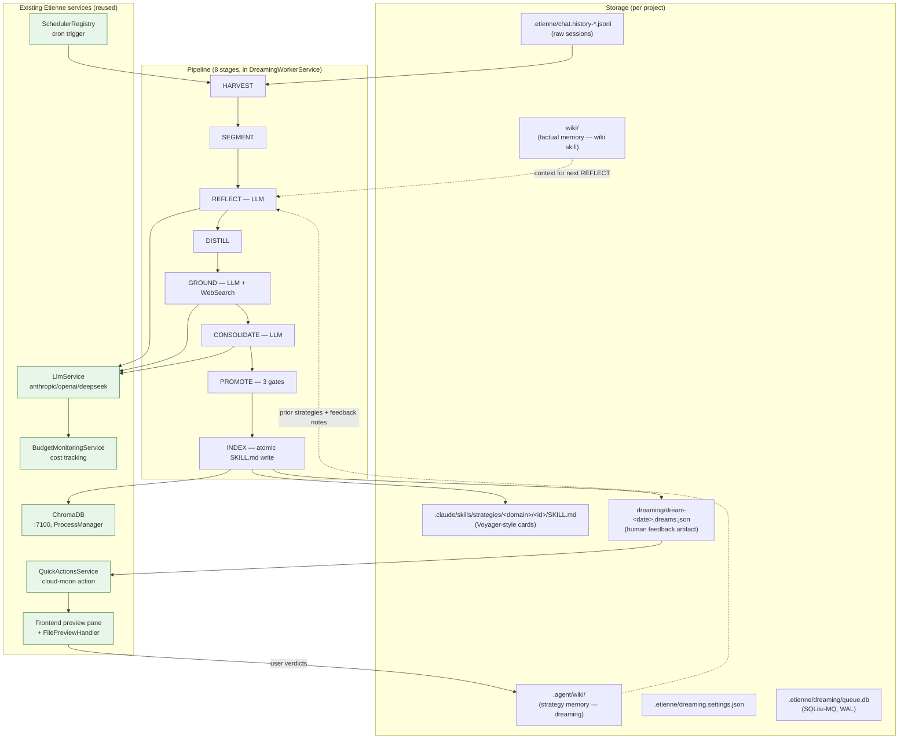

# ADR-012: Dreaming — Offline Strategy Memory

**Status:** Accepted
**Date:** 2026-05-10

## Context

Etienne's online inference path treats each session as ephemeral: chat history is persisted to `.etienne/chat.history-*.jsonl`, but no automated process distills cross-session learnings into reusable strategy. Without a self-improvement loop the agent cannot accumulate "lessons learned" across sessions, and the user has no surface for curating the agent's strategic memory.

The PRD (`requirements-docs/prd-dreaming.md`) introduces *dreaming* — a nightly, offline batch process where the agent reflects on recent sessions, distills strategy candidates, web-grounds them, and surfaces the top items for human review (thumbs-up / thumbs-down / "deepen"). The PRD ships an "Architektur-Blueprint v2" describing a Claude-Agent-SDK + ChromaDB + SQLite-MQ pipeline. The user explicitly chose to implement that full v2 blueprint rather than a thin scheduler-only variant, with the constraint that we reuse Etienne's existing infrastructure (LlmService, BudgetMonitoringService, ProcessManagerService for ChromaDB, SchedulerRegistry for cron, SkillsService, file-preview pane, quick actions) rather than fork it.

The core engineering challenge is balancing the v2 blueprint's ambition (8-stage pipeline, embedding pre-filter, web grounding, contested-strategy detection) against the project guideline "minimal scope, no premature abstraction" and the practical reality that we have a working multi-provider LLM service, a working scheduler, and an already-managed ChromaDB instance.

## Decision

Implement the full 8-stage pipeline (HARVEST → SEGMENT → REFLECT → DISTILL → GROUND → CONSOLIDATE → PROMOTE → INDEX) as a new `DreamingModule` that **plugs into existing Etienne services** instead of standing up parallel infrastructure. The pipeline is driven by a per-project SQLite job queue (`better-sqlite3`, WAL) under `<project>/.etienne/dreaming/queue.db` and a single `DreamingWorkerService` that drains the queue across all projects. LLM stages route through the existing `LlmService` (so they automatically pick up the user's anthropic/openai/deepseek configuration and feed costs into `BudgetMonitoringService`). Embeddings and the `strategy_descriptions_<project>` ChromaDB collection reuse the already-managed Chroma instance on port 7100.

### Concrete component choices

- **Settings file**: `<project>/.etienne/dreaming.settings.json`, mirroring `budget-monitoring.settings.json`. The PRD says "saved inside the .agent folder"; we interpret `.agent` as the project's hidden agent meta-dir, which in Etienne is `.etienne` for runtime state and `.agent` for workspace-level shared config (currently only `<workspace>/.agent/quick-actions.json`). Settings are runtime state, hence `.etienne/`.
- **Strategy memory**: lives at `<project>/.agent/wiki/` (plain markdown for human reading) AND as `.claude/skills/strategies/<domain>/<id>/SKILL.md` cards (the Voyager-style retrieval signal that the inference agent's existing skill loader autonomously selects from).
- **Quick actions extension**: the existing `QuickActionsDto` gains two optional fields, `project?: string` (project-scoped action) and `previewFile?: string` (click opens the preview pane instead of sending a prompt). Frontend filters the list to `!action.project || action.project === currentProject`. No fork into a second service.
- **Budget enforcement**: soft pre-flight check. `DreamingService.isOverDailyBudget` reads `.etienne/costs.json` (already maintained by `BudgetMonitoringService`), sums today's `requestCosts`, and refuses to enqueue when over `maxBudget`. No mid-run process kill.
- **Promotion gates**: G1 confidence ≥ 0.6 + support ≥ 1, G2 web-supports OR cross-trajectory ≥ 2, G3 composite (`0.30·confidence + 0.25·support + 0.25·web + 0.20·diversity`) ≥ 0.78. G1/G2 rejects buffer in `buffered_candidates` for the next run.
- **DAG coordination**: each `reflect` job stores its candidate output in `run_state` keyed by job id. After completing a `reflect`, the worker checks whether all sibling reflects under the same `segment` parent are done; if so it enqueues a single `distill` job for the domain with the aggregated candidates. After any terminal stage finishes, the worker checks whether the entire run has zero pending/in-progress jobs; if so it finalizes by writing `dream-<date>.dreams.json` and upserting the cloud-moon quick action.

### Deliberate deviations from PRD blueprint v2

- **No new Claude Agent SDK runtime.** The blueprint suggests `@anthropic-ai/claude-agent-sdk`'s `query()`. We use `LlmService.generateTextWithMessages` instead — already wired for cost tracking, secrets management, and provider selection. Strategy SKILL.md cards still use the Anthropic format so the inference agent's existing skill loader selects them autonomously.
- **No standalone Chroma subprocess.** We reuse the instance already managed by `ProcessManagerService` via `vector-store.service.ts` (port 7100).
- **No `chokidar` watcher** syncing wiki files to ChromaDB. INDEX-stage upserts after a dream run are sufficient.
- **No bespoke MCP server** for `mcp__wiki__search` / `mcp__wiki__read`. The existing `wiki` skill already has `wiki-search.ts` / `wiki-add.ts` scripts.
- **No real WebSearch tool plumbing in v1.** The GROUND stage asks the LLM to nominate plausible authoritative sources from training knowledge and classify them. A future revision can plug a real `WebSearch` MCP tool when one is exposed by `LlmService`.
- **No structured-output mode (`generateObject`).** We use `generateText` + Zod parsing with up to 2 retries on schema failure. The `ai` SDK's `generateObject` is available but the retry-on-error pattern is portable across providers (DeepSeek's Anthropic-compat endpoint may not support tool-mode JSON).

## Consequences

**Positive**

- Reuses every relevant existing service (LLM, budget, scheduler, ChromaDB, skills, quick actions, preview pane). Net new infrastructure: one SQLite queue file per project, one ChromaDB collection per project, one new module.
- Strategy SKILL.md cards become first-class skills the inference agent already knows how to load. No new injection seam in the chat path until Phase 6's optional `StrategyPrefilterService` is wired in.
- The pipeline is observable via `SELECT * FROM jobs` against the per-project queue, and via the standard cost-tracking SSE stream.
- Crash-safe: the worker calls `recoverStale()` each tick, releasing jobs whose `locked_until` expired without completion. Retries use exponential backoff capped at 600s; jobs give up after 3 attempts.

**Negative / open questions**

- DAG coordination via post-hoc parent inspection (worker checks "have all my siblings finished?" after each completion) is racier than a true DAG engine. The single-flight `busy` flag on the worker prevents intra-process races but multi-instance deployments would need to claim jobs by hostname-prefixed worker id. v1 assumes single backend instance.
- "Run finalization" (writing `dream-*.dreams.json`) happens when the worker observes zero pending/in-progress jobs for the run. If the queue is briefly empty between stages — e.g. the last `reflect` completes and `distill` hasn't been enqueued yet — finalization could fire prematurely. In practice the same worker call that completes `reflect` also enqueues `distill` synchronously (within `maybeAdvanceParent`), so the next pending count includes the new job. Still worth watching in production.
- The GROUND stage's "make up plausible URLs from training" is a known compromise. Until a real WebSearch integration lands, `web_score` should be treated as a weak signal and PROMOTE's gate G2 falls back to "cross-trajectory ≥ 2" for candidates with no web support.
- Soft pre-flight budget enforcement does not prevent a single dream run from blowing past the budget mid-run. Hard mid-run enforcement would require per-stage callbacks into `BudgetMonitoringService.checkBudgetLimit` plus a worker-level abort path. Out of scope for v1.

**Future work**

- Wire `StrategyPrefilterService.selectRelevantSkillNames` into the inference path's skill loader once a project accumulates more than ~20 strategy SKILL.md cards.
- Plumb a real `WebSearch` MCP tool into the GROUND stage when one is exposed via `LlmService.generateTextWithMessages` tool API.
- Multi-instance worker sharding via hostname-prefixed worker ids and per-job hostname claim.
