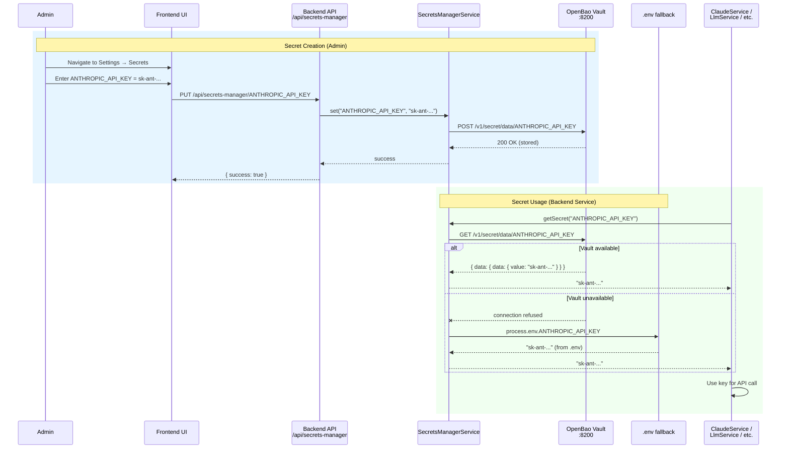

## API Keys & Secrets Management

We use **Anthropic Opus 4.5** via the Claude Agent SDK. 

### Entering API Keys via `.env` (Standard Developer Workflow)

For development purposes create a `.env` file inside the `backend/` directory with your sensitive keys:

```env
# Anthropic API Key (used for direct Claude API calls when aiModel=claude)
ANTHROPIC_API_KEY=sk-ant-api03-...AA

# Local data directory root for all projects
WORKSPACE_ROOT=C:/Data/GitHub/claude-multitenant/workspace

# OpenAI API Key (used for deep research, output guardrails, sessions, persona manager)
OPENAI_API_KEY=sk-...

# JWT secret for authentication tokens
JWT_SECRET=your-jwt-secret-here

# Memory Management Configuration
MEMORY_MANAGEMENT_URL=http://localhost:6060/api/memories
MEMORY_DECAY_DAYS=6

# Budget Control Configuration
COSTS_CURRENCY_UNIT=EUR
COSTS_PER_MIO_INPUT_TOKENS=3.0
COSTS_PER_MIO_OUTPUT_TOKENS=15.0

# Checkpoint Provider Configuration
CHECKPOINT_PROVIDER=gitea
GITEA_URL=http://localhost:3000
GITEA_USERNAME=your.user@gitea.local
GITEA_PASSWORD=****
GITEA_REPO=workspace-checkpoints

# Secrets Manager Configuration
SECRET_VAULT_PROVIDER=openbao
OPENBAO_ADDR=http://127.0.0.1:8200
OPENBAO_DEV_ROOT_TOKEN=dev-root-token
```

The `.env` file is the quickest way to get started. All backend services read their keys from this file by default. You can copy `backend/.env.template` as a starting point.

### Secrets Manager (OpenBao Vault)

For **production or team environments**, the project includes a **Secrets Manager** — a standalone service at `/secrets-manager/` that runs [OpenBao](https://github.com/openbao/openbao) (an open-source secrets vault). This provides centralized, secure storage for API keys instead of keeping them in plaintext `.env` files.

**How it works:**
- The Secrets Manager runs as a separate process on port **8200**, managed via the Process Manager
- The backend has an abstraction layer (`SecretsManagerService`) with a plugin-based provider pattern:
  - **OpenBao provider** (default) — reads/writes secrets from the self-hosted vault via HTTP API
  - **Azure Key Vault provider** — uses Azure Key Vault with Service Principal authentication
  - **AWS Secrets Manager provider** — uses AWS Secrets Manager with IAM credentials
  - **Env provider** (fallback) — reads from `process.env` when the vault is unavailable
- All backend services inject `SecretsManagerService` to retrieve keys at runtime
- If the primary provider is down or a key is not found in the vault, the system **permanently** falls back to `.env` values for the rest of the session — zero downtime
- This means only sensitive values (API keys, tokens, credentials) need to be stored in the vault; all other configuration stays in `.env` as usual

> **Note:** When using **Azure Key Vault** or **AWS Secrets Manager** as your provider, the OpenBao service is **not required** — you do not need to install or start it. OpenBao is only needed when `SECRET_VAULT_PROVIDER=openbao` (the default).

**Starting the Secrets Manager:**
```bash
cd secrets-manager
npm install
npm run dev       # Downloads OpenBao binary and starts dev server on :8200
npm run seed      # Seeds secrets from backend/.env into the vault
```

**Managed secrets:** `ANTHROPIC_API_KEY`, `OPENAI_API_KEY`, `JWT_SECRET`, `GITEA_PASSWORD`, `SMTP_CONNECTION`, `IMAP_CONNECTION`, `DIFFBOT_TOKEN`, `VAPI_TOKEN`

### Secret Lifecycle — Sequence Diagram



### Provider Selection

Set `SECRET_VAULT_PROVIDER` in your `.env` to choose the primary provider:

| Value | Description |
|-------|-------------|
| `openbao` (default) | Uses OpenBao vault with automatic `.env` fallback |
| `azure-keyvault` | Uses Azure Key Vault with Service Principal authentication |
| `aws` | Uses AWS Secrets Manager with IAM credentials |
| `env` | Uses `.env` file directly, vault is ignored |

> **Note:** The `CLAUDE_CODE_USE_FOUNDRY` environment variable, when set, automatically selects `azure-keyvault` as the provider.

#### Azure Key Vault Configuration

Set the following environment variables when using `SECRET_VAULT_PROVIDER=azure-keyvault`:

| Variable | Description |
|----------|-------------|
| `AZURE_TENANT_ID` | Azure Active Directory tenant ID |
| `AZURE_CLIENT_ID` | Application (Service Principal) client ID |
| `AZURE_CLIENT_SECRET` | Application client secret |
| `AZURE_VAULT_URL` | Vault URL, e.g. `https://<vault-name>.vault.azure.net/` |

Key names are automatically converted: underscores (`_`) become hyphens (`-`) to comply with Azure naming restrictions (e.g. `ANTHROPIC_API_KEY` is stored as `ANTHROPIC-API-KEY`).

#### AWS Secrets Manager Configuration

Set the following environment variables when using `SECRET_VAULT_PROVIDER=aws`:

| Variable | Description |
|----------|-------------|
| `AWS_REGION` | AWS region, e.g. `us-east-1` |
| `AWS_ACCESS_KEY_ID` | IAM access key ID |
| `AWS_SECRET_ACCESS_KEY` | IAM secret access key |
| `AWS_SECRETS_PREFIX` | *(optional)* Namespace prefix — secrets are stored as `<prefix>/<KEY_NAME>` |
