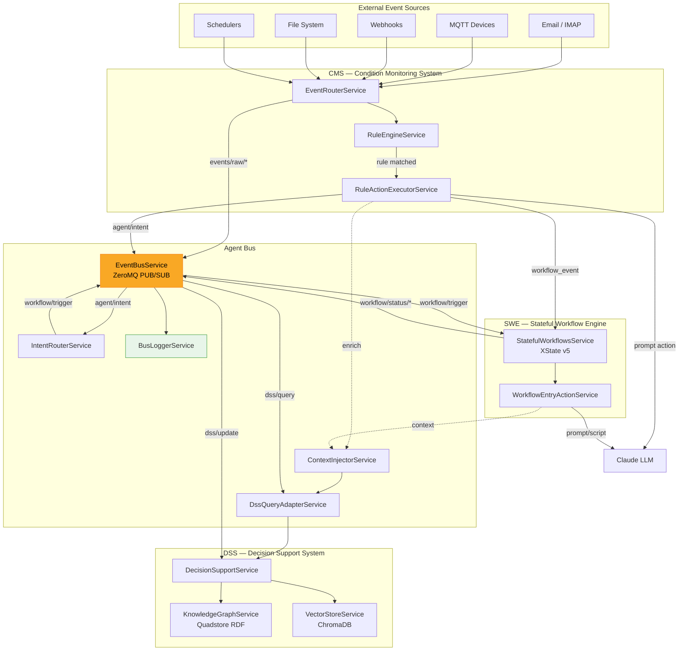
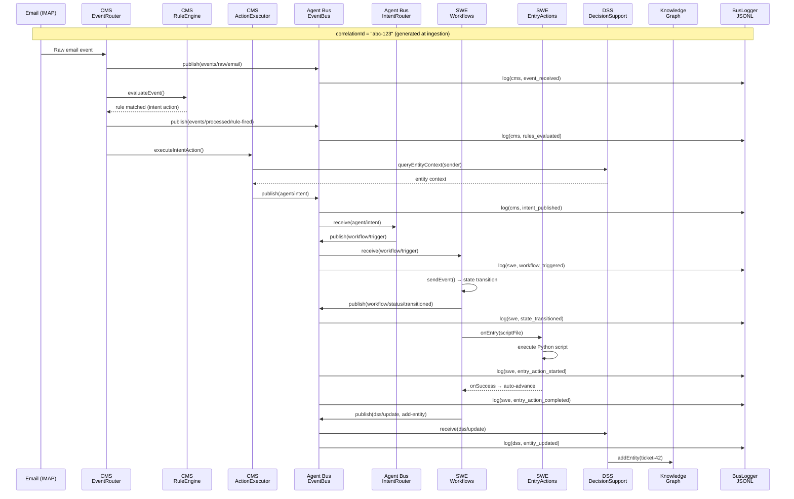
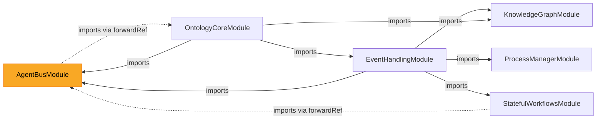
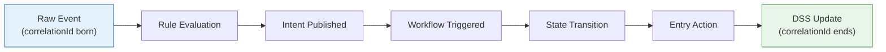

# Event Bus Components — Integrated AI Agent Architecture

## Overview

The Integrated AI Agent Architecture connects three existing systems through a shared ZeroMQ event bus,
enabling a perceive → contextualize → decide → act → remember agent loop.

| System | Role | Metaphor |
|--------|------|----------|
| **CMS** (Event-Handling) | Sensory Layer | Eyes & ears — perceives what's happening now |
| **DSS** (Ontology-Core) | Memory & Reasoning | Brain — stores knowledge, provides context |
| **SWE** (Stateful-Workflows) | Motor Layer | Hands — executes deliberate multi-step actions |
| **Agent Bus** | Nervous System | Connects all components via messages |

## Architecture Diagram



## End-to-End Data Flow (Email Example)



## NestJS Module Dependencies



## ZeroMQ Topic Namespaces

| Topic Pattern | Publisher | Subscriber(s) | Purpose |
|---------------|-----------|---------------|---------|
| `events/raw/*` | CMS (EventRouter) | Any | Raw inbound events (email, mqtt, webhook, filesystem, scheduling) |
| `events/processed/*` | CMS (EventRouter) | Any | Enriched events after rule evaluation |
| `agent/intent` | CMS (ActionExecutor) | IntentRouter | High-level intent classified by LLM |
| `workflow/trigger` | IntentRouter | SWE | Start or resume a workflow |
| `workflow/status/*` | SWE | Any | Workflow lifecycle updates (transitioned, completed) |
| `dss/query` | DssQueryAdapter | DSS | Request knowledge graph context |
| `dss/response` | DSS | DssQueryAdapter | Response to a query |
| `dss/update` | SWE, CMS | DSS | Write new facts to the knowledge graph |

## Components Reference

### EventBusService
**File:** `backend/src/agent-bus/event-bus.service.ts`

The central message hub. Manages ZeroMQ PUB/SUB sockets separate from the legacy event pipeline.

- **PUB socket:** `ipc:///tmp/agent-bus-pub`
- **SUB socket:** `ipc:///tmp/agent-bus-sub`
- All messages must include `correlationId` and `projectName` (enforced by `BusMessageBase` type)
- Every `publish()` call also writes a JSONL trace entry via BusLoggerService

### BusLoggerService
**File:** `backend/src/agent-bus/bus-logger.service.ts`

Writes structured JSONL log entries per service per project. Enables cross-service trace reconstruction.

### IntentRouterService
**File:** `backend/src/agent-bus/intent-router.service.ts`

Subscribes to `agent/intent`. Reads per-project config from `workspace/<project>/.etienne/intent-router.json`
and maps intent types + urgency filters to workflow triggers.

### DssQueryAdapterService
**File:** `backend/src/agent-bus/dss-query-adapter.service.ts`

Facade for querying the DSS knowledge graph. Provides promise-based methods for entity context,
decision graph lookup, ontology context, and SPARQL execution. Publishes `dss/query` and `dss/response`
bus messages for observability.

### ContextInjectorService
**File:** `backend/src/agent-bus/context-injector.service.ts`

Shared utility used by CMS, DSS, and SWE to fetch entity context from the knowledge graph and
format it as markdown for LLM prompt injection. Ensures all LLM calls across the system have
consistent grounding.

## Correlation ID

Every causal chain has a single `correlationId` (UUIDv4) that traces the full path from
raw event ingestion through to knowledge graph updates.



**Origin:** Generated in `EventRouterService.publishEvent()` when a raw event enters the system.
If the caller already provides a `correlationId`, it is preserved (idempotent).

**Propagation:** Each service copies the `correlationId` into every outgoing bus message and
passes it through `data` fields in workflow events so it survives across service boundaries.

## Log Files

### Log File Locations

All paths are relative to `workspace/<project>/`:

| Service | Env Variable | Default Path | Rotation |
|---------|-------------|--------------|----------|
| CMS | `AGENT_BUS_LOG_CMS` | `.etienne/agent-logs/cms-YYYY-MM-DD.jsonl` | Daily |
| DSS | `AGENT_BUS_LOG_DSS` | `.etienne/agent-logs/dss-YYYY-MM-DD.jsonl` | Daily |
| SWE | `AGENT_BUS_LOG_SWE` | `.etienne/agent-logs/swe-YYYY-MM-DD.jsonl` | Daily |

### Legacy Log Locations (unchanged)

| System | Path | Format |
|--------|------|--------|
| CMS Event Log | `.etienne/event-log/YYYY-MM-DD.jsonl` | `{event, triggeredRules[], timestamp}` |
| SWE Script Log | `workflows/scripts/logs/YYYY-MM-DD.jsonl` | `{timestamp, level, script, event, ...}` |

### JSONL Log Entry Format

Each line in the agent-logs JSONL files is a JSON object:

```json
{
  "timestamp": "2026-02-21T14:30:00.123Z",
  "correlationId": "a1b2c3d4-e5f6-7890-abcd-ef1234567890",
  "service": "cms",
  "topic": "events/raw/email",
  "action": "event_received",
  "projectName": "my-project",
  "data": {
    "eventId": "evt-abc",
    "group": "Email",
    "name": "Message Received"
  }
}
```

### Log Actions by Service

**CMS:**
| Action | When | Data |
|--------|------|------|
| `event_received` | Raw event enters system | eventId, group, name |
| `rules_evaluated` | Rules matched | matchedRules[] |
| `action_dispatched` | Action type chosen | actionType, target |
| `intent_published` | Intent sent to bus | intentType, urgency |

**DSS:**
| Action | When | Data |
|--------|------|------|
| `query_received` | Entity/graph queried | queryType, entityId |
| `query_responded` | Response sent | success, resultSize |
| `entity_updated` | KG mutation | entityId, type |
| `action_status_changed` | Action status update | graphId, actionId, status |

**SWE:**
| Action | When | Data |
|--------|------|------|
| `workflow_triggered` | Event received | workflowId, event |
| `state_transitioned` | State changed | from, to |
| `entry_action_started` | Prompt/script began | scriptFile or promptFile |
| `entry_action_completed` | Prompt/script finished | exitCode or response |
| `dss_update_published` | Facts written to KG | entityId, updateType |

### Trace Retrieval

Reconstruct a full causal chain by querying the REST API:

```
GET /api/agent-bus/:project/trace/:correlationId
```

Returns all log entries from CMS, DSS, and SWE with the given correlationId, sorted by timestamp.

```
GET /api/agent-bus/:project/traces?limit=50
```

Returns recent correlationIds with a summary of the chain.

## Rule Action Types

| Type | Description | Destination |
|------|-------------|-------------|
| `prompt` | Execute a Claude LLM prompt | Unattended endpoint |
| `workflow_event` | Send event directly to a workflow | StatefulWorkflowsService |
| `intent` | Classify intent and publish to bus | agent/intent topic → IntentRouter → workflow |

## Environment Variables

| Variable | Default | Purpose |
|----------|---------|---------|
| `AGENT_BUS_LOG_CMS` | `.etienne/agent-logs/cms.jsonl` | CMS trace log path (per project) |
| `AGENT_BUS_LOG_DSS` | `.etienne/agent-logs/dss.jsonl` | DSS trace log path (per project) |
| `AGENT_BUS_LOG_SWE` | `.etienne/agent-logs/swe.jsonl` | SWE trace log path (per project) |
