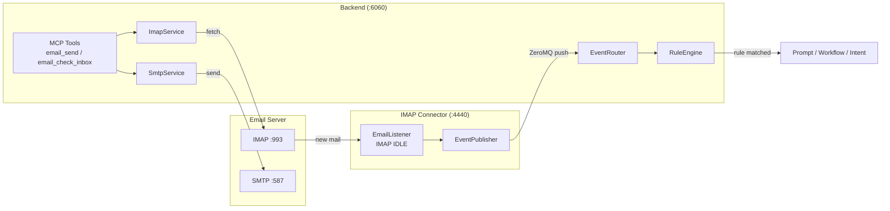

[← back to README](../README.md)

# Using the Agent with its own Email Account

Etienne can operate its own email account — monitoring an IMAP inbox for incoming mail and sending replies or notifications via SMTP. This gives projects a dedicated communication channel that the agent can use autonomously or on behalf of the user.

## Two Integration Modes

| Mode | How it works | Use case |
|------|-------------|----------|
| **MCP Tools** (on-demand) | Agent calls `email_send` / `email_check_inbox` tools directly | Sending reports, checking for specific emails, replying to messages |
| **Event-driven** (real-time) | Standalone IMAP Connector monitors inbox via IMAP IDLE and publishes events to the agent bus | Triggering rules when emails arrive — e.g. auto-processing invoices, alerting on important mail |

## Architecture



## Configuration

All email credentials are stored as secrets (OpenBao vault or `.env` fallback). Both connection strings use the same pipe-delimited format:

| Secret | Format | Example |
|--------|--------|---------|
| `IMAP_CONNECTION` | `host\|port\|secure\|user\|password` | `mail.example.com\|993\|true\|bot@example.com\|secret` |
| `SMTP_CONNECTION` | `host\|port\|secure\|user\|password` | `mail.example.com\|587\|false\|bot@example.com\|secret` |
| `SMTP_WHITELIST` | Comma-separated addresses | `alice@example.com,bob@example.com` |

- **Port 993** with `secure=true` — direct TLS (IMAP)
- **Port 587** with `secure=false` — STARTTLS (SMTP)
- **SMTP_WHITELIST** restricts which recipients the agent can email (security measure)

## MCP Tools

**`email_send`** — Send an email with optional HTML body and file attachments (paths relative to the project directory).

**`email_check_inbox`** — Fetch unseen emails, optionally filtered by subject prefix and/or date. Emails are saved to the project workspace:

```
workspace/<project>/emails/received/<ISO_DATE>-<SENDER>-<SUBJECT>/
  message.txt
  attachment1.pdf
```

## Email Events on the Bus

When the IMAP Connector service is running, every incoming email is published as an event:

```json
{
  "name": "Email Received",
  "group": "Email",
  "source": "IMAP Connector",
  "payload": {
    "From": "sender@example.com",
    "To": "bot@example.com",
    "Important": false,
    "Subject": "Invoice #4021",
    "BodyText": "Please find attached...",
    "Attachments": ["invoice-4021.pdf"]
  }
}
```

These events flow through the CMS rule engine — you can create rules that match on sender, subject, importance, or use semantic conditions to classify email content.

## Email Skill

An optional **email** skill is available in the skill repository (`skill-repository/standard/optional/email/`). When provisioned to a project, it teaches the agent when and how to use the email tools effectively — including best practices for plain-text fallbacks, attachment handling, inbox filtering, and reply workflows.

See [MCP UI](../mcp-ui.md).
