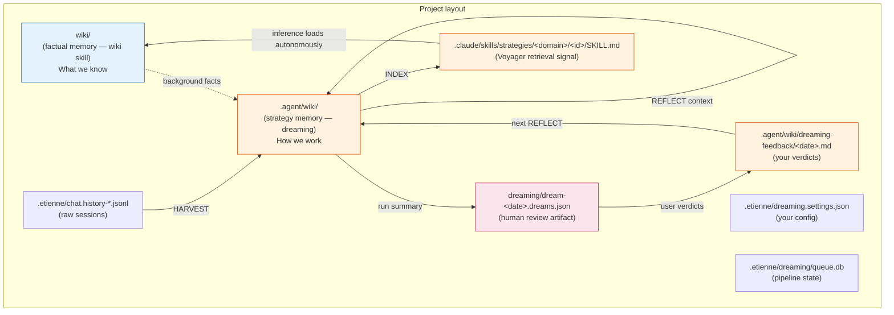

[← back to README](../README.md)

# Dreaming: How an Agent Learns From Itself While You Sleep

Imagine you're a senior engineer reviewing a junior's pull requests. You don't just merge what works — you remember the patterns. Three weeks later when the junior asks "should I add a unique constraint here?", you don't re-derive the answer. You recall it. Strategies accumulate. Mistakes leave fingerprints. Your judgment compounds.

LLM coding agents have no such mechanism by default. Every session starts fresh. The same trap is fallen into seven times in seven projects. The same insight is rediscovered, used once, and forgotten by the time the conversation closes.

**Dreaming** is Etienne's attempt to fix that — not by claiming "real memory," but by building a small, opinionated nightly process that turns recent sessions into a curated strategy library the agent can autonomously consult tomorrow.

## What dreaming actually does

Every night (or whenever you set the cron), Etienne does this for each enabled project:

1. **Reads** the `.etienne/chat.history-*.jsonl` session files modified since the last run.
2. **Cuts** them into trajectory windows (12 turns each, sliding step 6) and tags coarse outcome signals (tool errors, retries).
3. **Asks an LLM** to extract `WHEN/DO/BECAUSE` candidate strategies from each trajectory. Empty trajectories produce no candidates — invention is forbidden.
4. **Clusters** near-duplicate candidates inside the run via embedding cosine ≥ 0.85.
5. **Web-grounds** each cluster: the LLM nominates 3–8 plausible authoritative sources from training knowledge and classifies each as supports/contradicts/neutral.
6. **Consolidates** with existing strategy cards: if cosine > 0.88 to an existing skill, run a MERGE pass. Direct contradictions get marked `contested`.
7. **Promotes** through three gates: G1 confidence + support, G2 web evidence or cross-trajectory support, G3 composite score ≥ 0.78. G1/G2 rejects buffer for the next run.
8. **Indexes** survivors as Anthropic-format SKILL.md cards under `.claude/skills/strategies/<domain>/<id>/`. The card's frontmatter `description` is what the inference agent retrieves on autonomously — Voyager's "skill indexed by description" pattern, but as a first-class Anthropic concept.

The pipeline's terminal artifact is `dreaming/dream-<YYYY-MM-DD>.dreams.json` — the top N items by composite score, surfaced for your review the next morning.

## Why bother with the human in the loop

Offline self-improvement loops have a well-known failure mode: the agent decides its own training signal, drifts in unhelpful directions, and you only notice three weeks later when the suggestions feel weirdly off. Dreaming explicitly resists this with a feedback artifact and a quick action above the chat input.

When you open a project with an undismissed dream file, a cloud-moon icon appears above the chat input. Click it and the preview pane opens a questionnaire. Each item gets three buttons:

- **Thumbs-up** (`good`): keep — strategy looks useful → status `active`
- **Thumbs-down** (`bad`): reject — discard → status `deprecated`
- **Shovel** (`deepen`): investigate further next run → status `investigating`

Your verdicts get written to `.agent/wiki/dreaming-feedback/<date>.md`, which the *next* HARVEST reads as additional context. The agent doesn't act on your feedback immediately — it just remembers it for tomorrow's REFLECT pass. Slow, but legible.

## The wiki structure

Dreaming is the second of two markdown memory stores in an Etienne project. They share a layout but mean different things.

`wiki/` answers "what is true about this project." `.agent/wiki/` answers "what does the agent know about how to *work* on this project." Different lifecycles, different invariants, different skills maintain them.

## Dreaming is a research topic, not a defined process

The PRD that sparked this implementation includes an aspirational "Architektur-Blueprint v2" describing a much heavier system: Claude Agent SDK runtime, dedicated SQLite-MQ DAG engine, a `chokidar` filesystem watcher syncing wiki chunks to ChromaDB in real time, a bespoke MCP server for `mcp__wiki__search`, and a real WebSearch integration. None of those are intrinsically wrong — they reflect a particular research direction.

Etienne's implementation deliberately picks a different point on the design space:

| Question | v2 blueprint | Etienne's dreaming |
|---|---|---|
| Pipeline runtime | Standalone Claude Agent SDK | Existing `LlmService` (any provider) |
| Job queue | Bespoke DAG engine | Per-project SQLite + worker tick loop |
| ChromaDB | New subprocess managed by dreaming | Reuse existing instance on :7100 |
| Wiki indexing | `chokidar` watcher, real-time | INDEX-stage upserts after each run |
| Wiki MCP | New `mcp__wiki__search` server | Reuse the existing `wiki` skill's scripts |
| Web grounding | Real WebSearch | LLM nominates plausible sources from training |
| Strategy cards | Anthropic SKILL.md (Voyager pattern) | Anthropic SKILL.md (Voyager pattern) |

The shared anchor — Voyager-style strategy cards as the inference-time retrieval signal — is the part that matters most. Everything around it can shift toward the heavier or lighter end of the spectrum depending on what fails first in your deployment.

If you find that:
- Your projects accumulate hundreds of strategy cards and the SDK's autonomous selection slows down → wire `StrategyPrefilterService` into the inference path and use the ChromaDB collection.
- The "LLM-nominates-sources" trick produces too many hallucinated URLs → plug a real WebSearch tool into the GROUND stage.
- A single backend instance can't keep up with the dream queue → shard the worker by hostname.

The pipeline is intentionally easy to grow into.

## What we adopted from the blueprint, in the end

- **Voyager skill-by-description pattern**: strategies are SKILL.md cards under `.claude/skills/strategies/<domain>/<id>/`, retrieved by their frontmatter `description`. Promoted-by-dreaming cards are first-class skills the inference agent already knows how to load.
- **8-stage HARVEST → SEGMENT → REFLECT → DISTILL → GROUND → CONSOLIDATE → PROMOTE → INDEX pipeline**: each stage as a distinct job type in SQLite-MQ.
- **Three-gate threshold filter**: G1 light, G2 evidence, G3 composite ≥ 0.78. G1/G2 rejects buffer for next run.
- **Karpathy-wiki dual-store layout**: factual `wiki/` separate from strategic `.agent/wiki/`, both pure markdown.
- **Provenance, confidence, support count, contested-status**: all captured in the SKILL.md card body, not the frontmatter (which stays small for retrieval-time efficiency).

## What we cut, on purpose

- No standalone Claude Agent SDK runtime — `LlmService` already routes to anthropic/openai/deepseek with cost tracking.
- No standalone Chroma subprocess — the existing `ProcessManagerService` already manages one on port 7100.
- No real-time `chokidar` wiki sync — INDEX-stage upserts after each dream run are good enough.
- No `mcp__wiki__search` MCP server — the existing `wiki` skill already has search/add scripts.
- No real WebSearch tool integration in v1 — LLM-nominated sources are a known weak signal, gated by PROMOTE's G2 fallback to cross-trajectory support.
- No structured-output mode (`generateObject`) — `generateText` + Zod parsing with retries works across providers, including DeepSeek's Anthropic-compat endpoint.

These are recorded in [ADR-012](../adrs/012-dreaming-offline-strategy-memory.md) as deliberate deviations.

## Configuring dreaming

Open Settings → Dreaming. The modal lets you set:

- Daily start time (cron expression; default `0 22 * * *`)
- IANA time zone
- Maximum items per dream (default 10)
- Either a maximum daily budget OR a maximum LLM-call count per run

A soft pre-flight check reads `.etienne/costs.json`, sums today's project spend, and refuses to enqueue if you're already over budget. Mid-run hard enforcement is out of scope for v1.

The "Run now" button enqueues a HARVEST immediately — useful for testing or when you want to compress a long session you just finished into strategy without waiting for tomorrow.

## What this looks like in practice

You finish a long PostgreSQL migration debugging session at 7 PM. Dreaming fires at 22:00. By the time you open the project the next morning, a cloud-moon icon sits above the chat input. You click it. The preview pane shows three items: a strategy about parallel COPY ordering for OLTP migrations, a lesson about `pg_restore -j` not working the way you'd expect, and a "deepen" candidate about WAL archiving during bulk loads that the LLM thinks might generalize but isn't sure about.

You thumbs-up the first two, deepen the third, submit. The cloud-moon icon disappears. Tomorrow, when you ask the agent about a different migration in a different project, the strategy SKILL.md card is sitting there waiting. The agent's frontmatter description retrieval picks it up autonomously, loads it into context, and the conversation skips two of the three rounds you'd otherwise have spent re-deriving the same plan.

That's the loop. It is not magic; it is markdown plus discipline. The discipline lives mostly in the human-in-the-loop verdicts. The markdown is what lets you read everything the agent decided to remember and edit it directly when it's wrong.
