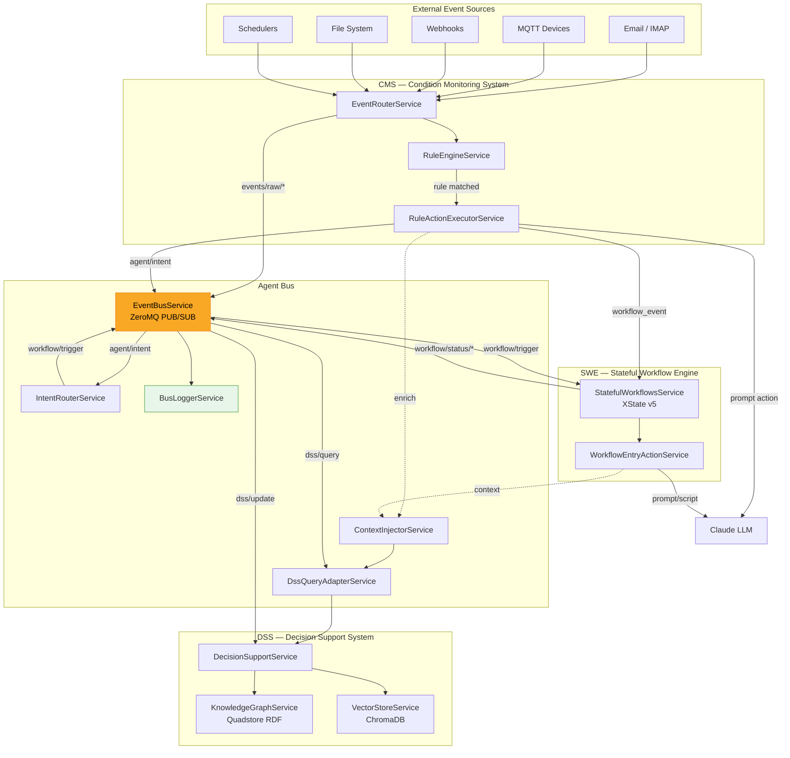

## Event Bus Components — Integrated AI Agent Architecture

The Integrated AI Agent Architecture connects three existing systems through a shared ZeroMQ event bus,
enabling a **perceive → contextualize → decide → act → remember agent loop**.

| System | Role | Metaphor |
|--------|------|----------|
| **CMS** (Event-Handling) | Sensory Layer | Eyes & ears — perceives what's happening now |
| **DSS** (Ontology-Core) | Memory & Reasoning | Brain — stores knowledge, provides context |
| **SWE** (Stateful-Workflows) | Motor Layer | Hands — executes deliberate multi-step actions |
| **Agent Bus** | Nervous System | Connects all components via messages |

## Architecture Diagram

[More info...](/backend/src/agent-bus/EVENT_BUS_COMPONENTS.md)
