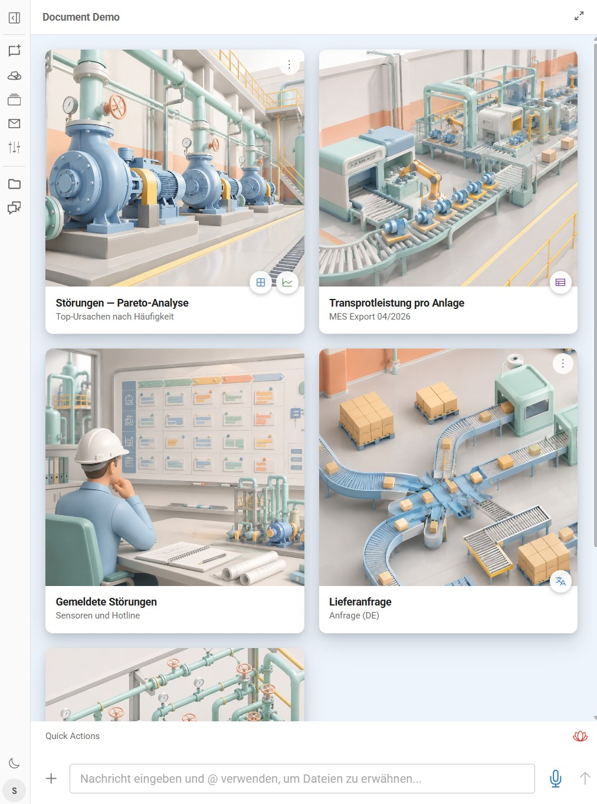
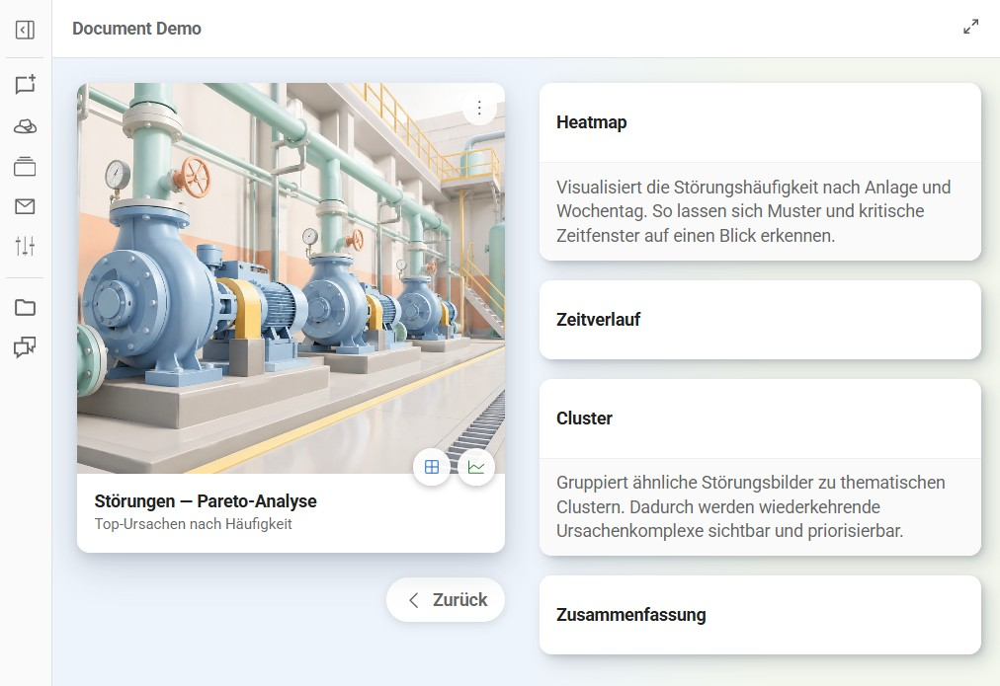

# Hyperscreen

Hyperscreen is a configurable, card-based overlay rendered on top of the chat
message pane. It turns a project into a visual launch screen: a grid of image
cards, each of which can open a file in the preview pane, expose quick-action
buttons, or slide in a secondary panel of related cards.

It is implemented in [src/components/Hyperscreen.jsx](src/components/Hyperscreen.jsx).



The submenu / context panel slides in from the right and shows a stacked list of
related cards (one card per row):



---

## How it works

- Configuration lives in the **project** directory at `hyperscreen/settings.json`.
  It is fetched at runtime via
  `GET /api/workspace/:project/files/hyperscreen/settings.json`.
- All images referenced in the config are **project-relative** files served from
  the same workspace endpoint. A bare filename like `"industry1.jpg"` resolves to
  `hyperscreen/industry1.jpg`; a path containing a slash (e.g. `"sub/space.jpg"`)
  is used as-is relative to the project root.
- **Localization is handled entirely inside `settings.json`.** Titles, subtitles,
  tooltips, descriptions and the background are read verbatim from the config —
  there is no i18n lookup. Put whatever language you need directly in the values.
- Clicking a card (or a submenu/context item) that has a `previewFile` emits a
  file-preview request, opening that artifact in the preview pane.
- Card image heights are computed automatically: every image is preloaded, the
  **median** aspect ratio is taken, and a single shared pixel height is derived
  from the measured column width. This keeps the grid uniform while images stay
  undistorted (`object-fit: cover`, cropped never stretched).

---

## Top-level structure

```json
{
  "background": "#eef4fb",
  "cards": [ /* … card objects … */ ]
}
```

| Field        | Type     | Required | Description |
|--------------|----------|----------|-------------|
| `background` | string   | No       | CSS color for the overlay background. Defaults to `#eef4fb` (pale light blue) when omitted. |
| `cards`      | array    | Yes      | The primary cards shown in the main grid. If missing or not an array, the grid is empty. |

---

## The card object

A card appears in the main grid. Every field is optional, but a card with no
`image`, no `submenu`, and no `previewFile` renders as a bare title block.

```json
{
  "id": "stoerungen-pareto",
  "title": "Störungen — Pareto-Analyse",
  "subtitle": "Top-Ursachen nach Häufigkeit",
  "image": "industry1.jpg",
  "previewFile": "stoerungen_01_pareto.png",
  "submenu": [ /* SubmenuButton items */ ],
  "contextMenu": [ /* ContextMenu items */ ]
}
```

| Field         | Type     | Description |
|---------------|----------|-------------|
| `id`          | string   | Stable identity, used as the React key. Falls back to the array index if omitted, so it is recommended for stable rendering. |
| `title`       | string   | Main label, shown in the title block (single line, truncated with an ellipsis if too long; full text on hover). |
| `subtitle`    | string   | Secondary label below the title, in muted/secondary text. Hidden if omitted. |
| `image`       | string   | Project-relative image file. Shown as the card's cover image at the shared computed height. If it fails to load, the image area is hidden. |
| `previewFile` | string   | File opened in the preview pane when the card is clicked. **Without it the card is not clickable** (cursor stays default and clicking does nothing). |
| `submenu`     | array    | Small round quick-action buttons overlaid on the bottom-right of the image. See [Submenu items](#submenu-items). |
| `contextMenu` | array    | A "⋮" (three-dots) menu in the top-right corner. See [Context menu items](#context-menu-items). |
| `description` | string   | Only rendered for cards shown **inside a context panel** (the reversed layout). Displayed as a light-grey body-text block under the title. Ignored for main-grid cards. |

> **Note on the image area:** the image block is rendered when the card has an
> `image` **or** a non-empty `submenu` (so the quick-action buttons have a place
> to anchor). A card with neither shows just the title block.

---

## Submenu items

`submenu` is an array of small circular icon buttons that float over the
bottom-right corner of a card's image. They are ideal for quick "open the related
chart / other-language version" actions.

```json
"submenu": [
  {
    "id": "open-heatmap",
    "icon": "PiGridFourLight",
    "title": "Heatmap öffnen",
    "previewFile": "stoerungen_02_heatmap.png",
    "color": "#1565c0"
  },
  {
    "id": "open-timeline",
    "icon": "PiChartLineLight",
    "title": "Zeitverlauf öffnen",
    "previewFile": "stoerungen_03_zeitverlauf.png",
    "color": "#2e7d32"
  }
]
```

| Field         | Type   | Description |
|---------------|--------|-------------|
| `id`          | string | React key (falls back to index). |
| `title`       | string | Shown as the button's tooltip on hover. |
| `icon`        | string | Icon name. See [Icons](#icons). Rendered at 16px in `color`. |
| `color`       | string | Icon color. Defaults to `#444`. |
| `image`       | string | Used **only when `icon` is omitted** — renders a small round avatar from this project-relative image instead of an icon. |
| `previewFile` | string | File to open in the preview pane when clicked. |
| `cards`       | array  | Alternative to `previewFile`: clicking slides in a context panel built from these cards (same routing as a context-menu item — see below). If both are present, `cards` wins. |

Click behavior: if the item defines `cards`, the secondary panel slides in;
otherwise, if it has a `previewFile`, that file opens in the preview pane.

---

## Context menu items

`contextMenu` is an array driving the "⋮" overflow menu in the card's top-right
corner. Each entry is a labelled (optionally icon'd) menu row. A context entry
can either open a file directly or **slide in a secondary panel** of cards.

```json
"contextMenu": [
  {
    "id": "ctx-all-charts",
    "icon": "PiImagesLight",
    "title": "Alle Auswertungen anzeigen",
    "background": "#f3f7ee",
    "cards": [
      {
        "id": "c-heatmap",
        "title": "Heatmap",
        "description": "Visualisiert die Störungshäufigkeit nach Anlage und Wochentag.",
        "previewFile": "stoerungen_02_heatmap.png"
      },
      { "id": "c-timeline", "title": "Zeitverlauf", "previewFile": "stoerungen_03_zeitverlauf.png" }
    ]
  },
  {
    "id": "ctx-cluster",
    "icon": "PiTreeStructureLight",
    "title": "Cluster-Analyse öffnen",
    "previewFile": "stoerungen_04_cluster.png"
  }
]
```

| Field         | Type   | Description |
|---------------|--------|-------------|
| `id`          | string | React key (falls back to index). |
| `title`       | string | The menu row label. |
| `icon`        | string | Optional leading icon for the menu row (18px). |
| `previewFile` | string | If set, selecting the row opens this file in the preview pane. |
| `cards`       | array  | If set (and `previewFile` is not), selecting the row **slides in a context panel** containing these cards. |
| `background`  | string | Background color for the slid-in context panel. The overlay fades from the main background into this color. Defaults to `#eef4fb`. |

Selection precedence: if the item has a `previewFile`, it opens that file;
otherwise, if it has a `title` (and `cards`), it slides in the context panel.

### The context panel (secondary layout)

When a `cards`-bearing entry is selected, the main grid shrinks to the left 50%
(showing only the parent card) and a panel slides in from the right with the
child cards **stacked one per row**. These child cards use the *reversed* layout:

- The **title** sits on top.
- An optional **`description`** renders below in a light-grey body-text block. If
  the description is empty/omitted, the grey area is hidden entirely.

Child cards accept the same fields as primary cards (`id`, `title`, `subtitle`,
`image`, `previewFile`, `description`, and even their own nested `submenu` /
`contextMenu`). A "Zurück" (back) pill below the parent card closes the panel.

---

## Icons

Icon names refer to [`react-icons`](https://react-icons.github.io/react-icons/):

- **Phosphor icons** (names starting with `Pi`, e.g. `PiGridFourLight`,
  `PiChartLineLight`, `PiTreeStructureLight`, `PiImagesLight`) are resolved
  directly from the Phosphor set.
- Any other name falls back to the shared icon registry
  ([src/utils/iconRegistry.js](src/utils/iconRegistry.js)).

If a name cannot be resolved, a submenu button falls back to its `image` avatar
(if provided); a context-menu row simply renders without a leading icon.

---

## Complete example

This is the configuration that produced the screenshots above
(`workspace/<project>/hyperscreen/settings.json`):

```json
{
  "background": "#eef4fb",
  "cards": [
    {
      "id": "stoerungen-pareto",
      "title": "Störungen — Pareto-Analyse",
      "subtitle": "Top-Ursachen nach Häufigkeit",
      "image": "industry1.jpg",
      "previewFile": "stoerungen_01_pareto.png",
      "submenu": [
        { "id": "open-heatmap", "icon": "PiGridFourLight", "title": "Heatmap öffnen", "previewFile": "stoerungen_02_heatmap.png", "color": "#1565c0" },
        { "id": "open-timeline", "icon": "PiChartLineLight", "title": "Zeitverlauf öffnen", "previewFile": "stoerungen_03_zeitverlauf.png", "color": "#2e7d32" }
      ],
      "contextMenu": [
        { "id": "ctx-all-charts", "icon": "PiImagesLight", "title": "Alle Auswertungen anzeigen", "background": "#f3f7ee", "cards": [
          { "id": "c-heatmap", "title": "Heatmap", "description": "Visualisiert die Störungshäufigkeit nach Anlage und Wochentag.", "previewFile": "stoerungen_02_heatmap.png" },
          { "id": "c-timeline", "title": "Zeitverlauf", "previewFile": "stoerungen_03_zeitverlauf.png" },
          { "id": "c-cluster", "title": "Cluster", "description": "Gruppiert ähnliche Störungsbilder zu thematischen Clustern.", "previewFile": "stoerungen_04_cluster.png" },
          { "id": "c-summary", "title": "Zusammenfassung", "previewFile": "stoerungen_05_zusammenfassung.png" }
        ] },
        { "id": "ctx-cluster", "icon": "PiTreeStructureLight", "title": "Cluster-Analyse öffnen", "previewFile": "stoerungen_04_cluster.png" }
      ]
    },
    {
      "id": "delivery-request",
      "title": "Lieferanfrage",
      "subtitle": "Anfrage (DE)",
      "image": "industry4.jpg",
      "previewFile": "delivery_request_de.md",
      "submenu": [
        { "id": "open-en", "icon": "PiTranslateLight", "title": "English version", "previewFile": "delivery_request.md", "color": "#1565c0" }
      ]
    }
  ]
}
```

---

## Field quick reference

| Where        | Field         | Effect |
|--------------|---------------|--------|
| root         | `background`  | Overlay background color (default `#eef4fb`). |
| root         | `cards`       | Primary grid cards. |
| card         | `id`          | React key. |
| card         | `title`       | Card title. |
| card         | `subtitle`    | Muted secondary line. |
| card         | `image`       | Cover image (project-relative). |
| card         | `previewFile` | File to open on click; makes the card clickable. |
| card         | `submenu`     | Bottom-right quick-action buttons. |
| card         | `contextMenu` | Top-right "⋮" overflow menu. |
| card         | `description` | Body text — context-panel (reversed) cards only. |
| submenu item | `icon`/`color`/`image` | Button glyph and color (or avatar fallback). |
| submenu item | `title`       | Tooltip. |
| submenu item | `previewFile`/`cards` | Open a file, or slide in a panel. |
| context item | `icon`/`title` | Menu row glyph and label. |
| context item | `previewFile`/`cards` | Open a file, or slide in a panel. |
| context item | `background`  | Background of the slid-in panel. |

> **Images for this document:** the screenshots live at repo root in
> `docs/images/` (`hyperscreen-main.jpg`, `hyperscreen-submenu.jpg`) and are
> referenced from here as `../docs/images/…`.
