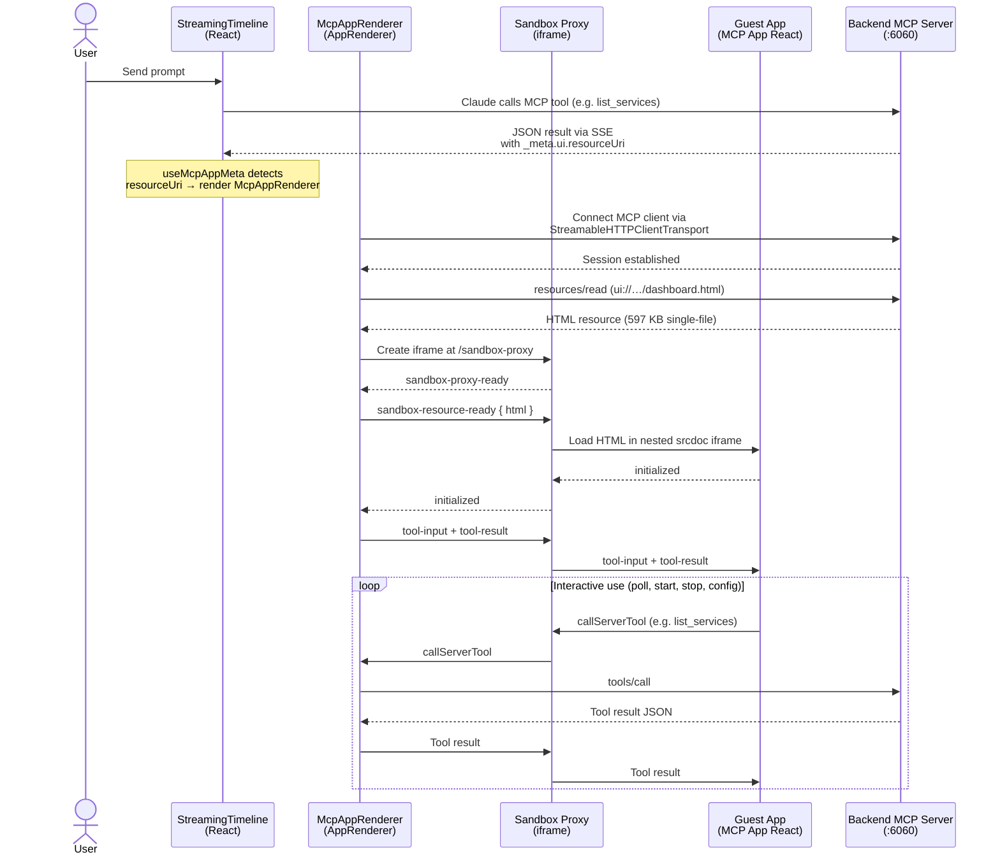

# MCP UI

MCP tools can serve interactive UIs directly inside the chat timeline. When a tool carries a `_meta.ui.resourceUri`, its result is rendered as a full MCP App (sandboxed iframe) instead of plain JSON, giving the user buttons, forms and live data right where the conversation happens.

One use case it the configuration of Etienne which can be optionally managed using the etienne configuration MCP tool:

<div align="center">

</div> 

The integration uses [`@mcp-ui/client`](https://github.com/idosal/mcp-ui) on the host side (React frontend) and [`@modelcontextprotocol/ext-apps`](https://github.com/modelcontextprotocol/ext-apps) inside the iframe (guest app).

## Architecture Flow



## Key Files

| Layer | File | Purpose |
|-------|------|---------|
| Backend | [etienne-configuration-tools.ts](backend/src/mcpserver/etienne-configuration-tools.ts) | Tool definitions with `_meta.ui.resourceUri`, resource HTML loader |
| Backend | [mcp-server-factory.service.ts](backend/src/mcpserver/mcp-server-factory.service.ts) | Registers resource handlers (`resources/list`, `resources/read`), exposes `getToolAppMeta()` |
| Backend | [mcp-server.controller.ts](backend/src/mcpserver/mcp-server.controller.ts) | `GET /mcp/tool-app-meta` endpoint for frontend discovery |
| Backend | [types.ts](backend/src/mcpserver/types.ts) | `McpResource` interface, `ToolGroupConfig.resources` |
| Frontend | [McpAppRenderer.jsx](frontend/src/components/McpAppRenderer.jsx) | Wraps `AppRenderer`, connects MCP client to backend |
| Frontend | [useMcpAppMeta.js](frontend/src/hooks/useMcpAppMeta.js) | Fetches tool-app metadata, maps both raw and `mcp__`-prefixed names |
| Frontend | [StreamingTimeline.jsx](frontend/src/components/StreamingTimeline.jsx) | Detects MCP App tools, renders `McpAppRenderer` inline |
| MCP App | [mcp-app-etienne-config/server.ts](mcp-app-etienne-config/server.ts) | Standalone MCP App server (development/testing) |
| MCP App | [mcp-app-etienne-config/src/mcp-app.tsx](mcp-app-etienne-config/src/mcp-app.tsx) | React dashboard UI (Services + Configuration tabs) |

## Adding a New MCP App

1. Create a React app under `mcp-app-<name>/` using `vite-plugin-singlefile` to produce a single HTML file in `dist/`
2. In your tool definition, add `_meta: { ui: { resourceUri: 'ui://<name>/dashboard.html' } }` to the entry tool
3. Register a `McpResource` in the tool group's config inside `mcp-server-factory.service.ts` with a `loadContent` function pointing at the built HTML
4. Add the group to `mcp-server-registry.json`
5. The frontend picks it up automatically via `/mcp/tool-app-meta`

## Sandbox Proxy

`AppRenderer` from `@mcp-ui/client` requires a **sandbox proxy** — a small HTML page that bridges `postMessage` communication between the host and a nested iframe containing the MCP App HTML. This provides iframe isolation so the guest app cannot access the host page's DOM, cookies, or storage.

**How it works:**

```
Host (AppRenderer on :5000)
  │
  └─ <iframe src="/sandbox-proxy?contentType=rawhtml">   ← proxy iframe
       │
       └─ <iframe srcdoc="...">                          ← MCP App HTML
            │
            └─ postMessage ↔ proxy ↔ host (JSON-RPC)
```

1. `AppRenderer` creates an iframe pointing at the proxy URL
2. The proxy signals readiness via `{ method: "ui/notifications/sandbox-proxy-ready" }`
3. The host sends the MCP App HTML via `{ method: "ui/notifications/sandbox-resource-ready", params: { html } }`
4. The proxy loads the HTML into a nested `srcdoc` iframe with `sandbox="allow-scripts"`
5. All subsequent JSON-RPC messages (tool calls, size changes, etc.) are forwarded bidirectionally

**Configuration:**

The proxy is served by a Vite middleware plugin at `/sandbox-proxy` on the same origin (port 5000). No additional ports are required, making it Docker-compatible.

| File | Purpose |
|------|---------|
| [sandbox_proxy.html](frontend/public/sandbox_proxy.html) | The proxy HTML — receives HTML via `postMessage`, creates nested iframe, forwards messages |
| [vite.config.js](frontend/vite.config.js) | `mcpSandboxProxyPlugin` serves `sandbox_proxy.html` at `/sandbox-proxy` via Vite middleware |
| [McpAppRenderer.jsx](frontend/src/components/McpAppRenderer.jsx) | Passes `sandbox={{ url: new URL('/sandbox-proxy', origin) }}` to `AppRenderer` |

**Note:** The `@mcp-ui/client` library checks whether the proxy origin matches the host origin. For `AppRenderer` (used for full MCP Apps with bidirectional tool calls), same-origin proxies work correctly. The origin check only blocks same-origin in `HTMLResourceRenderer` (a simpler component not used here).
