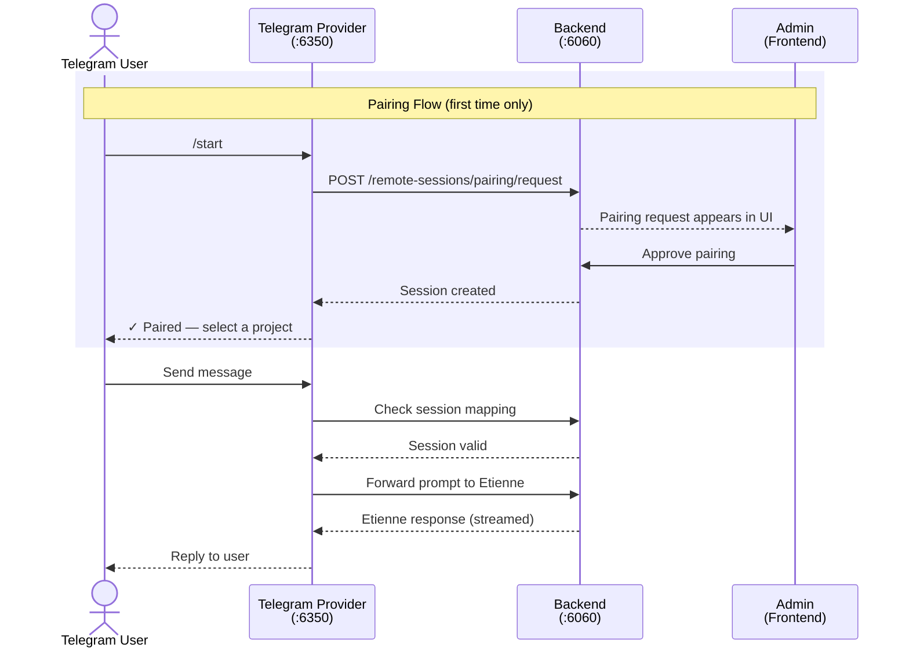

# Messenger Integration

Etienne supports external messaging platform integration, allowing users to interact with projects directly from messaging apps like Telegram. The system uses a secure pairing mechanism where all users are blocked by default until explicitly approved by an admin.

## Architecture



**Components:**
- **Telegram Provider** (`/telegram`) - Grammy-based bot using long polling, handles messages and media uploads
- **Remote Sessions Module** (`/backend/src/remote-sessions`) - Manages session mappings and pairing requests
- **Frontend Pairing Modal** - Admin approval interface for new user pairing requests

### Configuration

Create a `.env` file in the `/telegram` directory:

```env
# Required: Telegram Bot Token from @BotFather
TELEGRAM_BOT_TOKEN=your-bot-token-here

# Optional: Backend URL (default: http://localhost:6060)
BACKEND_URL=http://localhost:6060
```

To create a Telegram bot:
1. Open Telegram and search for **@BotFather**
2. Send `/newbot` and follow the prompts
3. Copy the bot token provided by BotFather

## Usage Guide

**Starting the Provider:**
```bash
cd telegram
npm install
npm run dev   # Development mode
```

**Pairing Flow:**
1. User sends `/start` to the Telegram bot
2. A pairing request appears in the Etienne web UI
3. Admin clicks **Approve** or **Deny** in the modal dialog
4. Once approved, user can select a project and start chatting

**Available Commands:**
| Command | Description |
|---------|-------------|
| `/start` | Begin pairing or show current status |
| `/status` | Show current session status |
| `/projects` | List available projects |
| `/disconnect` | Disconnect from Etienne |
| `/help` | Show available commands |

**Project Selection:**
```
project 'project-name'
```

**Sending Files:**
Users can send photos, documents, videos, and audio files which are automatically uploaded to the project's `.attachments` folder.

**More information:** See [telegram/README.md](telegram/README.md) for complete documentation including troubleshooting and development guides.
