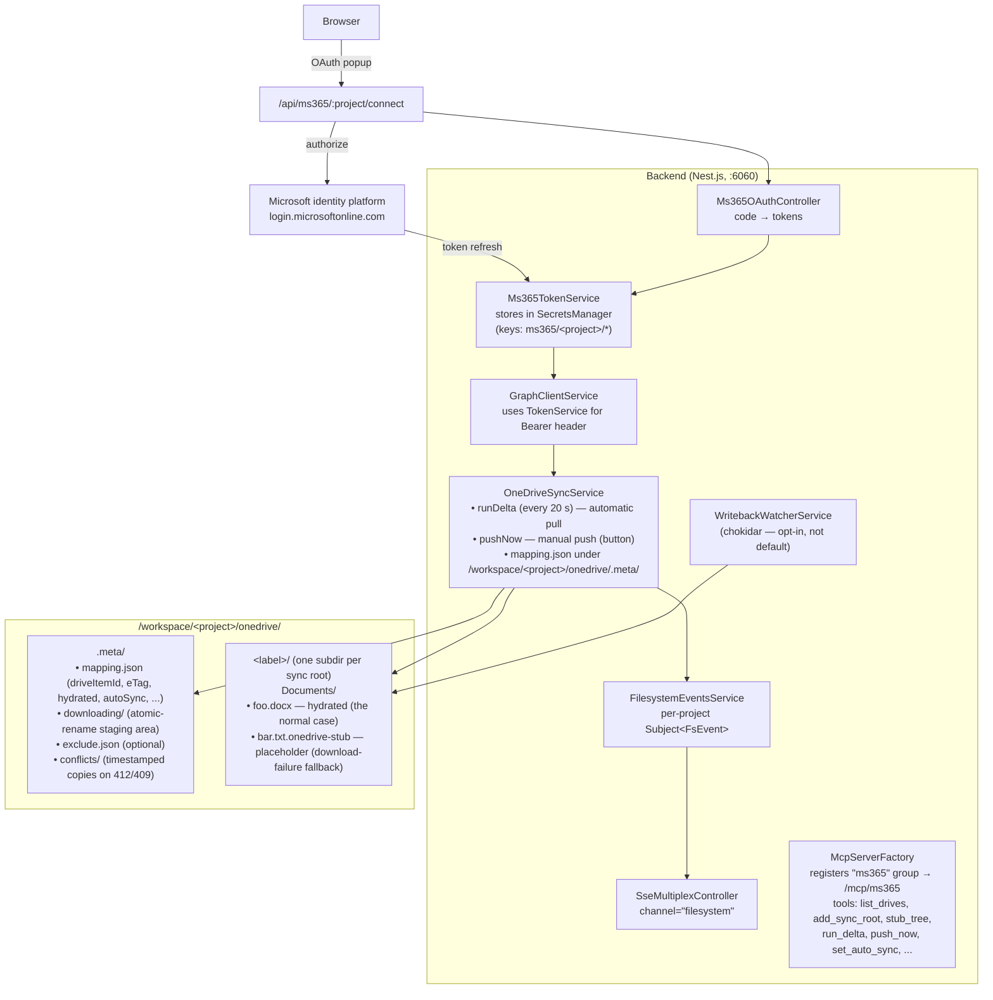

# OneDrive / Microsoft 365 Integration

End-to-end integration that mirrors a user's OneDrive (and SharePoint, with org mode) into a project's workspace volume so Claude Code can read and write those files as if they were local. Implemented as a single Nest.js module with five layers:

1. **OAuth + token storage** — per-project Microsoft identity, refresh on demand.
2. **Graph client** — typed wrapper over `https://graph.microsoft.com/v1.0`, with retry/throttle handling.
3. **OneDrive sync service** — tree materialization, delta polling, manual push, mapping persistence.
4. **Write-back watcher** — chokidar-based real-time uploader (available but **not** part of the default auto-sync flow).
5. **MCP bridge** — exposes the sync engine as MCP tools at `/mcp/ms365`, so Claude Code in any session can manage its own connection.

A "thin pass-through" of an external MCP server was **deliberately rejected**. Instead, the backend talks to Microsoft Graph directly, because:

- The pass-through approach (`softeria/ms-365-mcp-server` as a child process) shares one token cache across all projects, with per-tool `account` injection — one mistake leaks files across tenants.
- A native Graph client lets the backend own per-project tokens via the existing `SecretsManagerService` (OpenBao / Azure KV / AWS Secrets Manager / env), with no extra process to supervise.
- Sync, write-back, and conflict tracking already run server-side. Adding an extra hop through stdio MCP would just slow them down.

The cost: every Graph endpoint we use was implemented explicitly. The current set covers OneDrive + SharePoint drives + delta + upload-session for large files. Excel workbook editing, Teams, Outlook, Planner, and the rest of Graph are **not** wired up — add them to `GraphClientService` and `ms365-bridge-tools.ts` as needed.

---

## Sync strategy (Pull-auto + Push-manual)

The integration follows a deliberately asymmetric model:

| Direction | Trigger | What's covered |
|---|---|---|
| **OneDrive → local** | Automatic (every 20 s via delta) | adds, deletes, renames, content changes (only for already-hydrated files) |
| **Local → OneDrive** | **Manual** (the user clicks **Push** in the modal, or `push_now` is called via MCP) | uploads new local files, deletes remote files whose local copy was removed |

Rationale:

1. **OneDrive is the source of truth.** Whatever happens there should reflect locally within the polling interval. Adds, deletes, and renames propagate automatically; content changes propagate only when the local copy is already hydrated (we never silently overwrite a hydrated file's bytes — *that* requires the user re-running `hydrate_path`, see Limitations).

2. **Local changes need a human ack.** A misconfigured script that drops 10 GB of logs into `/workspace/<project>/onedrive/` should not automatically chew through your OneDrive quota. Same for an accidental `rm -rf` — local deletes don't immediately delete on OneDrive. Click Push when you mean it.

3. **Real-time write-back is still available but opt-in.** The `WritebackWatcherService` (chokidar) can be started manually if you want continuous bidirectional sync. It isn't started by the auto-sync flag and isn't wired into the modal anymore.

### What `Push` actually does

The Push button calls the `push_now` MCP tool, which runs `OneDriveSyncService.pushNow()`:

1. Walk the local mirror under each sync root (skipping `.meta/`, `.onedrive-stub`, `.downloading`, `.part`).
2. **For each local file:**
   - If not in `mapping.json` → upload (small ≤ 4 MB or chunked upload-session).
   - If in mapping with same size and `hydrated: true` → skip (no detectable change).
   - Otherwise → upload as a content update.
3. **For each mapping entry that's hydrated but whose local copy is missing → delete on OneDrive.**

Reports `{ uploaded, deleted, failed, skipped }` which the frontend shows as a toast like *"Push: 2 uploaded, 1 deleted"*.

**Renames** from local→remote are not detected by `pushNow` alone — it sees only the final state, so a rename looks like delete+add and you get a fresh remote upload plus a remote delete. Renames from OneDrive→local are detected by the delta loop and applied atomically. If you need transparent local→remote rename detection, manually start the `WritebackWatcherService` (it pairs `unlink`+`add` within 3 s and calls `moveOrRenameItem` instead).

---

## Architecture



### Lifecycle

1. **Connect.** User clicks "Connect Microsoft 365" in the project. Backend redirects to Microsoft, code comes back to `/api/ms365/oauth/callback`, tokens land in `SecretsManager` keyed by project name. The `home_account_id` and `account_email` are read from `/me`.

2. **Choose what to sync.** User adds a sync root (`add_sync_root`): a `{ driveId?, remotePath, label }` tuple. `driveId` blank means personal `/me/drive`; any other value is a SharePoint or shared drive ID from `list_drives` / `list_sites` / `list_site_drives`. The drive picker is a `Select` in the modal, populated on open by an internal `list_drives` call.

3. **Materialize the tree.** `stub_tree` walks the OneDrive root via Graph, creates folders locally, and **downloads each file directly** (atomically: written under `.meta/downloading/`, then renamed into place). Stubs (`*.onedrive-stub`) appear only as a fallback when a download fails.

4. **Auto-sync (pull-only).** Once a sync root exists and `autoSync` is on, the backend polls `/delta` every 20 s. New files are downloaded. Renames move local files. Deletes remove local files. Content updates re-download — but **only for already-hydrated files**, never silently re-overwriting a stub-fallback.

5. **Manual push.** User clicks Push (`CloudUpload` icon in the dialog header) or invokes `push_now`. Backend uploads any local-added files and deletes any remote files whose local copy is gone. Result is reported as a toast.

6. **Filesystem event stream.** Every materialize / hydrate / rename / remove emits an event into `FilesystemEventsService`, which the SSE multiplexer forwards on a `filesystem` channel. The project's file explorer subscribes via `useMultiplexSSE` and reloads (500 ms debounce) so the UI updates without polling.

---

## Components

### `Ms365TokenService` — [backend/src/ms365/ms365-token.service.ts](backend/src/ms365/ms365-token.service.ts)

Stores `access_token`, `refresh_token`, `expires_at`, `home_account_id`, `account_email` under keys `ms365/<project>/*` in `SecretsManagerService`. `getValidAccessToken(project)` refreshes 5 min before expiry, with an in-flight-refresh map to prevent stampedes when concurrent requests arrive.

Calls `https://login.microsoftonline.com/<tenant>/oauth2/v2.0/token` with `grant_type=refresh_token`. Tenant defaults to `common` (multi-tenant + personal accounts); set `MS365_MCP_TENANT_ID` to lock to a single tenant.

### `Ms365OAuthController` — [backend/src/ms365/ms365-oauth.controller.ts](backend/src/ms365/ms365-oauth.controller.ts)

Routes:

| Method | Path | Purpose |
|---|---|---|
| `GET` | `/api/ms365/:project/connect` | Build authorize URL + redirect. CSRF state stored in-memory with 10-min TTL. |
| `GET` | `/api/ms365/oauth/callback` | Exchange code, fetch `/me`, store tokens. Returns a small HTML page that `postMessage`s back to the opener and closes itself. |
| `GET` | `/api/ms365/:project/status` | `{ connected, accountEmail, expiresAt }` |
| `POST` | `/api/ms365/:project/disconnect` | Delete all `ms365/<project>/*` keys. |

Marked `@Public()` because the OAuth callback can't carry the app's JWT (Microsoft does the redirect, not the frontend). The `state` parameter is the only CSRF protection on the callback — the in-memory map is intentionally per-process; if you run multiple backend instances behind a load balancer, replace `stateStore` with a shared store (Redis, SecretsManager namespace) before going to production.

### `GraphClientService` — [backend/src/ms365/graph-client.service.ts](backend/src/ms365/graph-client.service.ts)

Thin axios wrapper around `https://graph.microsoft.com/v1.0`. Every method takes `project` as the first argument and looks up that project's token. `withRetry` handles:

- **401 once** → force token refresh, retry once. If a second 401 comes back, throw.
- **429** → honor `Retry-After`, up to 5 attempts.
- **5xx** → exponential backoff, up to 5 attempts.

High-level methods:

- `listDrives` / `listSites` / `listSiteDrives`
- `getRootChildren` / `getChildrenByPath` / `getItemByPath` / `getItemById`
- `downloadItemContent` (uses `@microsoft.graph.downloadUrl`, returns Buffer)
- `uploadSmallFile` (≤ 4 MB inline PUT) / `uploadLargeFile` (chunked upload session, 3.2 MB chunks)
- `createFolder` / `deleteItem` / `moveOrRenameItem`
- `searchFiles`
- `getDelta` (handles `@odata.nextLink` and `@odata.deltaLink` automatically)

Adding a new Graph capability is mechanical: drop a method here, expose it as a tool in the bridge.

### `OneDriveSyncService` — [backend/src/ms365/onedrive-sync.service.ts](backend/src/ms365/onedrive-sync.service.ts)

State lives in `/workspace/<project>/onedrive/.meta/mapping.json`:

```jsonc
{
  "version": 1,
  "roots": [
    { "driveId": "b!...", "remotePath": "Documents", "label": "personal", "localRoot": "/workspace/foo/onedrive/personal/Documents" }
  ],
  "deltaTokens": { "personal": "https://graph.microsoft.com/v1.0/.../delta?token=..." },
  "entries": {
    "Documents/foo.docx": {
      "driveItemId": "01ABCD...",
      "driveId": "b!...",
      "remotePath": "Documents/foo.docx",
      "eTag": "\"{abc-123},1\"",
      "size": 12345,
      "lastModifiedDateTime": "2026-05-13T10:00:00Z",
      "hydrated": true,
      "lastSync": 1715600000000
    }
  },
  "pendingUploads": [],
  "conflicts": [],
  "autoSync": true
}
```

`withMapping(project, fn)` serializes access via a per-project lock — all reads and writes go through it, so concurrent tool calls don't clobber each other.

`autoSync` defaults to `true` for new mappings. Toggling it via `set_auto_sync` starts/stops the delta-poll timer.

Key methods:

- `stubTree(project, rootLabel?)` — walk the remote tree once, downloading every file. **Despite the name** (kept for back-compat), files are written for real, not as stubs.
- `runDelta(project)` — call `/delta`, then reconcile the file system: download adds, rename moves, delete removes. Looks up entries by `driveItemId` (not by name), so deletions whose Graph response omits the name are still processed.
- `pushNow(project)` — see "What `Push` actually does" above.
- `hydratePath(project, remotePath)` — force-download a single file (used to recover from a stub fallback or refresh a stale hydrated file).
- `removeRoot(project, label)` — also purges entries and deletes the local mirror directory.

The stub file format (a JSON object with `driveItemId`, `remotePath`, `size`, `eTag`, and a `hydrate` hint) is intentionally human-readable. Stubs are now a *fallback* path — they appear only when a download fails mid-operation.

Exclude patterns live in `.meta/exclude.json` (optional). Defaults skip `~$*` (Office lock files), `*.tmp`, `.DS_Store`, `Thumbs.db`, and any file > 500 MB. Patterns are simple `*` globs against the file name.

**Atomic downloads.** Each download writes to `.meta/downloading/<itemId>-<ts>.part` and is then renamed into place. Temp files never appear in the user-visible tree, and the chokidar watcher (if started) ignores `*.downloading` and `*.part` defensively.

### `FilesystemEventsService` — [backend/src/ms365/filesystem-events.service.ts](backend/src/ms365/filesystem-events.service.ts)

Per-project RxJS `Subject<FilesystemEvent>`. Emitted from `materialize`, `hydratePath`, `renameLocalAndMapping`, `removeLocalAndMapping`, and `removeRoot`. Wired into the SSE multiplexer on channel `filesystem`. The frontend file explorer subscribes via `useMultiplexSSE` and reloads with a 500 ms debounce.

Event shape:

```ts
type FilesystemEvent =
  | { type: 'fs.added';   project: string; path: string; isDir?: boolean; source: 'onedrive' }
  | { type: 'fs.removed'; project: string; path: string;                  source: 'onedrive' }
  | { type: 'fs.renamed'; project: string; from: string; to: string;      source: 'onedrive' }
  | { type: 'fs.changed'; project: string; path: string;                  source: 'onedrive' };
```

### `WritebackWatcherService` — [backend/src/ms365/writeback-watcher.service.ts](backend/src/ms365/writeback-watcher.service.ts)

*Available but not part of the default auto-sync flow.* When manually started, it spawns a chokidar watcher rooted at `/workspace/<project>/onedrive/`, ignoring `.meta/**`, `*.onedrive-stub`, `*.downloading`, `*.part`. Events:

- `add` / `change` → debounce 2 s, then `uploadSmallFile` or `uploadLargeFile`. Mapping is updated with the response's `driveItemId` and `eTag`.
- `unlink` → look up `driveItemId`, call `deleteItem`. **Deferred 3 s to pair with a later `add` of the same size = rename**, in which case `moveOrRenameItem` is used instead.

On 412 (precondition failed) or 409 (conflict), the local content is copied to `.meta/conflicts/<timestamp>-<flattened-path>` and surfaced via `sync_status`. There is **no automatic three-way merge** — manual resolution is intentional.

Large files (> 4 MB) use `createUploadSession` and PUT chunks directly to the pre-authed `uploadUrl` Microsoft returns. The chunk size (3.2 MB) is a multiple of the 320 KiB alignment Graph requires.

`OnModuleInit` resumes auto-pull (delta polling) for projects whose mapping has `autoSync: true`. It does **not** auto-arm the chokidar watcher — that's an explicit user action only.

### `ms365-bridge-tools.ts` — MCP tools — [backend/src/ms365/ms365-bridge-tools.ts](backend/src/ms365/ms365-bridge-tools.ts)

Registered as the `ms365` group in `McpServerFactoryService`. Reachable from a project session as:

```
POST /mcp/ms365
  Authorization: Bearer test123
  X-Project-Name: <project>
  Content-Type: application/json
  Mcp-Session-Id: <uuid from initialize>
  { "jsonrpc": "2.0", "id": 1, "method": "tools/call", "params": { "name": "<tool>", "arguments": { ... } } }
```

Tools:

| Tool | Purpose |
|---|---|
| `list_drives` | OneDrive + shared drives for the connected account. |
| `list_sites` | SharePoint sites (org mode). Optional `query`. |
| `list_site_drives` | Document libraries inside a SharePoint site. |
| `add_sync_root` | Register `{ drive_id?, remote_path, label }` as a sync root. Auto-starts delta polling if `autoSync` is on. |
| `list_sync_roots` | Currently configured roots. |
| `remove_sync_root` | Unregister by label; also purges entries and deletes the local mirror folder. |
| `stub_tree` | Walk the remote tree and download every file (folders become real dirs). Optional `root_label`. |
| `hydrate_path` | Force-download a specific remote path (used to recover from a fallback stub or refresh a stale file). |
| `search_onedrive` | Graph search; metadata only. |
| `sync_status` | Roots, entries, hydrated count, pending uploads, conflicts, polling state, write-back-watcher state. |
| `run_delta` | Force a pull-style delta poll now. Returns `{ changed, added, renamed, removed }`. |
| `push_now` | One-shot scan: upload local-added files, delete remote files whose local copy is gone. Returns `{ uploaded, deleted, failed, skipped }`. |
| `get_auto_sync` / `set_auto_sync` | Read/write the `autoSync` flag. When on, the 20 s delta poll runs in the background. |
| `create_folder` | `parent_path`, `folder_name`, optional `drive_id`. |

The project context comes from `X-Project-Name` (or `?project=`). The `Ms365BridgeTools` resolves the project via a closure over `McpServerFactoryService.currentProjectRoot`, the same mechanism every other dynamic tool group uses.

### Frontend — [frontend/src/components/MS365Connect.jsx](frontend/src/components/MS365Connect.jsx)

A single MUI dialog opened from the project Dashboard tile **OneDrive**:

- **Header bar:** title + Pull icon (`run_delta`) + Push icon (`push_now`) + `auto-sync` checkbox + Close.
- **Body:**
  - **Sync roots** card: each row has a "sync this tree now" folder icon (calls `stub_tree`) and a trash icon (calls `remove_sync_root` with confirm dialog). Add-root form below with `Label` + `Drive` dropdown (auto-populated from `list_drives` on open, first entry preselected) + `Remote path` + `Add`.
  - **Browse SharePoint sites (org mode)** — collapsible, collapsed by default. Search-driven via `list_sites`.
- **Footer (DialogActions):** "Connected as `<email>`" left-aligned (tooltip shows token expiry); `Refresh` + `Disconnect` right-aligned. Disconnect goes through a styled MUI confirm dialog (no native `confirm()`).
- **Toasts** for all action outcomes (Pull / Push / Sync / Remove).

The frontend calls the MCP HTTP endpoint via a shared helper that maintains an `Mcp-Session-Id` per project and auto-reinitializes on session loss (e.g. backend restart). Errors carry the response body; transient `400: Server not initialized` is silently recovered.

---

## Microsoft Entra app registration

You need an app registration in Microsoft Entra ID (formerly Azure AD).

1. Portal → **Microsoft Entra ID** → **App registrations** → **New registration**.
2. Name: `claude-multitenant-onedrive` (or anything).
3. **Supported account types:** "Accounts in any organizational directory and personal Microsoft accounts" if you want to support both work and personal OneDrives. Set to single-tenant if you want to restrict.
4. **Redirect URI:** Web → `http://localhost:6060/api/ms365/oauth/callback` (dev). Add the prod URL alongside it once deployed.
5. After creation:
   - **Application (client) ID** → `MS365_MCP_CLIENT_ID`
   - **Directory (tenant) ID** → `MS365_MCP_TENANT_ID` (or use `common`)
   - Under **Certificates & secrets**, create a new **client secret** if you need confidential-client behavior (server-side OAuth, refresh tokens without PKCE). → `MS365_MCP_CLIENT_SECRET`. Public-client / PKCE flow works without a secret, but this backend currently uses confidential-client.

   **The Value column is shown once.** Don't copy the *Secret ID* (a GUID) — copy the *Value* (mixed-case alnum with `~`, `.`, `_`, `-`).
6. Under **API permissions** → **Microsoft Graph** → **Delegated permissions**, add:
   - `offline_access` (required to get refresh tokens)
   - `User.Read`
   - `Files.Read` and `Files.ReadWrite` (personal drive)
   - `Files.Read.All` and `Files.ReadWrite.All` (org mode — SharePoint and other users' drives)
   - `Sites.Read.All` and `Sites.ReadWrite.All` (org mode — SharePoint sites)

   Click **Grant admin consent for <tenant>**. The `.All` scopes require an admin to consent once per tenant; individual users connecting after that won't be prompted again.

If your app is **single-tenant**, you must set `MS365_MCP_TENANT_ID` to your tenant's directory ID (the `common` endpoint rejects single-tenant apps registered after 2018).

---

## Environment variables

| Variable | Required | Default | Notes |
|---|---|---|---|
| `MS365_MCP_CLIENT_ID` | yes | — | Entra app's Application (client) ID. |
| `MS365_MCP_CLIENT_SECRET` | yes (confidential client) | — | The *Value* column from Certificates & secrets, not the Secret ID GUID. |
| `MS365_MCP_TENANT_ID` | no¹ | `common` | Use a specific GUID/domain to lock to a single tenant. **Required** if your app registration is single-tenant. |
| `MS365_REDIRECT_URI` | no | `http://localhost:6060/api/ms365/oauth/callback` | Must exactly match the Entra app registration. |
| `MS365_SCOPES` | no | `offline_access Files.ReadWrite.All Sites.ReadWrite.All User.Read` | Space-separated. Drop `.All` for personal-OneDrive-only mode. |
| `MS365_DELTA_INTERVAL_MS` | no | `20000` (20 s) | Per-project delta poll cadence when `autoSync` is on. |
| `WORKSPACE_ROOT` | no | `/workspace` | Where projects (and their `onedrive/` subdir) live. |
| `SECRET_VAULT_PROVIDER` | no | `openbao` | Already a backend-wide setting; tokens go into whichever vault is selected. |

¹ Required if the app is single-tenant; optional for multi-tenant apps.

---

## End-to-end walkthrough

Assumes: Entra app registered, env vars set, backend running on :6060, frontend on :5000.

1. **Open project `acme` in the frontend.** Click the **OneDrive** dashboard tile.
2. **Click "Connect Microsoft 365".** A popup opens to `login.microsoftonline.com`. Sign in, consent. The popup posts back and closes; the footer shows "Connected as alice@contoso.com".
3. **Pick a drive.** The "Drive" dropdown was already populated when the dialog opened (first entry selected). Leave it on your primary OneDrive (or pick another).
4. **Set label = `personal`, remote path = `Documents` (or blank for the whole drive), click Add.** Backend creates `/workspace/acme/onedrive/personal/` and starts delta polling.
5. **Click the folder icon next to the new root.** That fires `stub_tree`. Backend walks `Documents/` on Graph and **downloads every file directly** under `/workspace/acme/onedrive/personal/Documents/`. Toast: "Synced: 47 files, 12 folders".
6. **Auto-sync is on by default.** Within 20 s of any OneDrive change (add / rename / delete in the web UI), the local mirror reflects it, and the project's file explorer refreshes automatically via the `filesystem` SSE channel.
7. **Pushing local changes.** Drop a new file into `/workspace/acme/onedrive/personal/Documents/` → click the **Push** icon in the dialog header. Toast: "Push: 1 uploaded". Delete a local file → click Push → toast: "Push: 1 deleted" → the file is gone from OneDrive web.
8. **From Claude Code in project `acme`:**
   ```
   ls /workspace/acme/onedrive/personal/Documents
   cat /workspace/acme/onedrive/personal/Documents/notes.md
   # → real content, no MCP hop needed
   ```
9. **Disconnect.** Click Disconnect (footer right). MUI confirm dialog. Tokens are wiped; sync roots stay configured but `autoSync` will be a no-op until you reconnect.

---

## Limitations and known constraints

**Local→remote renames aren't auto-detected by Push.** `pushNow` sees only the final filesystem state, so a rename from `a.txt` to `b.txt` looks like *delete `a.txt`, upload `b.txt`*. Net effect on OneDrive is correct but loses the version history of the original. For transparent rename handling, manually start the `WritebackWatcherService` (it pairs `unlink`+`add` within 3 s into a single `moveOrRenameItem`).

**Local→remote bytes need an explicit Push.** This is by design (see "Sync strategy"). A misconfigured script can't accidentally fill your OneDrive — but you also need to remember to click Push after editing.

**4 MB inline-upload cap.** Files > 4 MB use the chunked upload-session path — slower, more API calls, but works up to ~250 GB per Graph's limits.

**Excel native editing isn't implemented.** This would need Graph's workbook API (`/items/{id}/workbook/...`). For now, Excel files are download-edit-upload only — the same as Word and PowerPoint.

**Hydrated files re-download on remote change.** When `runDelta` sees an item already marked `hydrated` whose content (eTag) changed remotely, it re-downloads. If a remote-side and local-side edit happen between polls, the remote bytes win at the next pull — you lose your local edit. There is **no merge UI**. Workaround: rename your work-in-progress to take it out of the auto-tracked path, or disable auto-sync while editing.

**`account` isolation is enforced by the backend, not by Microsoft.** Every Graph call goes through `Ms365TokenService.getValidAccessToken(project)`, which looks up the project's token from `SecretsManager`. There is no shared MCP child process whose `account` param could be tampered with. Cross-tenant leakage requires a backend bug, not a single mis-routed tool call.

**Tenant admin consent is required for org mode.** `Files.ReadWrite.All` + `Sites.ReadWrite.All` need an admin to click "Grant admin consent" in the Entra portal once. After that, regular users can sign in without prompts.

**OAuth state is per-process.** `stateStore` in `Ms365OAuthController` is a `Map` in memory. Multi-instance deployments need a shared store before `state` can survive a callback hitting a different backend instance from the one that initiated the redirect.

**Graph throttling (429) is handled per-request, not globally.** Heavy `stub_tree` runs on a large drive could hit per-app limits across all projects. If you start seeing 429 storms, batch via Graph's `$batch` endpoint (up to 20 requests).

**MCP session pinning.** The frontend caches an `Mcp-Session-Id` per project. After a backend restart all sessions are wiped; the next request gets `400 "Server not initialized"`, which the helper transparently retries after `initialize`. Worst case: one extra round-trip.

---

## Adding more Graph capabilities

Pattern, repeating Excel as a worked example:

1. **Add the method to `GraphClientService`:**
   ```ts
   async getWorksheets(project: string, itemId: string, driveId?: string) {
     const base = driveId ? `/drives/${driveId}` : '/me/drive';
     const data = await this.get<{ value: any[] }>(project, `${base}/items/${itemId}/workbook/worksheets`);
     return data.value;
   }
   ```
2. **Expose it in `ms365-bridge-tools.ts`:**
   ```ts
   {
     name: 'list_worksheets',
     description: '...',
     inputSchema: { type: 'object', properties: { item_id: { type: 'string' }, drive_id: { type: 'string' } }, required: ['item_id'] },
   }
   // ... in execute switch:
   case 'list_worksheets':
     return { worksheets: await graph.getWorksheets(project, args.item_id, args.drive_id) };
   ```
3. **Update Entra app permissions** if the new endpoint needs scopes you don't already request.
4. **Restart** the backend (Nest re-registers the tool group at boot).

No frontend change needed — Claude can discover the tool via the standard MCP `tools/list` round-trip.

---

## File map

```
backend/src/ms365/
├── ms365.module.ts                  (Nest module — exports services for factory)
├── ms365-token.service.ts           (tokens + refresh)
├── ms365-oauth.controller.ts        (/api/ms365/* OAuth routes)
├── graph-client.service.ts          (typed Graph wrapper, retry/throttle)
├── onedrive-sync.service.ts         (delta, push_now, hydrate, mapping, materialization)
├── writeback-watcher.service.ts     (chokidar — opt-in, not auto-armed)
├── filesystem-events.service.ts     (Subject<FilesystemEvent> → SSE channel)
└── ms365-bridge-tools.ts            (MCP tool surface)

backend/src/mcpserver/
├── mcp-server-factory.service.ts    (registers "ms365" group)
└── mcp-server.module.ts             (imports Ms365Module)

backend/src/sse-multiplex/
├── sse-multiplex.controller.ts      (forwards FilesystemEventsService → "filesystem" channel)
├── sse-multiplex.module.ts          (imports Ms365Module)
└── sse-mux.types.ts                 (adds "filesystem" to MuxChannel union)

backend/src/app.module.ts             (imports Ms365Module)

frontend/src/components/
├── MS365Connect.jsx                  (dialog: header icons + sync-roots + collapsible SharePoint + footer status)
├── DashboardGrid.jsx                 (OneDrive tile)
└── SettingsModal.jsx                 (mounts the dialog)

frontend/src/hooks/
├── useMultiplexSSE.js                (subscribes Filesystem.jsx to "filesystem" channel)
└── sse-mux.types.js                  (adds "filesystem" channel)

frontend/public/
└── onedrive.png                      (dashboard tile icon)
```

---

## What's intentionally not built

- **A single-MCP-child-process bridge to `softeria/ms-365-mcp-server`.** Considered and rejected for the reasons in the architecture section. If you ever want this, mount it under a different group name (e.g. `ms365-passthrough`) so it lives alongside, not instead of, this implementation.
- **Auto-push of local changes.** By design, see "Sync strategy." If you want it, manually start the `WritebackWatcherService` for that project (its `startWatching` is still exposed via the service API; just not wired into the modal).
- **A separate per-end-user-per-project auth model.** Tokens are scoped per project, not per logged-in user. If two end users share project `acme`, they share the OneDrive that's connected to `acme`. To split them, key tokens under `ms365/<project>/<userId>/...` and pass user context into every Graph call.
- **Three-way merge on conflict.** The 412 conflict path in the chokidar watcher writes side files to `.meta/conflicts/`; manual resolution. A merge UI is out of scope.
- **Local→remote rename detection in `push_now`.** Looks like delete+add. The chokidar watcher does pair them within 3 s if you start it; the manual push doesn't.
- **Three-pane diff for Office documents.** Word/PowerPoint round-trip works but doesn't surface a diff.
- **Real-time presence / co-authoring.** Graph doesn't expose this for arbitrary clients; the OneDrive web UI is the only place to co-author Office files.
