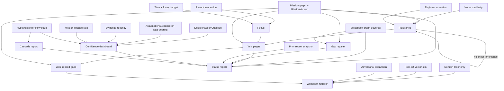
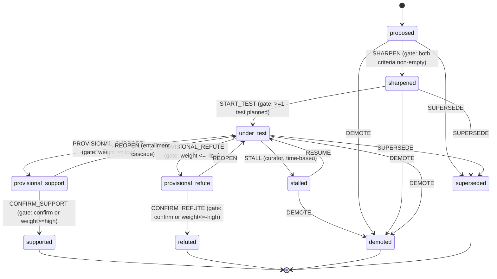

# System Design — Engineering Design Support System

This document is the design and rationale for the Engineering Design Support
System (the `design-support` optional skill plus its hypothesis subsystem),
written for later review. It is distinct from the user-facing
`workspace/<project>/documentation.md` (a how-to) and the per-skill
`user-guidance.md` (a dashboard quick-start). It explains *what the system
maintains*, *how its parts depend on each other*, *where each dependency is
enforced in the implementation*, and *how the design is verified*.

The reference deployment is the `desalination-devices` demo project.

---

## 1. Purpose & scope

Support a single engineer designing a product over a multi-month horizon.
Organize the engineer's evolving understanding around a **versioned mission**
and a **typed dependency graph**; surface gaps and uninvestigated whitespots;
run a **hypothesis lifecycle** as state machines; produce **status reports**
on demand.

In scope: what the system maintains, the dependency propagation, the surfaced
insights, the persisted artifacts. Out of scope (non-goals, mirroring the
requirements): not a project-management tool (no tasks/Gantt/time-tracking);
not collaborative (single engineer); not CAD/simulation; not a substitute for
the engineer's judgment; not autonomous beyond bounded loops.

The system is realized **entirely on existing platform primitives** — the RDF
knowledge graph, the vector store, the wiki skill, the stateful workflow
engine, the scheduler, and the event-handling rule engine. **No backend or
frontend source code is changed.**

---

## 2. Entity & dependency model

### 2.1 Entities

| Entity | Realized as |
|---|---|
| Mission | `MissionIntent/Constraint/NonGoal/AcceptanceCriterion` + `MissionVersion` KG nodes; markdown source at `wiki/_meta/mission.md`; version snapshots in `mission/history/` |
| Scrapbook (typed graph) | KG nodes (`Concept/Reference/Sketch/Constraint/OpenQuestion/Decision/Risk/Assumption/Evidence/Gap/Whitespot`) + typed edges; **system of record** |
| Scrapbook (view) | The visual scrapbook (`scrapbook_*` tools), a deterministic projection of the KG |
| Relevance | `relevance` property + `relevanceProvenance` (four components kept separate) |
| Focus | `focus` property + `focusLastReinforced`; decays; budget-conserved |
| Wiki | synthesized prose (`wiki` skill) from stable KG clusters |
| Hypothesis | `Hypothesis` KG node + one stateful workflow instance (`hypothesis-<slug>`) |
| Test | `Test` KG node (`testStatus` planned/in-progress/complete) — not a workflow |
| Gap / Whitespot register | materialized `Gap` / `Whitespot` KG nodes |
| Cascade report | `CascadeReport` KG node with per-item `reviewStatus` |
| Derivation triage | `DerivationTriage` KG node, one per mission version |
| Status report | immutable `reports/status-<ISO>-<variant>.md` snapshots |

The full schema (properties, edge predicates, the `kg_update_entity`
delete-and-recreate hazard) is the operating contract in
`skill-repository/standard/optional/design-support/references/architecture.md`.

### 2.2 Data dependencies (spec §4.1) — with enforcement points

| Dependency | Enforced by |
|---|---|
| Relevance ← mission distance, vector sim, neighbor, assertion | `design-support` skill (`add`/`mission`/`curator` modes); formula in `architecture.md §2`; each component kept in `relevanceProvenance` |
| Focus ← interaction, decay, budget | `curator` mode focus pass; `architecture.md §3`; conservation invariant `Σfocus=focusBudget` |
| Wiki ← stable clusters × relevance×focus × mission | `synthesize` mode, `clusterStabilityDays` from `config.json` |
| Wiki-implied gaps ← wiki ToC vs mission | `synthesize` mode emits `Whitespot` candidates (REQ-13) |
| Gap register ← graph traversals | `critic` mode structural traversal → `Gap` nodes |
| Whitespot register ← taxonomy, prior-art, adversarial, wiki gaps | `critic` mode; `design-support/domain-taxonomy.md` |
| Confidence dashboard ← multi-signal | `report` mode; signal inputs in `architecture.md §6` |
| Status report ← mission, graph, wiki, gaps, prior snapshot, dashboard | `report` mode + `references/report-template.md` |
| Cascade report ← refuted hypothesis traversal | `hyp-refuted.prompt` onEntry side-effect |

### 2.3 Behavioral dependencies (spec §4.2) — with enforcement points

```mermaid
graph TD
  MEDIT[Mission edit] --> RREL[Recompute relevance all nodes]
  MEDIT --> ALIGN[Flag newly-misaligned decisions as Gap]
  MEDIT --> MVER[New MissionVersion]
  MEDIT --> MDWF[mission-derivation: closed→pending→triage]
  ADDNODE[Add scrapbook node] --> EMB[Embed in vector store]
  ADDNODE --> AUTOLINK[Auto-link near nodes]
  ADDNODE --> LOCALREL[Update local relevance/focus]
  ADDNODE -->|if OpenQuestion| RQUEUE[Enqueue researcher]
  ADDEV[Evidence on OpenQuestion] --> RESOLVE[resolve / Decision / sub-questions]
  STABLE[Cluster stable] --> SYNTH[Synthesizer wiki page]
  STABLE --> WGAPS[Emit wiki-implied gaps]
  LOWACT[Low interaction] --> CURATE[Curator maintenance]
  LOWACT --> OFFER[Offer review session - not push]
  CONTRA[Critic: mission contradiction] --> PUSH[Interrupt the engineer]
  REPREQ[Status report request] --> FRESH[Fresh gap register + dashboard]
  REPREQ --> SNAP[Persist immutable snapshot]
  REFUTE[Hypothesis refuted] --> CASCADE[Cascade report + REOPEN entailed + mission-revision]
```

| Trigger → effect | Enforced by |
|---|---|
| Mission edit → relevance recompute + Gap + MissionVersion + derivation | `mission` mode; `mission-derivation` workflow `MISSION_EDITED` |
| Add node → embed + autolink + local recompute + (OpenQuestion→researcher) | `add` mode |
| Evidence on OpenQuestion → resolve/Decision/sub-questions | `research` mode |
| Cluster stable → synthesize + wiki-implied gaps | `synthesize` mode (cluster-stability-triggered, **not** every change — REQ-11) |
| Low interaction → curator maintenance + review *offer* (no push) | nightly curator cron; `hyp-stalled.prompt` writes the offer |
| **Critic mission-contradiction → interrupt** | `critic-mission-contradiction` event rule → `critic-interrupt` prompt (**the only push**) |
| Status report request → fresh registers + immutable snapshot | `report` mode |
| Hypothesis refuted → cascade | `hyp-refuted.prompt` onEntry |

---

## 3. Substrate decisions (the trade-space, for review)

| Decision | Chosen | Rejected alternative & why |
|---|---|---|
| Typed graph home | **RDF knowledge graph** is the system of record | *Extend the scrapbook tree*: rejected — the scrapbook is a label/priority tree with no typed cross-branch edges or provenance; the spec's `contradicts`/`dependsOn`/`entails` graph cannot be faithfully encoded there. The KG's free-form `kg_create_entity`/`kg_create_relationship` model it natively. |
| Engineer UX | **Chat-first; scrapbook mirrors** | *Chat-only, no mirror*: rejected — loses the live visual mindmap the user explicitly wanted. The scrapbook is a deterministic projection; edits flow back. |
| Mission storage | **Versioned markdown is source**, parsed into KG nodes | *KG graph as the only mission form*: higher fidelity but high editing friction; markdown keeps the engineer in a familiar surface and the parser is made robust by regenerating a fixed section structure. |
| Loop execution | **Skill-driven, pull-only + one nightly curator cron** | *Full workflow-engine orchestration of all loops*: rejected — heavier, and the spec is explicit about bounded, pull-only loops. |
| Report filtering | **Declarative internal→external rules** | *Per-generation engineer review gate*: rejected for this slice — adds a manual step; declarative rules are deterministic and auditable. |
| Hypothesis behavior | **Stateful workflow per hypothesis** | *Status as a plain KG property*: rejected — the lifecycle is a state machine with side-effects on transition; the workflow engine is exactly that, and owning the status prevents drift. |
| Tests | **KG nodes**, not nested workflows | *Nested Test workflows*: faithful but multiplies instances; deferred. |
| Decision dependency on refutation | **Cascade annotation only** | *Decision-review workflow*: heavier; the cascade report with per-item review status is sufficient and systematic. |

---

## 4. The four loops

All four are **skill sub-procedures**. Only the **curator** is scheduled (a
nightly `schedule-task` cron → `/api/claude/unattended`). The others run
pull-only (engineer-initiated) and as bounded curator post-steps; they also
act as hypothesis-workflow subscribers via state `onEntry` prompts.

- **Researcher** — pursues top OpenQuestions/Tests by relevance×focus
  (REQ-19); attaches `Evidence` with `evidenceFor(strength,direction)`.
- **Synthesizer** — projects stable clusters into wiki pages with backlinks;
  reverse-projects wiki structural gaps as `Whitespot` candidates; sets wiki
  epistemic language from hypothesis workflow state (provisional ⇒ hedged,
  supported ⇒ confident, refuted ⇒ "ruled out because…").
- **Curator** — recompute relevance; decay + renormalize focus (conservation
  invariant); dedupe; patient age-out; refresh registers; **fire `STALL` on
  stale `under_test` hypotheses**; refresh the scrapbook projection.
- **Critic** — structural Gap traversals; taxonomy + prior-art + adversarial
  Whitespots; mission-drift across `MissionVersion`s; the **single push** on
  a mission contradiction.

Pull-only is an invariant, not a guideline: it is verified negatively by
`integration-ds-critic-push.test.ts` (the critic rule must be the *only*
enabled prompt-push event rule).

---

## 5. Hypothesis lifecycle subsystem

Machine config:
`references/hypothesis-machine.json`. Each state's `meta.onEntry.promptFile`
is one of `references/hyp-*.prompt` (staged into `workspace/<proj>/workflows/`
at install so the entry-action runner can resolve it).

**Cascade on `refuted` is the keystone.** `hyp-refuted.prompt`: create a
`CascadeReport` (`cascadeOf`→H) listing every `dependsOn` Decision, every
`entails`-target Hypothesis (each sent `REOPEN`), and every heavily-weighted
wiki section, with per-item `reviewStatus`; if `missionDerived`, raise a
mission-revision `Gap` + prompt. Without this, "we proved X wrong" is a note;
with it, the revision work is scoped.

**Mission-derivation meta-workflow** (`mission-derivation-machine.json`,
singleton): `closed —MISSION_EDITED→ pending_derivation —CANDIDATES_READY→
triage —TRIAGE_COMPLETE→ closed`. Writes a `DerivationTriage` audit node per
mission version.

Cross-instance coordination uses the workflow engine's ZMQ event bus: every
transition publishes `workflow/status/transitioned`; `workflow/trigger`
messages drive `sendEvent` on other instances. The cascade sends `REOPEN`
directly via `workflow_send_event`; the event-bus rule is the fallback path.

---

## 6. The guard constraint & its consequence (most important review item)

**Verified platform limitation:** the stateful workflow engine stores
`{ target, guard }` strings in the machine config but **does not evaluate
guards** — XState v5 needs a `setup({ guards })` the platform does not
provide. Declarative XState guards are therefore inert.

**Consequence — the design is built around this.** Every hypothesis guard
("both criteria non-empty", "evidence weight crosses threshold", stall
timing) is an **onEntry-prompt gate**: the state's `onEntry` prompt reads the
Hypothesis KG node, evaluates the guard itself, and only calls
`workflow_send_event` to advance when the guard holds. Otherwise it takes an
explicit *"do nothing, wait for engineer/curator"* branch.

**Loop-safety mitigation.** A parked state must not re-fire forever: (a) every
gating prompt has the explicit no-op branch (no event sent); (b) the
workflow-entry-action runner dedups concurrent entry actions per
`project:workflow:state` key; (c) `REOPEN` is idempotent (re-entering
`under_test` from `provisional_*` is safe; the under-test prompt skips Tests
already `complete` and probes already recorded).

A reviewer must understand this is a structural workaround, not an
incidental implementation detail. It is the reason
`integration-ds-hypothesis-lifecycle.test.ts` exists and asserts the
anti-vagueness gate *holds with empty criteria* and *releases when criteria
are present* — i.e. that the prompt-gate actually gates.

---

## 7. Relevance & focus math

Exact formulas live in
`references/architecture.md` §2–§3; all constants in
`design-support/config.json`. Summary:

- `relevance = asserted ?? (wMission·missionDistance + wVector·vectorSim +
  wNeighbor·neighborInherit)`; components retained in `relevanceProvenance`;
  `relevanceDivergenceFlag` when `|asserted − derived| > divergenceThreshold`.
- Focus: `1.0` on interaction; curator decays `focus·exp(−Δt/focusTau)` then
  renormalizes so `Σfocus = focusBudget` (conservation invariant, tolerance
  `focusBudgetTolerance`).

Defaults and the reasoning (spec §10 + hypothesis open questions): focus
budget `20`, decay τ `21d`, cluster window `5d`, divergence `0.3`, stall
window `14–28d` scaled by relevance, evidence low/high `0.4/0.75` with
per-hypothesis overrides, curator `0 3 * * *`. These are first-pass values
for a months-long single-engineer project; surfaced as tunable in
`documentation.md`, never hard-coded in skill prose.

---

## 8. Status report & confidence dashboard

`report` mode renders `references/report-template.md` to an immutable
`reports/status-<ISO>-<variant>.md`. Confidence dashboard signals, each
printed with its inputs: decision:open-question ratio; assumption:evidence on
load-bearing decisions; evidence recency on high-relevance decisions; mission
change rate; **load-bearing decisions on open hypotheses** (= `dependsOn` ∩
non-terminal workflow state — brittleness as a real number derived from graph
state). Internal vs external is a **declarative filter**: external drops
whitespots + critic speculation, reframes gaps as "areas under active
investigation", and keeps decisions/evidence/confidence. Filtered, never
falsified. Delta reads the prior snapshot of the same variant.

---

## 9. Integration test strategy

The system's value is dependency propagation; the tests assert the §4 edges,
not surface behavior. Convention (matching the repo): standalone `tsx` +
`node:assert` scripts in `backend/test/`, HTTP-driven against live services,
**auto-`SKIP` (exit 0)** when a service is unreachable, throwaway project per
run, no mocking. Shared harness: `backend/test/lib/ds-harness.ts`. Ordered
runner: `backend/test/run-ds-integration.mjs` (the repo has no CI; this is the
substitute).

### Dependency → test traceability

| Spec dependency | Test | Asserts |
|---|---|---|
| §4.1/§4.2 mission→relevance; REQ-3,6,8 | `integration-ds-relevance-propagation` | mission edit recomputes relevance, keeps provenance components, materializes a Gap for the misaligned decision |
| §4.1 focus; REQ-7 | `integration-ds-focus-budget` | touched node high, others decayed, **Σfocus ≈ budget** |
| REQ-5,8,9 | `integration-ds-scrapbook-mirror` | KG→scrapbook projection at priority≈rel×10; scrapbook edit→KG asserted relevance + divergence flag |
| optional component; REQ-18 | `integration-ds-hypothesis-lifecycle` | onEntry-prompt anti-vagueness gate holds with empty criteria, releases with criteria; workflow state is lifecycle truth |
| hypothesis side-effects (keystone) | `integration-ds-cascade-on-refutation` | refute→CascadeReport listing dependent decision + entailed-H REOPEN + mission-revision Gap |
| §4.2 meta-workflow | `integration-ds-mission-derivation` | mission edit advances derivation workflow + writes DerivationTriage audit |
| REQ-23..30 | `integration-ds-report-snapshot` | immutable snapshots; external filter drops whitespots keeps decisions/confidence; second snapshot not overwritten |
| REQ-20,21 | `integration-ds-critic-push` | critic rule = KG-condition→prompt; the **only** enabled prompt-push rule (pull-only invariant) |
| reproducibility | `integration-ds-seed-smoke` | the seeded workspace has the design-support artefacts (skill, docs auto-open, workflows incl. cascade + mission-derivation, critic rule) |

Run: `cd backend && node test/run-ds-integration.mjs`. With services down the
suite reports `PASS 0 SKIP 9 FAIL 0` and exits 0 (verified).

---

## 10. Risks & open questions

| ID | Risk / question | Resolution / chosen default | Revisit when |
|---|---|---|---|
| O1 | XState guards not evaluated | onEntry-prompt gates + explicit no-op branch + entry-action dedup | a platform `setup({guards})` ships |
| O2 | Cross-instance REOPEN reliability | direct `workflow_send_event`; event-bus rule fallback | if the cascade test shows H2 not reopening |
| O3 | `kg_update_entity` is delete+recreate | always pass full props + re-assert edges (enforced in every prompt) | if a KG update API gains partial-patch |
| O4 | Scrapbook image attach has no MCP tool | REST `POST .../scrapbook/nodes/:id/images`; wiki-embed fallback | if a scrapbook image MCP tool is added |
| O5 | Seed needs services up; project-level idempotent | documented prerequisites + re-seed procedure in the seed README | — |
| O6 | onEntry prompts are budget-gated agent runs | tight prompts; curator post-step caps in `config.json` | if budget pressure observed |
| O7 | Mission markdown parse fragility | regenerate `mission.md` into a fixed section structure | if parsing misses sections |
| O8 | spec §10 + hypothesis defaults are guesses | values in `config.json`, surfaced as tunable in `documentation.md` | after real project usage data |
| §10-a | Domain taxonomy origin | generated from the mission at bootstrap, editable | if templates prove better |
| §10-b | Cluster-stability window | `clusterStabilityDays=5` | if synthesis too eager/slow |
| §10-c | Evidence thresholds | `0.4`/`0.75` global + per-hypothesis overrides | per-claim tuning needed |
| §10-d | Stall duration | `14–28d` scaled by relevance | project pace differs |
| §10-e | Review-session cadence | offered (not pushed) when stalled hypotheses accumulate | — |
| §10-f | Wiki edit reconciliation | preserve-and-merge on re-synthesis (synthesizer is conservative) | if engineer edits clash |
| §10-g | External report filter | declarative rules (not per-generation review) | if management needs change |

---

## 11. Reproducibility — the three-location contract

The seed is the single source of truth.

1. **Fixtures** (`scripts/seed-desalination/fixtures/*.ts`, incl.
   `hypotheses.ts`) define the data and the seeded lifecycle states (a mix
   including one Refuted-with-cascade and one mission-derived hypothesis).
2. `scripts/seed-desalination/seed-desalination.ts` steps 10–15 install the
   skills, POST the typed graph, create + drive the workflows, write
   `documentation.md` + register it auto-open, seed the critic rule, and
   register the curator cron.
3. `workspace/desalination-devices/` is the **live copy** the seed writes —
   used for testing.
4. `demo-project-folders/desalination-devices/` is the **golden reference**,
   synced *from* the workspace copy after a clean seed (excluding live churn:
   `.etienne/chat.*`, `costs.json`, `agent-logs/`, `session.id`).

Re-seed requires deleting the project dir and dropping the project's Chroma +
Quadstore namespaces (documented in `scripts/seed-desalination/README.md`).
