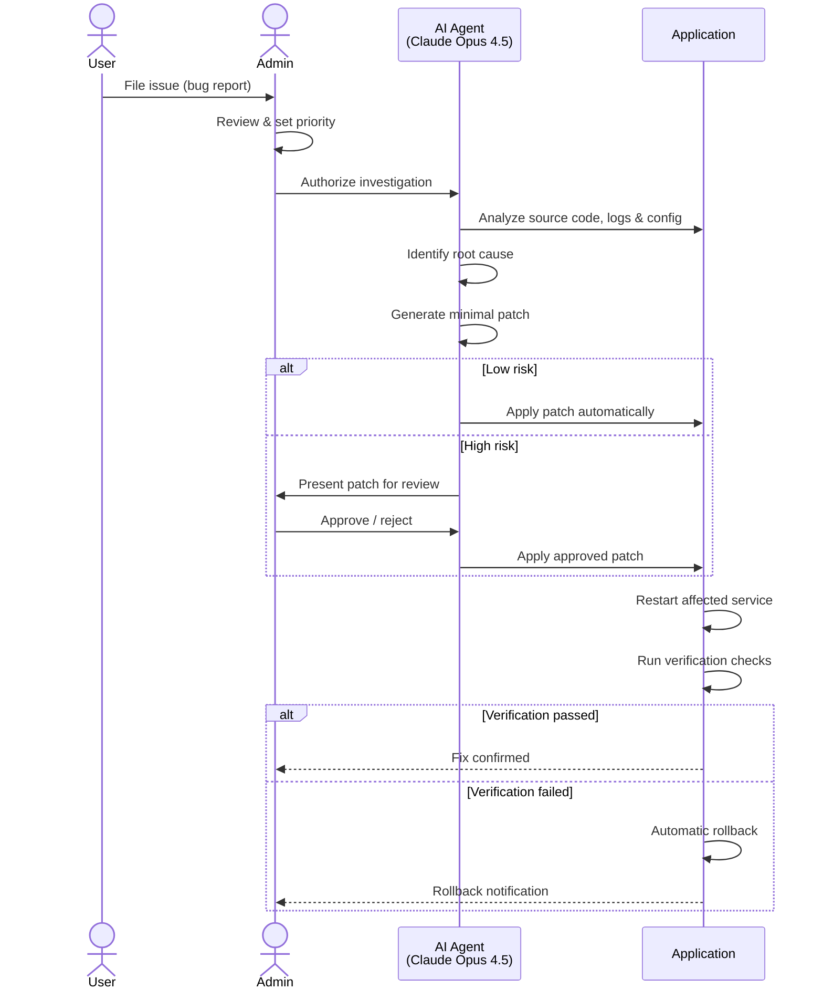
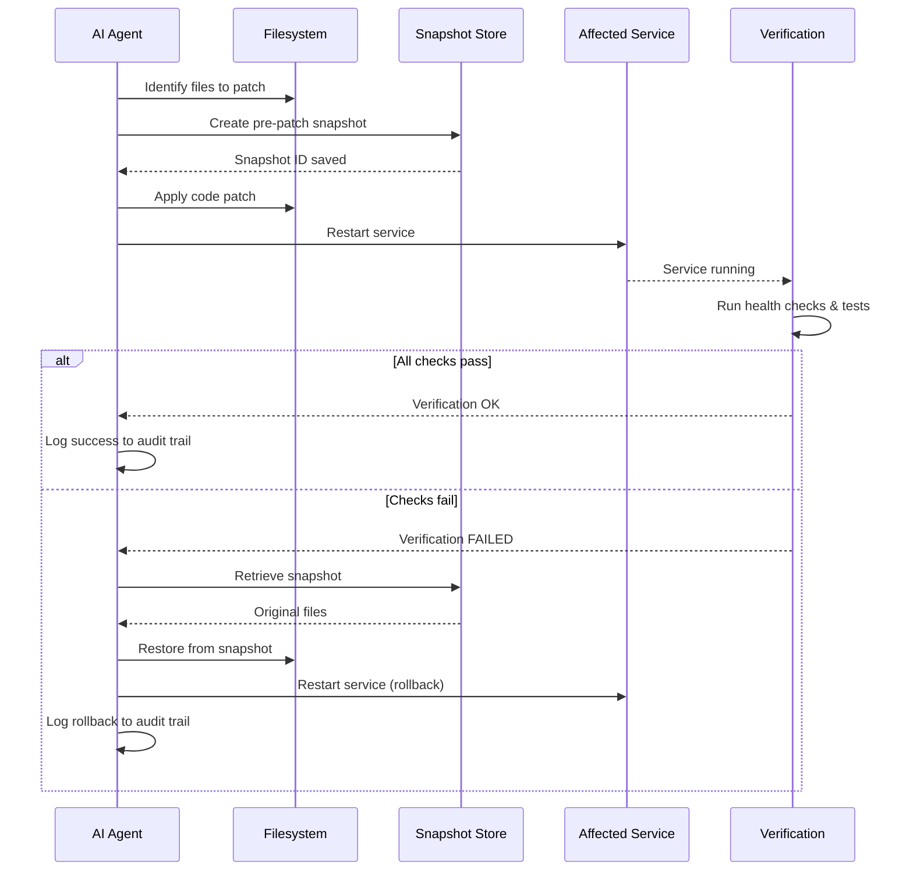

# Self-Healing Capabilities

As this project is built around the most sophisticated coding harness, one feature comes to your mind quite immediatelly: "Can't the agent fix its own code when there's some kind of error?"

> Not every error is an error though - this is why
> we should add a proper safeguard by using the human
> 4 eyes principle: No code part of the vital agent functionalities
> should be fixed automatically!

Etienne gives our agent the ability to patch its own source code when you report problems — with full human oversight at every critical step. You can open the **issue tracker** from the project menu:

**Here's the workflow:** A user files an issue describing what's broken. An admin reviews it, sets priority, and authorizes the AI agent to investigate. Because the data (which probably caused the error) is still in the project directory, the agent — Claude Opus 4.5 via the Claude Agent SDK — can directly analyze data, source code, logs, and configuration "in-place", it can identify the root cause, and can create a minimal code patch. Depending on the risk level, the patch is either applied automatically or presented to the admin for review. After patching, the affected service restarts and the system verifies the fix worked. If it didn't, automatic rollback kicks in.

This is not a copilot suggesting changes for you to implement. This is an embedded repair system that lives inside our agent, understands our code at the deepest level, and acts on explicit human authorization.

**Four safety layers** ensure you're always in control:
1. **Admin approval gates** — no agent action starts without explicit authorization
2. **Agent-level guardrails** — dangerous commands blocked, file edits restricted to the application directory
3. **Pre-patch snapshots** with automatic rollback on verification failure
4. **Immutable audit trail** — every agent action is logged (who approved, what changed, what happened)

**Graduated autonomy** lets admins build trust incrementally across four levels: from observe-only (Level 0) where the agent only diagnoses and suggests fixes, to fully automatic patching with rollback guarantees (Level 3). New deployments always start at Level 0.

The immune system most other agents lack — with a human hand on the switch.

To enable self-healing on a project, activate the **self-healing** skill from the skill store. It guides users through creating structured issue reports with title, description, reproduction steps, and expected vs. actual behavior — all submitted to an admin for review before any automated repair is triggered.
