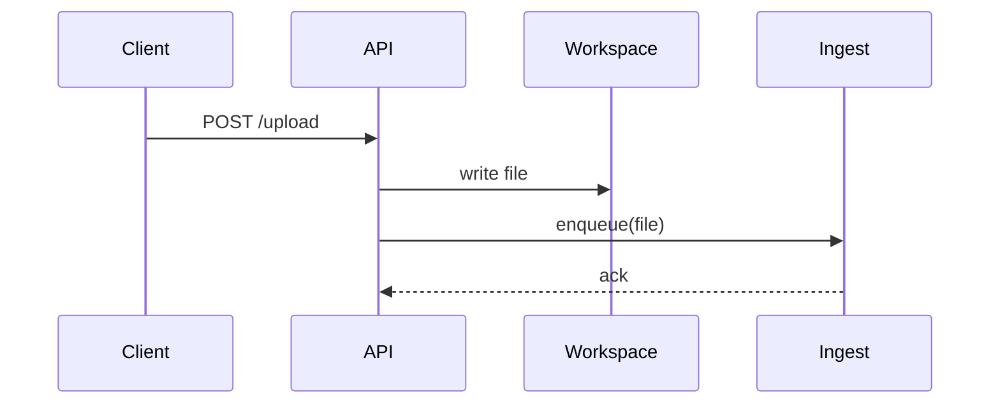

# Wiki — long-term memory as a markdown knowledge base

You maintain `wiki/` — a structured, mission-driven, pure-markdown knowledge base that is the project's persistent memory. The mission lives at `wiki/_meta/mission.md` and was written by the host application before this session started; you do **not** invent or modify it.

## Operating principles

1. **Mission first.** Before any wiki operation in a session, read `wiki/_meta/mission.md` and `wiki/_meta/taxonomy.md`. Everything you write must serve the mission. Information unrelated to the mission does not belong in the wiki, no matter how interesting.
2. **Read before write, every time.** Before writing or updating any page, run `wiki-search` with the candidate title plus two to three salient terms. Decide between *update existing*, *cross-link*, or *create new* based on the results. Skipping this step creates duplicates that are expensive to clean up.
3. **Index before drill.** When answering a question from the wiki, read `wiki/index.md` first, then drill into the two to five most relevant pages. Do not regrep the whole tree. `index.md` is the **entry page of the wiki** — it is fully auto-generated by `wiki-index.ts` and contains a mission excerpt, headline stats, recently updated pages, top topics by mission relevance, meta navigation, and the full category listing. Treat it as read-only: never hand-edit it; instead, regenerate it after any batch of writes so the entry page stays current.
4. **History, not overwrite.** When new information conflicts with what is on a page, append the prior claim to the page's `## History` section with its date and source. Never silently rewrite. Conflicts must remain visible.
5. **Provenance is mandatory.** Every claim's `sources` frontmatter entry is either `{kind: conversation, turn, note}` or `{kind: file, path, lines}`. A page with no provenance must be marked `confidence: low` and `status: draft`.
6. **Stubs over silence.** When a topic is mentioned but not yet researched, create a stub page rather than dropping the reference. Stubs cost almost nothing and prevent forgetting.
7. **Slugs are immutable.** Once a page is published, its slug never changes. Renames create a redirect in `wiki/_meta/redirects.md` and an `aliases` entry on the page.
8. **No network, no embeddings.** All knowledge comes from this conversation or from text files already in the project. Do not browse the web.

## When to invoke wiki operations

Invoke proactively, without waiting for an explicit "save this" request, in these situations:

- The user shares a preference, decision, requirement, fact, or finding ("I want X", "we decided Y", "we should avoid Z").
- The user asks a question that the wiki could answer ("what do we know about…", "have we considered…", "what did we decide about…").
- The user uploads or points to a project file that plausibly contains mission-relevant information.
- The user uses an explicit memory phrase ("remember", "save", "add to wiki", "note", "for the record").
- The session is wrapping up and there are uncommitted findings.

When uncertain whether something is wiki-worthy, apply this rule: **if the next session would be poorer without it, save it; if it is transient chat noise, do not**.

## Wiki layout you maintain

```
wiki/
├── _meta/
│   ├── mission.md            # READ-ONLY for you
│   ├── taxonomy.md           # categories + tag axes; you evolve this
│   ├── changelog.md          # append-only event log
│   ├── graph.md              # auto-generated by wiki-index
│   └── redirects.md          # old-slug → new-slug
├── index.md                  # ENTRY PAGE — auto-generated by wiki-index. Mission excerpt, stats,
│                             #   recently updated, top topics, meta nav, then all pages by category.
│                             #   Never hand-edit; regenerate after any batch of writes.
├── topics/<slug>.md          # the substantive pages
├── sources/<slug>.md         # one summary per ingested codebase file
└── queries/<yyyy-mm-dd>-<slug>.md   # filed answers worth keeping
```

## Page frontmatter — the canonical schema

Every page under `topics/`, `sources/`, `queries/` carries this header. Required fields are bold.

```yaml
---
title: <Human readable>
slug: <kebab-case>
status: stub | draft | stable | deleted
confidence: high | medium | low
tags: [t1, t2, axis:value]
mission_relevance: 0..1
sources:
  - kind: conversation
    turn: <ISO-8601 timestamp>
    note: <short>
  - kind: file
    path: <relative to project root>
    lines: <"start-end" or "all">
created: <ISO-8601>
last_updated: <ISO-8601>
supersedes: []
aliases: []

# Optional — set by Adaptive Memory when active. Absent fields default to
# classification='private' and a synthesised Provenance at the service boundary.
classification: public | private | secret
provenance:
  sourceSessions: [<session-id>, ...]
  sourceEntries: [<upstream-entry-id>, ...]
  createdBy: agent | ponderer | user
  createdAt: <ISO-8601>
  updatedAt: <ISO-8601>
  inferenceTag: <ponderer-pattern-id>      # ponderer-only
---
```

`title`, `slug`, `status`, `confidence`, `mission_relevance`, `created`, `last_updated`,
and at least one `sources` entry are required. `classification` and `provenance` are
optional but should be supplied whenever the page is written through Adaptive Memory;
`status: deleted` is reserved for `wiki-delete.ts` tombstones and is excluded from
`index.md` regeneration.

## Cross-linking convention

Use relative markdown links: `[Walnut wood](../topics/walnut-wood.md)`. Every page ends with a `## Backlinks` section maintained by `wiki-add` — never edit it by hand.

## Diagrams — when to embed mermaid

Wiki pages render in the project frontend, which displays ```` ```mermaid ```` fenced blocks as inline SVG. You may embed mermaid diagrams in any `topics/`, `sources/`, or `queries/` page when a diagram conveys structure that prose obscures.

Reach for a diagram in exactly these three situations:

- **Sequences** — interactions over time across multiple actors or components (request flows, ingest pipelines, auth handshakes, lifecycle of an event). Use `sequenceDiagram`.
- **Dependencies** — directed relationships between modules, services, packages, or concepts ("X depends on Y", call graphs, build order, blocker chains). Use `graph LR` or `graph TD`.
- **Data models** — entity shapes and relationships (tables, records, domain objects, message schemas). Use `erDiagram` or `classDiagram`.

Discipline — diagrams must earn their place:

1. **Prose first.** A diagram is justified only when it makes a relationship clearer than three sentences of prose would. If you can write the relationship out cleanly, do that and skip the diagram.
2. **One diagram per concept**, not per page. A page with five diagrams is doing prose's job badly.
3. **Keep diagrams small** — aim for under ~12 nodes. Split into multiple focused diagrams rather than one mega-graph.
4. **Supplement, don't replace.** A reader who can't render mermaid (terminal, plain-text export, grep) must still get the full story from the surrounding text. The diagram is a visual aid, not the source of truth.
5. **No diagrams on `status: stub` or `confidence: low` pages.** Diagram-worthy structure implies you've actually researched it.

Minimal worked snippet for a `sequenceDiagram` inside a page body:

````markdown
The upload handler validates the file, persists it to the workspace, then notifies the ingest worker:


````

## The six scripts

All scripts live at `.claude/skills/wiki/scripts/` and run with `tsx`. Their stdout is structured (single JSON object per call). Always parse the JSON; do not rely on prose output.

| Script | Purpose | Typical call |
|---|---|---|
| `wiki-search.ts` | Ranked search across body and frontmatter. **Run before every write.** | `tsx <skill>/scripts/wiki-search.ts --query "mid-century sofa" --limit 10` |
| `wiki-add.ts` | Add a new page or update an existing one. Handles frontmatter merge (including `classification` + `provenance`), history append, backlink maintenance. | `tsx <skill>/scripts/wiki-add.ts --input /tmp/page.json` |
| `wiki-delete.ts` | Soft-delete a page (sets `status: deleted`, appends a tombstone to `_meta/redirects.md`). Idempotent. Preserves the file on disk per the history-append-only principle. | `tsx <skill>/scripts/wiki-delete.ts --slug brand-x --bucket topics --reason "merged into brand-y"` |
| `wiki-index.ts` | Rebuilds the wiki **entry page** `index.md` (mission excerpt, stats, recently updated, top topics, meta nav, full category listing) and `_meta/graph.md`. Skips pages with `status: deleted`. **Run after any batch of writes.** Flags: `--recent-limit N`, `--top-limit N`, `--report-orphans`. | `tsx <skill>/scripts/wiki-index.ts` |
| `wiki-taxonomy.ts` | Diffs current pages against `_meta/taxonomy.md` and the mission. Reports orphan tags, missing pages, oversized categories. Use `--bootstrap` on first run. | `tsx <skill>/scripts/wiki-taxonomy.ts --diff` |
| `wiki-ingest-file.ts` | Heuristic extraction of mission-relevant chunks from a codebase file. Produces a *draft* JSON you review and pass to `wiki-add`. | `tsx <skill>/scripts/wiki-ingest-file.ts --path src/foo.ts` |

Resolve `<skill>` as `.claude/skills/wiki`. The wiki root is always `<cwd>/wiki/`.

## Standard workflows

### Bootstrap (first activation)
1. `cat wiki/_meta/mission.md` — confirm it exists and has content. If missing or empty, ask the user/host to populate it; do nothing else.
2. `tsx scripts/wiki-taxonomy.ts --bootstrap` — get a proposal.
3. Review semantically, edit, write the final `taxonomy.md`.
4. Create stub pages for each proposed topic via `wiki-add` (`status: stub`).
5. `tsx scripts/wiki-index.ts`.
6. Append a `bootstrap` entry to `_meta/changelog.md`.

### Conversation-fact ingest
1. Run `wiki-search` with the fact's key terms.
2. Decide: update / cross-link / create / stub.
3. Build the page JSON (title, slug, body, tags, mission_relevance, sources entry of kind `conversation`).
4. `wiki-add` with `--update` or `--create`.
5. `wiki-index` and changelog entry.

### File ingest
1. `wiki-ingest-file --path <file>` — get the heuristic draft.
2. Review the chunks; discard noise; keep mission-relevant facts.
3. For each kept chunk: run `wiki-search` (deduplication), then `wiki-add`.
4. Create one summary page in `wiki/sources/` linking back to all topic pages it touched.
5. `wiki-index` and changelog.

### Question answering
1. Read `wiki/index.md`.
2. Pick the two to five most relevant pages and `cat` them.
3. Answer the user citing the page paths.
4. If the answer was non-trivial and reusable, file it as a new `wiki/queries/<date>-<slug>.md` (Karpathy's "explorations compound" rule).
5. Changelog entry of kind `query`.

### Lint / health-check
Run `wiki-taxonomy --diff` plus `wiki-index --report-orphans`. Investigate stubs older than the configured threshold, oversized categories, contradictions visible in `## History` sections, and pages with no inbound links. File a lint report at `wiki/queries/<date>-lint.md`.

## Conflict resolution

When the conversation contradicts a file, or when two files contradict each other, both claims must remain visible on the page. Place the more recent claim in the body, the older claim in `## History`, and add a `## Open question` section if the disagreement is unresolved. Mark the page `confidence: medium` until resolved.

## Confidence rules

- `high` — multiple independent sources or an explicit user decision.
- `medium` — a single source, or inferred from heuristics.
- `low` — speculation, mention without detail, or missing provenance. Stubs default to `low`.

## Worked example

User says: *"We decided on a mid-century modern sofa from Brand X."*

1. `tsx scripts/wiki-search.ts --query "sofa Brand X mid-century"` — returns no exact match, one related page `mid-century-style-direction.md`.
2. Build the new page JSON. Title: `Brand X mid-century sofa (selected)`. Slug: `brand-x-mid-century-sofa`. Status: `stable`. Confidence: `high` (explicit user decision). Tags: `[furniture, sofa, brand:brand-x, style:mid-century, decision]`. Source: conversation, current turn. Body explains the decision and links to `mid-century-style-direction.md` and the to-be-created `brand-x.md` (stub).
3. `tsx scripts/wiki-add.ts --input /tmp/sofa.json --create` — creates the page; auto-creates the `brand-x` stub because the body links to it; updates backlinks on `mid-century-style-direction.md`.
4. `tsx scripts/wiki-index.ts`.
5. `cat >> wiki/_meta/changelog.md` with a `decision` entry.

## What does not go in the wiki

Transient chitchat, unverified speculation marked clearly as such, the user's typos and self-corrections, anything outside the mission, anything the user asks not to record, anything that would be obsolete in a week, and decorative diagrams that restate the surrounding prose without adding structural clarity.

For more depth on any step, read `references/conventions.md`, `references/workflows.md`, or `references/pitfalls.md`.
